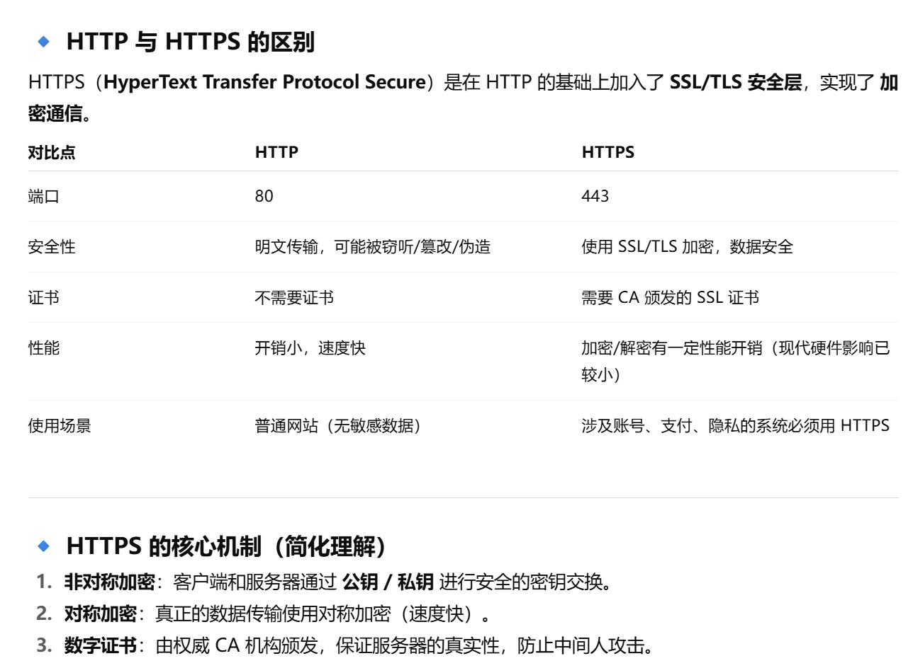
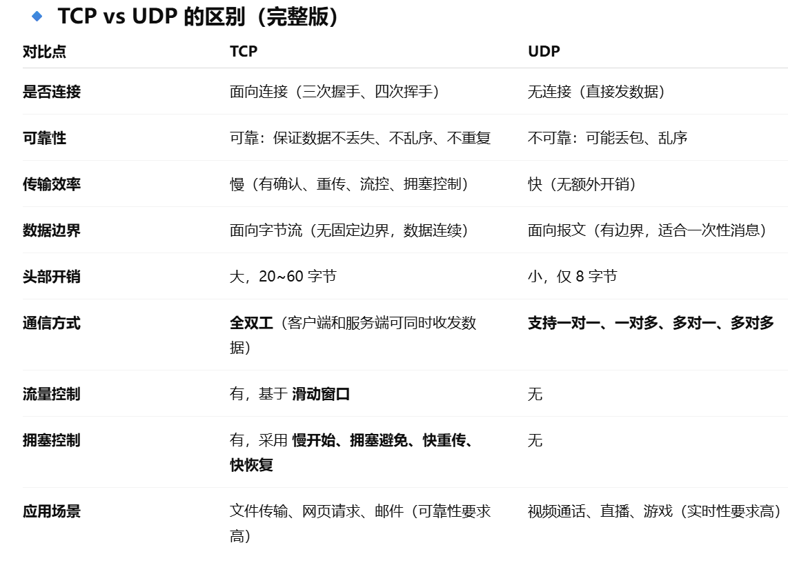

#### 1. 什么是HTTP? HTTP 和 HTTPS 的区别?
##### HTTP
HTTP（超文本传输协议）是一种应用层协议，用于在 客户端（通常是浏览器）和服务器 之间传输数据（文本、图片、视频等）。

默认端口：80

特点：
- 无状态：每次请求独立，服务器不会记住之前的状态（可用 Cookie/Session/Token 解决）。
- 明文传输：数据未加密，容易被窃听和篡改。
- 基于请求-响应模型：客户端发起请求，服务器返回响应。
- 简单快速：客户向服务器请求服务时，只需传送请求方法和路径。由于HTTP协议简单，使得HTTP服务器的程序规模小，因而通信速度很快
- 灵活：HTTP允许传输任意类型的数据对象。正在传输的类型由Content-Type加以标记


#### HTTP和HTTPS的区别？


### 2，说说HTTP 常见的状态码有哪些，适用场景？
http状态码的作用：服务器告诉客户端当前请求响应的状态，通过状态码就能判断和分析服务器的运行状态
#### 分类
- 1 表示消息提示
- 2 表示成功（代表请求已成功被服务器接收、理解、并接受）
- 3 表示重定向
- 4 表示请求错误
- 5 表示服务器错误
#### 常见状态码
100：客户端在发送POST数据给服务器前，征询服务器情况，看服务器是否处理POST的数据，如果不处理，客户端则不上传POST数据，如果处理，则POST上传数据。常用于POST大数据传输

206：一般用来做断点续传，或者是视频文件等大文件的加载

301：永久重定向会缓存。新域名替换旧域名，旧的域名不再使用时，用户访问旧域名时用301就重定向到新的域名

302：临时重定向不会缓存，常用 于未登陆的用户访问用户中心重定向到登录页面

304：协商缓存，告诉客户端有缓存，直接使用缓存中的数据，返回页面的只有头部信息，是没有内容部分

400：参数有误，请求无法被服务器识别

403：告诉客户端进制访问该站点或者资源，如在外网环境下，然后访问只有内网IP才能访问的时候则返回

404：服务器找不到资源时，或者服务器拒绝请求又不想说明理由时

503：服务器停机维护时，主动用503响应请求或 nginx 设置限速，超过限速，会返回503

504：网关超时

#### 总结
常见的有：
200 表示请求成功；
201 表示资源创建成功；
204 表示删除成功无内容；
301 和 302 用于重定向，
304 表示资源未修改，可以用缓存；
400 表示请求参数错误，401 未登录，403 权限不足，404 资源不存在；
500 表示服务器错误，502 网关错误，503 服务不可用，504 网关超时。

在实际开发中，比如前端调用接口时，会根据状态码来进行相应处理：401 跳转登录，403 提示无权限，404 提示资源不存在，500 则展示服务器异常。

### 3. 说一下 GET 和 POST 的区别？
HTTP协议中发送请求的方法，本质上都是TCP链接，并无差别，但是由于HTTP的规定和浏览器/服务器的限制，导致他们在应用过程中会体现出一些区别
#### 区别
1. 语义不同
    - GET：获取资源。
    - POST：提交数据 / 新建资源。
2. 参数位置（约定）
    - GET：参数放在 URL（?key=value），有长度限制。
    - POST：参数放在 请求体 body，理论上无长度限制。
3. 幂等性
    - GET：幂等（调用一次和调用多次结果相同，不改变服务器资源）。
    - POST：非幂等（每次调用都可能修改数据）。
4. 缓存机制
    - GET：浏览器和中间代理可缓存（常见于 304 Not Modified）。
    - POST：默认不缓存。
5. 安全性：
    - GET 参数在 URL 可见（浏览器历史、日志容易泄露）。
    - POST 数据在 body 里，相对安全（但本质上都需要 HTTPS 才能保证安全）。
6. 请求编码：
    - GET 只能进行 URL 编码。
    - POST 支持多种编码（application/x-www-form-urlencoded、multipart/form-data、application/json）。
7. 网络层面：
    - GET 请求可以被 浏览器预取(prefetch)、缓存，更适合查询接口。
    - POST 请求则更适合敏感、写操作的接口。
8. 参数长度
   - 浏览器或者服务器对此有限制，导致get请求参数有长度限制

#### 4. 说说地址栏输入 URL 敲下回车后发生了什么？
1. URL 解析
    - 浏览器解析输入的 URL，判断协议（http/https）、域名、端口等。
2. DNS 解析
    - 先查 浏览器缓存 → 系统缓存 → 路由器缓存 → 运营商 DNS → 根域名服务器。
    - 得到服务器对应的 IP 地址。
3. TCP 连接
    - 建立 TCP 三次握手，若是 HTTPS，还会进行 SSL/TLS 握手（证书验证、密钥交换）。
4. 发送 HTTP 请求
   - 浏览器构造请求报文（方法、URL、请求头、Cookie 等），通过 TCP 发送给服务器。
5. 服务器处理请求
   - Web 服务器（如 Nginx、Node.js、Java 服务）接收请求，处理逻辑（数据库、缓存），返回响应报文。
6. 浏览器接收响应
   - 浏览器收到 HTTP 响应报文（状态码、响应头、响应体）。
   - 如果是 301/302，进行重定向；如果是 304，走缓存；否则进入正常渲染。
   - 在服务器响应之后，由于现在http默认开始长连接keep-alive，当页面关闭之后，tcp链接则会经过四次挥手完成断开
7. 浏览器渲染页面
   - 解析 HTML → 构建 DOM 树
   - 解析 CSS → 构建 CSSOM
   - 合并 DOM + CSSOM → Render Tree
   - 布局（Layout）→ 绘制（Painting）→ 合成（Compositing）
   - 遇到 JS 会阻塞渲染（除非加 async/defer）。
8. 加载外部资源
   - 浏览器根据依赖并行下载 CSS、JS、图片等（HTTP/2 多路复用可并行）。
9. 用户交互
   - 页面可交互后，进入事件循环（Event Loop），处理用户输入、异步任务。

#### 5. 如何理解UDP 和 TCP? 区别? 应用场景? 
##### 定义
- UDP：直接将应用层报文加首部后交给网络层，不合并、不拆分，发送效率高。接收方去除首部后直接交给应用层。
    - 特点：标题短（4个字段，每字段2字节），开销小，适合对效率要求高的场景。
- TCP：将应用层数据视为**字节流**传输，类似流水形式。发送方将数据放入缓存区，根据网络拥塞状态动态调整报文段大小。
  - TCP报文首部为20字节，开销较大。
- TCP（传输控制协议） 和 UDP（用户数据包协议） 都是传输层协议。**TCP 重可靠，UDP 重效率**
##### 区别


#### 6. 跨域是什么？Vue项目中你是如何解决跨域的呢？

##### 什么是跨域？
- 跨域 指的是浏览器出于 **同源策略** 限制，不允许一个域名下的网页去请求另一个域名下的资源。
- 同源策略：**协议、域名、端口**必须一致，否则就是跨域。

##### 为什么会有跨域？
- 浏览器的 同源策略 是为了安全，**防止恶意网站盗取用户数据。**
- Node.js / Postman 发请求不会跨域，只有浏览器环境下才会触发。

##### 跨域解决方案
1. CORS（跨域资源共享）
   1. 服务端在响应头加上：
   ```javaScripts
   Access-Control-Allow-Origin: http://localhost:8080
   Access-Control-Allow-Methods: GET, POST, PUT, DELETE
   Access-Control-Allow-Headers: Content-Type, Authorization
   ```
2. Proxy(代理)
   1. 在 Vue CLI 配置 vue.config.js：
   ```javaScripts
   module.exports = {
    devServer: {
        proxy: {
        '/api': { // '/api'是代理标识，用于告诉node，url前面是/api的就是使用代理的
            target: 'http:/   backend-server.com', //目标地址，一般是指后台服务器地址
            changeOrigin: true, //是否跨域
            pathRewrite: { '^     api': '' } //把实际Request Url中的'/api'用""代替
            }
        }
    }
   }

   ```
3. Nginx 反向代理(服务端代理请求转发)
- 在服务器配置反向代理，将前端请求转发到后端 API。