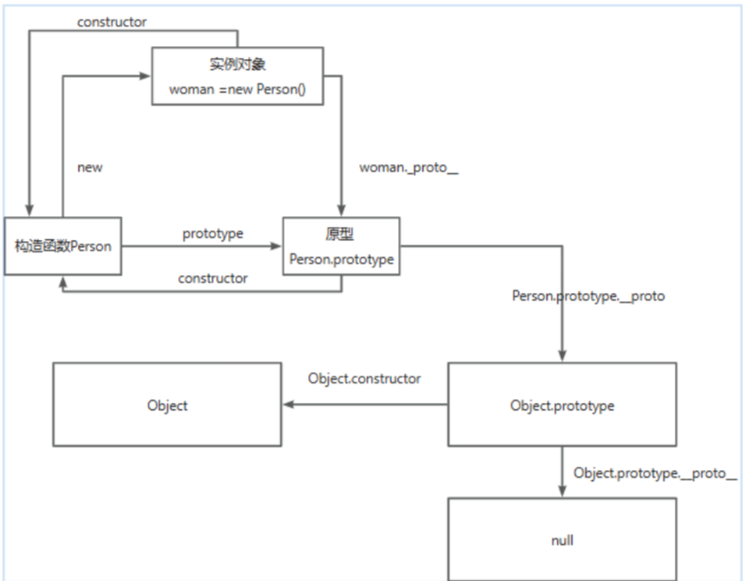

# JS基础相关问题
<font color="red">红色：应该回答出来</font>
<br>
<font color="yellow">黄色：不知道的内容</font>

   ### 1. 说说JavaScript中的数据类型？区别？
   #### 数据类型分类
   - 基本数据类型：String number（有NaN、infinity特殊值，注意边界） Boolean null（空值） undefined（有声明未赋值） BigInt（表示任意大小的整数） <font color="red">Symbol（表示唯一标识符）</font>
     - 存放在栈；<font color="yellow">赋值是按值传递，修改不会影响原值。</font>
   - 引用数据类型：targetect function <font color="red">Array；正则对象-RegExp，日期对象-Date、Map、Set等对象类型</font>
     - 存放在堆；<font color="yellow">赋值是按引用传递，修改会影响原对象。</font>
     - 
#### 数据类型判别：
   - typeof 判断基本数据类型，但是不能判断 null <font color="yellow">通过二进制判断</font>
     - 不能将targetect、Array和Null区分，都返回targetect
   - Array.isArray() 识别数组类型
   - instanceof 判断引用数据类型<font color="yellow">检测当前实例是否属于这个类的（原型链）</font>
   - <font color="yellow">targetect.prototype.toString.call() 精准判断数据类型； 返回当前实例所属类信息</font>
#### 类型转换
1. 显式转换：
   - Number():
     - 如果不可以被解析为数值、不是单个数值的对象、undefined都返回 NaN
     - 空字符串、false、null转为0
   - String()
   - Boolean()
   - <font color="yellow">parseInt()
     - 逐个解析字符，遇到不能转换的字符就停下来返回已解析成功的内容
   - BigInt()</font>
2. 隐式转换：
   1. 自动转为布尔值：undefined、null、false、+0、-0、NaN、""，除了上面几种会被转化成false，其他都换被转化成true
   2. 自动转为字符串：常发生在+运算中，一旦存在字符串，则会进行字符串拼接操作
   3. <font color="yellow">自动转为数值：除了+有可能把运算子转为字符串，其他运算符都会把运算子自动转成数值
   4. == 会进行隐式转换之后再来判断值是否相等</font>

### 2. avscript数组的常用方法有哪些？

#### 2.1 增删改类（影响原数组）
- push() / pop()：末尾添加/删除
- unshift() / shift()：开头添加/删除
- <font color="red">splice(start, deleteCount, ...items)：可删除、插入、替换；三个参数：开始位置、0（要删除的元素数量）、插入的元素。返回空数组</font>

#### 2.2 访问/拼接类（返回新数组，不修改原数组）

- <font color="red">concat()：合并数组
- slice(start, end)：截取数组，不包含end</font>
- join(separator)：数组转字符串

#### <font color="red">2.3 查找类（不修改原数组）</font> 作用：数据查询

- indexOf() 第一次出现/ lastIndexOf()最后一次出现：查找元素下标，没找到返回-1
- includes(value)：是否包含某个元素，返回true或false
- find(callback)：返回第一个满足条件的元素
- findIndex(callback)：返回第一个满足条件的下标

#### <font color="red">2.4 遍历类（不修改原数组）</font> 作用：表格展示、数据筛选

- forEach(item, index, array)：遍历元素（无返回值）有array则修改原数组
- map(callback)：返回新数组（映射）
- filter(callback)：筛选元素,返回满足条件的元素数组
- some(callback)：是否有任意元素满足条件，返回true/false
- every(callback)：是否所有元素满足条件,返回true/false

#### <font color="red">2.5 归并/计算类（不修改原数组）</font> 作用：购物车等数据计算

- reduce(callback, initialValue)：累计-计算
- reduceRight(callback, initialValue)：从右向左累计

#### 2.6 排序/反转（修改原数组）

- sort(compareFn)：排序（默认按字符串 Unicode 顺序）
- reverse()：反转数组
#### 2.7 ES6+ 新增（不修改原数组）作用：处理复杂的嵌套数据

- Array.from()：将类数组/可迭代对象转数组
- Array.of()：创建数组
- <font color="yellow" >flat(depth) / flatMap(callback)：扁平化数组</font>
  
### 3. Javascript字符串的常用方法有哪些？
JavaScript 中字符串（String）是 不可变的（immutable），**所以所有字符串方法都 不会修改原字符串，而是返回一个新的字符串或结果。**

#### 访问 & 长度 （基本访问）
- `str.length`：字符串长度  
- `str.charAt(index)`：返回指定位置的字符  
- `str.charCodeAt(index)`：返回指定位置字符的 Unicode 编码  
- `str.at(index)`：支持负索引，返回对应字符（ES2022）  

#### 搜索类（常用于 校验 URL、文件名、输入格式）
- `str.indexOf(substr, fromIndex)`：返回子串首次出现位置  
- `str.lastIndexOf(substr)`：返回子串最后出现位置  
- `str.includes(substr)`：判断是否包含子串（返回 `true/false`）  
- `str.startsWith(substr)`：是否以某子串开头  
- `str.endsWith(substr)`：是否以某子串结尾  
- `str.match(regexp)`：返回正则匹配结果  
- `str.search(regexp)`：返回匹配的位置  

#### 截取 & 提取（常用于截取文件后缀、提取子串。）
- `str.slice(start, end)`：截取子串（支持负数）  
- `str.substring(start, end)`：截取子串（不支持负数）  
- `str.substr(start, length)`：从起始位置取指定长度（⚠️ 已废弃，不推荐）  

#### 替换 & 拆分（常用于 数据清洗、模板替换。）
- `str.replace(substr/regexp, newStr)`：替换匹配到的内容  
- `str.replaceAll(substr/regexp, newStr)`：替换所有匹配项（ES2021）  
- `str.split(separator, limit)`：分割字符串为数组  

#### 大小写 & 去空格（常用于 表单输入校验）
- `str.toUpperCase()`：转大写  
- `str.toLowerCase()`：转小写  
- `str.trim()`：去掉首尾空格  
- `str.trimStart()` / `str.trimEnd()`：去掉首部/尾部空格  

#### 重复 & 填充（常用于 格式化数字、生成固定长度的 ID。）
- `str.repeat(n)`：重复字符串  
- `str.padStart(targetLength, padStr)`：开头填充到指定长度  
- `str.padEnd(targetLength, padStr)`：结尾填充到指定长度  

#### 模板 & 原始字符串
- `String.raw`：返回模板字符串的原始内容（不会转义 `\n` 等）  

### 4. == 和 ===区别，分别在什么情况使用？
#### 区别
1. == 先进行类型隐式转换再判断值是否相等
   <font color="yellow">- 转换情况：
     - 两个都为简单类型，字符串和布尔值都会转换成数值，再比较
     - 简单类型与引用类型比较，调用对象的 valueOf() 方法获取其原始类型的值，再比较
     - 两个都为引用类型，则比较它们是否指向同一个对象
     - null 和 undefined 相等
     - 存在 NaN 则返回 false</font>

2. === 不进行类型转换，直接判断 **值+类型** 是否相等;
   - undefined 和 null 与自身严格相等

#### <font color="yellow">使用情况</font>
- 推荐优先使用 ===（严格相等） 
  - 避免类型转换带来的意外结果。
  - 代码更可读，更安全。

- 只有在明确需要类型转换时，才用 ==
  - 比如，判断一个值是否为 null 或 undefined：
  ```javascript
  if (value == null) {
  // 等价于 value === null || value === undefined
  }
  ```

### 5. <font color="yellow">深拷贝浅拷贝的区别？如何实现一个深拷贝？</font>
对于基本类型来说，浅拷贝和深拷贝是一样的，都是拷贝值
#### 浅拷贝
- 定义：只复制对象的第一层属性，如果属性是引用类型（对象/数组），只会复制引用地址。不会开辟新的内存空间，共享内存空间。
- 结果：修改新对象里的引用属性，会影响原对象。
- 存在浅拷贝的现象有：
  - targetect.assign(target,targetect)【拷贝对象的可枚举属性到目标对象target，返回一个浅拷贝对象。】；
  - Array.prototype.slice(), Array.prototype.concat()，Array.from()；
  - 使用拓展运算符实现的复制
  
#### 深拷贝
- 定义：不仅复制第一层，还会递归复制对象里的对象，彻底分离原对象和新对象。
- 结果：修改新对象不会影响原对象。（因为深拷贝开辟了一个新的栈）
- 常见的深拷贝方式：
  - _.cloneDeep();
  - jQuery.extend();
    - 合并对象，支持深拷贝（默认浅拷贝，第一个参数为true支持深拷贝）
  - JSON.stringfy();
    - 有局限性，不能拷贝 function、Symbol、undefined
    - 不能正确处理 Date、RegExp、循环引用
  - 手写循环递归
  
  ### 6. 说说你对闭包的理解？闭包使用场景 
  - 闭包定义：可以访问外部函数定义域中的变量，即使外部函数已经执行完毕。
- 特点：
  - 能访问外部函数的变量。
  - 外部函数执行结束后，内部函数仍然可以引用这些变量。
  - 内部函数对外层变量形成“私有作用域”，不会污染全局作用域。
- 本质：是通过作用域链实现的 
- 使用场景：数据私有化/模块化；柯里化函数（复用参数）
- 注意：避免循环引用导致**内存泄漏**，循环中生成闭包需注意变量作用域，使用完要释放内存。
  
  ### 7. 说说你对作用域链的理解
- 作用域分类：
  - 全局作用域：任何不在函数中或是大括号中声明的变量，都是在全局作用域下，全局作用域下声明的变量可以在程序的任意位置访问
  - 函数作用域：如果一个变量是在函数内部声明的它就在一个函数作用域下面。这些变量只能在函数内部访问，不能在函数以外去访问
  - 块级作用域：在大括号中使用let和const声明的变量存在于块级作用域中。在大括号之外不能访问这些变量

 - 作用域链定义：JS官方用来查找变量的机制，当访问一个变量的时候，JS 引擎会从**当前作用域**开始查找，如果找不到就沿着**父级作用域链向上查找**，直到全局作用域。

- 特点：
  - 每个执行上下文都会有一个作用域链。
  - 内部函数可以访问外部函数的变量。
  - 当变量在当前作用域找不到时，沿作用域链逐级向上查找。
- 实际运用：变量查找、闭包、变量提升

### <font color="yellow">8. JavaScript原型，原型链 ? 有什么特点？</font>
- **原型（对象属性共享机制）**：Object.prototype
  - 作用：实现对象之间属性和方法的共享，节省内存。
- **原型链（查找机制）**：当访问对象的属性或方法时，如果对象本身没有，则会沿着 Prototype 链向上查找，直到找到 Object.prototype，再找不到返回 undefined。
  - 特点：实现了JS的继承机制

- 特点总结：
  - 共享性：方法放在原型上，所有实例共享。
  - 继承性：对象可以访问原型链上的属性。
  - 动态性：原型对象可以随时修改，实例会立即反映。
  - 链式查找：查找属性/方法时沿原型链向上搜索，直到 Object.prototype。

- 应用场景：
  - 节省内存：方法放在原型上，多个实例共享
  - 继承实现
  - 动态扩展实例方法
- 构造函数、原型和实例之间的关系 
  - 通过new 来创建实例对象
  - 构造函数每个对象的__proto__都是指向它的构造函数的原型对象prototype的
`person1.__proto__ === Person.prototype`
    - 使用 Object.getPrototypeOf可以获得原型
  - 每个函数拥有prototype属性，指向原型对象。同时，原型对象有一个自有属性constructor，这个属性指向该函数

- 函数（包括原生构造函数）的原型对象为Function.prototype;
`Function.prototype.__proto__ === Object.prototype`
- `Object.prototype.__proto__ === null`



### <font color="yellow">9. Javascript如何实现继承？</font>
- 继承的概念：子类可以继承父类的属性和方法，同时也可以重新定义父类的某些属性，并重写或覆盖某些属性和方法
- 实现方式：
  - 原型链继承
    - 子对象可以访问父对象的方法和属性
    - 缺点：实例共享引用类型属性，1个改都会改；属性初始化不灵活，需要调用构造函数否则容易undefined
  - 构造函数继承（借助call）
    - 优点：每个实例属性独立，父类自己定义的方法子类无法继承
    - 缺点：方法不能复用，需要在构造函数中定义，浪费内存
  - 组合继承：属性独立，方法共享
  - ES6 class继承：语法简洁，清晰
    ```javascript
    class Parent {
      constructor(name) {
        this.name = name;
      }
      greet() {
        console.log(`Hello, my name is ${this.name}`);
      }
    }

    class Child extends Parent {
      constructor(name, age) {
        super(name); // 调用父类构造函数
        this.age = age;
      }
      introduce() {
        console.log(`I am ${this.name}, and I am ${this.age} years old.`);
      }
    }

    // 示例
    const child = new Child("Alice", 10);
    child.greet(); // 输出: Hello, my name is Alice
    child.introduce(); // 输出: I am Alice, and I am 10 years old.
    ```
### <font color="yellow">10. 谈谈this对象的理解？</font>
- 定义：this 关键字是**函数运行时自动生成**的一个内部对象，只能在函数内部使用，总**指向调用它的对象**
- this在函数执行过程中，this一旦被确定了（this的指向在**函数调用**时确定的），就**不可以再更改**
  
#### 绑定规则
1. 默认绑定：普通函数直接调用时，非严格模式下指向 window（浏览器）或 global（Node），严格模式下为 undefined。

2. 隐式绑定：作为对象方法调用时，this 指向调用该方法的对象。

3. 显式绑定：通过 call、apply、bind 可以手动指定 this。

4. new 绑定：通过构造函数调用时，this 指向新创建的实例对象。
   - new过程遇到return一个对象，此时this指向为返回的对象
   ```javaScript 
   function fn()  
   {  
    this.user = 'xxx';  
    return {};  
   }
   var a = new fn();  
   console.log(a.user); //undefined
   ```
  - 如果返回一个简单类型的时候(例如：返回1)，则this指向实例对象
  - 注意的是null虽然也是对象，但是此时new仍然指向实例对象

5. 箭头函数：没有自己的 this，继承自外层作用域。  
6. 优先级：new绑定 > 显示绑定 > 隐式绑定 > 默认绑定

### 11. typeof 与 instanceof 区别
#### typeof
- 作用：返回一个字符串，表示操作数的类型。
- 可识别的类型：number、string、boolean、undefined、object、bigint、symbol、function、
- 特点：适合用来判断 **基本数据类型**和变量。
  ```javaScriptif
      (typeof a != 'undefined'){
      //变量存在
    }
  ```
- 局限：
  - typeof null === "object"（历史遗留 Bug）
  - 无法区分数组和对象（都返回 "object"）

#### instanceof(返回布尔值)
- 作用：检测某个对象的**原型链**上，是否能找到构造函数的 prototype。
- 语法：`obj instanceof Constructor`
- 特点：适合用来判断 引用类型（数组、对象、函数、类实例）。
- 局限：
  - 不能判断原始值（例如1123，但是new Number(123)可以判断）
  - 跨 iframe / 跨 realm 可能失效（因为构造函数不同）

#### 其他判断数据类型的方式
1. Object.prototype.toString.call()
- 最准确的类型判断方式，返回 "[object Type]"。
- 可区分所有内置对象（包括 null、Array、RegExp、Date、Map、Set）。
- 局限：写法稍繁琐。
- Object.prototype.toString 不加 call 时，只能检测当前对象，而且可能被重写；加上 call 后可以把任意值作为 this，返回其内部类型标签，是最稳妥的类型判断方法。

2. Array.isArray()
  - ES5 新增，专门判断是否为数组。
  - 推荐使用，语义清晰，跨 iframe 也能正常工作。

### 12.说说new操作符具体干了什么？
- 作用：new操作符用于创建一个给定构造函数的实例对象
- 它做了两件事：
  - 把 **构造函数和原型链** 关联起来。
  - 把 **构造函数里的逻辑** 应用到新对象上。

- 流程：
  - 1. 创建一个空对象`let newObj = {}`
  - 2. 绑定原型:将这个新对象的原型（__proto__）指向构造函数的 prototype。`newObj.__proto__ = Foo.prototype;`
  - 3. 执行构造函数：将构建函数中的this绑定到新建的对象newObj上`let result = Foo.call(newObj);`
  - 4. 返回结果
    - 如果构造函数显式返回一个对象（引用类型），则返回该对象。
    - 否则返回新创建的对象 newObj。

### 13. bind、call、apply 区别？如何实现一个bind?
- 作用：改变函数运行时的this指向
#### call
- 语法：`fn.call(thisArg, arg1, arg2, ...）`
- 作用：立即调用函数，this 指向 thisArg，参数按顺序传递。
#### apply
- 语法：`fn.apply(thisArg, [argsArray])`
- 作用：立即调用函数，this 指向 thisArg，参数以 **数组**形式传递。
#### bind
- 语法：`fn.bind(thisArg, arg1, arg2, ...)`
- 作用：不会立即执行，而是返回一个新的函数，新函数调用时 this 永远指向 thisArg，并可进行参数预置。
#### 区别
- 三者都可以改变函数的this对象指向
- 三者第一个参数都是this要指向的对象，如果如果没有这个参数或参数为undefined或null，则默认指向全局window
- 三者都可以传参，但是**apply是数组，而call是参数列表**，且apply和call是一次性传入参数，而bind可以分为多次传入
- bind 是**返回绑定this之后的函数**，apply 、call 则是立即执行
- bind 是永久改变this指向，call和apply是临时改变一次

### 14. ajax原理是什么？如何实现？
