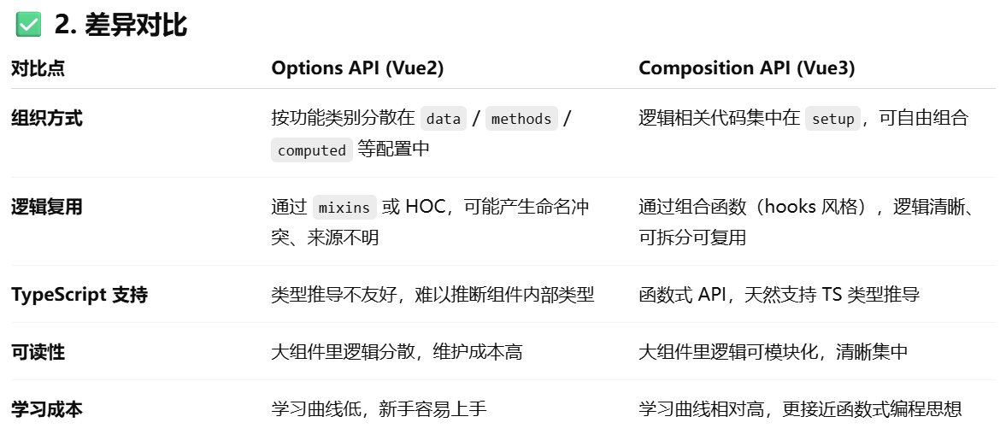

## 1. 说说你对vue的理解?
定义：Vue是一个JS框架，可以简化Web开发
### 核心特性
#### 1.数据驱动（MVVM）
- M（Model）：数据模型，负责业务逻辑和数据管理（API 请求、状态数据）。
- V（View）：视图层，负责 UI 展示（HTML、模板）。
- VM（ViewModel）：视图模型，负责连接 View 和 Model，实现数据双向绑定。**View 和 Model 的同步由 ViewModel 自动完成**
- 核心是通过 ViewModel 实现 **数据双向绑定**，让数据变化自动更新视图，用户操作也能自动更新数据。
相比传统 MVC，MVVM 省去了手动操作 DOM，直接操作数据，大幅提高了开发效率和代码可维护性。
#### 2. 组件化
- Vue 强调 UI 组件化，把页面拆分为可复用的独立模块（如按钮、表单、列表）。
- 组件之间通过 **props 传值 / emit 事件 / 状态管理** 通信。
- 实现 **低耦合 + 高复用** 。调试方便（组件之间相互独立，能够快速定位问题所在），可维护性高
#### 3. 响应式系统
- Vue 的最大特点：**响应式数据绑定**。
- Vue2 用 Object.defineProperty 劫持数据getter/setter，实现依赖收集。
- Vue3 用 Proxy 实现，性能更好，支持深层次劫持、动态属性。
- 数据变化自动更新，不用操作DOM、
#### 4. 虚拟 DOM & Diff 算法
- Vue 通过 Virtual DOM 来提高更新性能。
- 当数据变化时，Vue 会先更新虚拟 DOM，再与上一次快照进行 Diff 算法对比，只更新必要的真实 DOM 节点。
- 避免了直接操作真实 DOM 的高性能消耗。

## 2. 说说你对双向绑定的理解?
- 双向绑定（Two-Way Data Binding） 指的是 **数据模型**（Model） 和 **视图**（View） 之间的自动同步机制。（数据变化后更新视图，视图变化后更新数据）
- Vue中的双向绑定实现：v-model
  - 底层原理：
    - Vue2：OBject.defineProprety；对data里面的属性进行劫持，通过发布订阅模式（Observer + Watcher） 实现数据和视图的更新
    - Vue3：Proxy；通过 Proxy 拦截对对象的读写操作；性能更好，能监听数组和对象新增/删除等操作。
- 使用场景：表单交互、富文本编辑器、动态UI组件（开关按钮）
- 优点：减少了手动DOM操作，提高开发效率，代码更加直观
- 缺点：大型应用里面可能会造成数据流混乱（数据来源不清晰）
## 3. 说说你对SPA（单页应用）的理解?
- 定义：SPA指的是整个网站/应用只有一个 HTML 页面，所有的内容交互、页面切换都通过 **JavaScript 动态更新视图** 来完成。
- 页面初始化时会加载必要的 HTML、CSS、JS，之后用户的操作（如切换路由）不会再请求整个页面，而是 **局部刷新、数据异步加载**。
- 直白点：**只刷新局部，不刷新整个页面**。

### 特征
1. 前后端分离
   1. 前端视图渲染
   2. 后端提供接口数据
2. 前端路由控制
   1. 利用 history API 或 hash 实现路由切换；
   2. URL 变化时，不刷新页面，而是前端 JS 控制不同组件的渲染。
3. 用户体验更好
   1. 切换快、交互流畅，接近原生应用体验。

### 优点
1. 用户体验好：页面切换快，交互流畅，不用频繁刷新整个页面
2. 前后端分离，开发效率高
3. 代码复用性高：组件化开发，维护方便

### 缺点
1. 首屏加载慢：一次性加载大量JS/CSS
2. SEO不友好：
3. 浏览器回退/前进逻辑复杂：必须依赖前端路由来管理历史记录，否则容易出现问题。

### 应用场景：
- 后台管理系统（数据交互多，刷新少）
- 在线文档编辑器（如 Notion、石墨文档）
- Web 应用类产品（如 Gmail、Google Drive、Twitter Web 版）

### 优化缺点：
1. 首屏优化：
   1. 路由懒加载、按需加载资源；
   2. 服务端渲染（SSR，如 Nuxt.js、Next.js）：将组件或页面通过服务器生成html，再返回给浏览器
   3. 预渲染（Prerender）。

2. SEO 优化：
   1. SSR 或静态生成（URL静态化）；
      1. 静态生成：通过程序将动态页面抓取并保存为静态页面，这样的页面的实际存在于服务器的硬盘中；
      2. 通过WEB服务器的 URL Rewrite的方式，它的原理是通过web服务器内部模块按一定规则将外部的URL请求转化为内部的文件地址，一句话来说就是把外部请求的静态地址转化为实际的动态页面地址，而静态页面实际是不存在的。
   2. 使用 meta 标签 + sitemap 提升搜索引擎收录。

总结：SPA 是前端通过**路由和组件化**来模拟多页面效果的单页应用，优势是体验好，缺点是首屏慢和 SEO 难，需要结合 SSR/预渲染优化。

## 4. Vue中的v-show和v-if怎么理解？
两者都能控制元素是否在页面显示，语法一样，表达式为true显示；为false隐藏。

### 区别
#### 原理
1. v-show（CSS切换）
   1. 原理：通过** CSS display **属性 控制显示/隐藏。
   2. 当 false 时，并不会移除 DOM 元素，而是添加** display: none**;。
   3. 特点：DOM 始终存在，只是隐藏了。

2. v-if（会触发生命周期）
   1. 原理：通过 **条件渲染** 控制 DOM 的创建和销毁。
   2. 当 false 时，DOM 元素会 **直接被移除**，再次为 true 时会**重新创建**。
   3. 特点：DOM 是否存在取决于条件表达式。
   4. v-if由false变为true的时候，触发组件的beforeCreate、create、beforeMount、mounted钩子，由true变为false的时候触发组件的beforeDestory、destoryed方法

#### 性能
- v-show：**初始渲染开销较大**（因为无论条件真假，DOM 都会渲染一次），但切换开销小（只是改 CSS）。

- v-if：初始渲染开销小（不满足条件就不渲染），但**切换开销大**（频繁创建和销毁 DOM）。

### 应用场景
- v-show：需要 **频繁切换** 显示/隐藏的场景，比如 Tab 切换、下拉菜单展开/收起。

- v-if：**条件很少改变** 的场景，比如根据权限显示某个按钮，或页面只渲染一次的模块。

**频繁切换用 v-show，条件渲染用 v-if**

## 5. Vue实例挂载的过程中发生了什么?（不是很理解）
1. 初始化参数（_init）
   1. 合并用户传入的 options（el（元素，Vue要挂载的DOM节点）、data、methods、components...）和全局配置。
   2. 初始化生命周期、事件、渲染函数等。

2. 数据响应化（observe）
   1. 对 data 进行 **数据劫持**（Vue2 用 Object.defineProperty，Vue3 用 Proxy）。
   2. 建立 getter / setter，为后续依赖收集和更新视图做准备。

3. 编译模板（compile）
   1. 如果传入的是 template(`el:'#app'`)，Vue 会编译成 渲染函数 render function。
   2. 如果没有 template，会从 el 对应的 DOM 中提取内容再编译。
   3. 编译分三步：parse → optimize → generate，最终生成 render 函数。

4. 挂载（$mount）
   1. 执行 `vm.$mount(el)`，将实例挂载到指定的 DOM 节点。
   2. 内部调用 mountComponent，核心流程：
      1. 创建 Watcher，触发 render。
      2. render 执行时，访问 data → 触发 getter → 依赖收集。
      3. render 生成虚拟 DOM（VNode）。
      4. 通过 patch 将 VNode 转换为真实 DOM，并替换 el。

5. 响应式更新
   1. 当 data 改变时，setter 触发依赖更新，通知 Watcher。
   2. Watcher 重新执行 render → 生成新的 VNode。
   3. Diff 算法比对新旧 VNode，按需更新真实 DOM。

### 总结
1. new Vue → 初始化配置、数据响应化。
2. 编译模板 → 把 {{ msg }} 编译成 render 函数。
3. 执行挂载 → render 生成虚拟 DOM → patch 成真实 DOM。
4. 数据变化 → setter 触发更新 → Diff → 更新真实 DOM。

### 6. 说说你对Vue生命周期的理解? 
#### 生命周期

activated keep-alive缓存的组件激活时
deactivated keep-alive缓存的组件停用时

#### 阶段
1. 创建阶段（Creation）（set up）
   1. beforeCreate：实例初始化，还没有 data 和 methods。
   2. created：数据观测完成，可以访问 data 和 methods，但还没有挂载 DOM。

2. 挂载阶段（Mounting）
   1. beforeMount：编译模板完成，尚未把虚拟 DOM 挂载到页面。
   2. mounted：DOM 挂载完成，页面可见。

3. 更新阶段（Updating）
   1. beforeUpdate：数据更新时触发，DOM 还没更新。
   2. updated：数据更新并重新渲染 DOM 后触发。

4. 销毁阶段（Unmounting）
   1. beforeDestroy：实例销毁前触发，还能访问实例。
   2. destroyed：实例销毁后触发，事件解绑、子组件销毁。

#### 实际应用
1. Created、set up：初始化数据、发起Ajax请求获取后端数据
2. mounted/onMounted：初始化DOM节点，初始化第三方插件（echarts）
3. beforeUpdate & updated：监听数据变化前后，做调试或者debug
4. beforeDestroy/beforeUnmount & destroyed/onUnmount：解绑事件、清理定时器、清理资源，避免内存泄露

## 7. 为什么Vue中的v-if和v-for不建议一起用?
当v-if和v-for一起用的时候，会出现对每一项都进行v-if判断是否渲染，如果数组很大或者判断条件复杂对**性能消耗很大**，同时**逻辑会不清晰**，v-if对每一条循环项生效，而不是对整个列表生效

避免在同一个元素上面同时使用v-if和v-for
解决方式：
1. 在**外层包裹v-if**
2. 在**计算属性里面过滤数据**，避免每次循环都要进行v-if判断

## 8. SPA（单页应用）首屏加载速度慢怎么解决？
- 原因：SPA **一次性加载 大量 JS/CSS 文件**，浏览器必须下载、解析、执行 JS，才能渲染 DOM，**浏览器加载和渲染页面需要较长时间**，导致白屏或页面渲染延迟。
  
### 常见原因：
1. 资源体积大：JS/CSS文件大，网络加载速度慢
2. 渲染依赖JS：如果 JS 执行慢或阻塞渲染，白屏时间增加
3. 首次请求数据多：如果接口响应慢，页面渲染被延迟

### 解决方案：
1. 路由懒加载（按需加载组件）
   1. 首次加载只下载首页 JS，其余页面 JS 在路由访问时再加载。
2. 代码分割/Webpack按需加载：将业务逻辑拆分成多个 chunk，减少首屏 JS 体积。
``` javaScript
optimization: {
  splitChunks: {
    chunks: 'all'
  }
}
```
3. 服务端渲染（SSR）
   1. 原理：先在服务器生成 HTML，浏览器直接渲染页面。（Vue2->Nuxt.js Vue3->Nuxt3/vite +SSR）
   2. 优点：首屏渲染快，SEO更友好
4. 预渲染/静态生成
   1. 对首页或固定页面做 预渲染 HTML，用户访问直接拿到静态 HTML。
   2. 常用插件：prerender-spa-plugin
   3. 适合内容静态或首屏固定的页面。

5. 资源优化
   1. 压缩 JS/CSS（Terser、CSSnano）
   2. 图片懒加载或 WebP 格式
   3. 使用 CDN 加速资源加载
6. 首屏数据优化
   1. 尽量减少首屏API请求数量
   2. 使用缓存（localStorage / sessionStorage）或服务端渲染数据

## 9. 为什么data属性是一个函数而不是一个对象？
在vue组件里面data必须是一个函数，在根实例（new vue）里面data可以是对象，因为全局只有一个根示例，不会出现数据共享

### 为什么组件中要使用函数data？
1. **组件是可以复用的**
   1. 每个组件可能会被多次创建，如果data是一个对象
   2. 所有的组件示例都会**共享同一个data**，修改一个示例的数据会导致所有示例里面的数据都会被修改
2. **函数返回对象可以保证每个实例有独立的状态**
   1. 当 data 是函数时，每个组件实例执行 data() 返回一个 独立对象：

总结：组件中的 data 必须是函数，确保每个实例有 **独立的响应式状态**，避免多实例共享同一个对象导致状态污染。

## 10. Vue中给对象添加新属性界面不刷新? 
### 问题描述
``` javaScript
data() {
  return {
    user: { name: 'Tom' }
  }
}
// 如果你在方法里这样修改对象：

this.user.age = 18
// 问题：界面不会更新，{{ user.age }} 不会显示。
```
### 原理分析
1. Vue2的响应式原理的局限性
   1. Vue2 使用 `Object.defineProperty` 来劫持对象的 **已有属性** 的 getter/setter。
   2. 限制：Vue2 只能监控对象创建时存在的属性，**新增属性不被劫持**

### 解决方案
1. Vue.set / this.$set
   ``` javaScript
   this.$set(this.user, 'age', 18)
    // 或
    Vue.set(this.user, 'age', 18)
   ```
2. Vue3不会出现这个问题了

## 11. Vue组件间通信方式都有哪些?
父子通信、跨级通信、全局通信
### 父子通信
#### 父传子
#### props
1. 子组件设置props属性，定义接收父组件传过来的参数
``` javaScript
//子组件 Children.vue
 props:{  
       // 字符串形式  
     name:String // 接收的类型参数  
     // 对象形式  
     age:{    
         type:Number, // 接收的类型为数值  
         defaule:18,  // 默认值为18  
        require:true // age属性必须传递  
     }  
 }  
```
2. 父组件在使用子组件标签中通过字面量来传递值
``` javaScript
//父组件 Father.vue
 <Children name="jack" age=18 />  
```
#### ref
在父组件中**通过 ref 获取 子组件实例**，从而可以**直接访问子组件的数据或方法**。
Vue3
``` javaScript
<!-- Parent.vue -->
<template>
  <Child ref="childComp"/>
  <button @click="callChild">调用子组件方法</button>
</template>

<script setup>
import { ref } from 'vue'
import Child from './Child.vue'

const childComp = ref(null)
const callChild = () => {
  childComp.value.sayHello()
}
</script>

<!-- Child.vue -->
<script setup>
const sayHello = () => {
  console.log('Hello from child')
}
defineExpose({ sayHello })   // 必须显式暴露，父组件才能调用
</script>

```
Vue2
``` javaScript
<!-- Parent.vue -->
<template>
  <Child ref="childComp"/>
  <button @click="callChild">调用子组件方法</button>
</template>

<script>
import Child from './Child.vue'
export default {
  components: { Child },
  methods: {
    callChild() {
      this.$refs.childComp.sayHello()
    }
  }
}
</script>

<!-- Child.vue -->
<script>
export default {
  methods: {
    sayHello() {
      console.log('Hello from child')
    }
  }
}
</script>

```
#### 子传父（$emit/emit(vue3)）
1. 子组件通过$emit触发自定义事件，$emit第二个参数为传递的数值 `this.$emit('add', good)  `
2. 父组件绑定监听器获取到子组件传递过来的参数 `<Children @add="cartAdd($event)" />  `

### 跨级通信（provide/inject）
1. 在祖先组件定义provide属性，返回传递的值`provide: { user: this.user }`
2. 在后代组件通过inject接收组件传递过来的值 `inject: ['user']`

### 全局通信（Vuex和pinia）
#### Vuex
- `state`用来存放共享变量的地方
- `getter`，可以增加一个getter派生状态，(相当于store中的计算属性），用来获得共享变量的值
- `mutations`用来存放修改state的方法。
- `actions`也是用来存放修改state的方法，不过action是在mutations的基础上进行。常用来做一些异步操作


## 12.Vue中的$nextTick有什么作用？
### 作用
- 官方定义：在下次 DOM 更新循环结束之后执行延迟回调。在修改数据之后立即使用这个方法，获取更新后的 DOM
- 理解：
  - “Vue 内部的 DOM 更新是异步的，数据改了不会立刻反映在 DOM 上。如果你**马上去读 DOM，会拿到旧值**。想等页面更新完成再操作 DOM，就用 nextTick。”
  - `$nextTick` 用于在 **DOM 更新完成后执行代码**，避免操作旧 DOM。
- 表达：Vue2 `this.$nextTick(callback)`；Vue3 `import { nextTick } from 'vue'`

### 使用场景
1. 数据更新后，获取最新的 DOM（确保获取到的数据是更改过后的数据，不是旧数据）
2. 第三方插件初始化（确保 DOM 已经渲染出来，再初始化插件。）
3. 动画、滚动（保证元素渲染之后再滚动）

### Vue2和Vue3中nextTick的区别
### nextTick的原理


## 12. 你知道vue中key的原理吗？说说你对它的理解？
1. key 的作用
key 的本质是一个 **唯一标识**。
Vue 在进行虚拟 DOM diff 时，会通过 key 来判断两个节点是否相同：
- 如果 key 相同，Vue 认为是同一个节点，只会更新内容，不会销毁和重建。
- 如果 key 不同，Vue 会销毁旧节点，创建新节点。
  
2. key 的原理（虚拟 DOM diff 流程）
Vue 会对比新旧虚拟 DOM 的子节点。
- 如果有 key：
  - 通过 key 来快速定位对应的旧节点，进行复用或替换。
  - 避免错误复用，减少 DOM 操作。
- 如果没有 key（默认用索引值）：
  - Vue 会采用就地更新策略：复用相同位置的节点。
  - 可能导致错误复用，比如输入框值错乱。
3. 示例
假设有一个简单的列表切换：
``` html
<template>
  <div>
    <div v-if="toggle">
      <input placeholder="请输入A" />
    </div>
    <div v-else>
      <input placeholder="请输入B" />
    </div>
  </div>
</template>
```
如果不给 key：
Vue 认为这两个 `<input>` 是同一个节点，只会复用，导致切换时输入框内容还在。

如果加了 key：
``` html
<div v-if="toggle">
  <input key="A" placeholder="请输入A" />
</div>
<div v-else>
  <input key="B" placeholder="请输入B" />
</div>
```
Vue 会销毁旧的 `<input>`，创建新的 `<input>`，输入内容不会错乱。

4. 总结
- key 的作用：**高效更新、避免错误复用**。
- 最佳实践：
  - 列表渲染时，推荐使用业务唯一标识（如 id）作为 key。
  - 避免用 index 作为 key（除非静态列表、不涉及节点复用）。
  - 切换相似节点时加 key，确保重新渲染。

## 13. 什么是虚拟DOM？如何实现一个虚拟DOM？说说你的思路
- 概念：虚拟 DOM（Virtual DOM，简称 VDOM）就是**用 JavaScript 对象来模拟真实 DOM 结构**。
- 本质：一个轻量级的** JS 对象（树形结构）**，记录了元素的标签、属性、子节点等信息。
- 目的：
  - 避免频繁操作真实 DOM（性能消耗大）。
  - 通过 diff 算法，找到最小化更新的方式，再批量更新真实 DOM。
- 优点：
  - **性能优化**
    - 直接操作 DOM → 浏览器频繁触发 **回流和重绘**，很耗性能。
    - 虚拟 DOM → 先在 JS 内存中 diff 出差异，再一次性更新。
  - 跨平台渲染
    - 有了 VDOM，React/Vue 不仅能渲染到浏览器，还能渲染到 原生应用（React Native）、小程序，甚至 服务端渲染。
- 实现思路：
   - `VNode`：定义虚拟节点结构(tag、dada、text、children、elm、context)。
   - `render`：把虚拟 DOM 渲染成真实 DOM。
   - `diff & patch`：对比新旧虚拟 DOM 树，最小化更新真实 DOM。

## 14. SSR解决了什么问题？有做过SSR吗？你是怎么做的？
1. SSR（Server-Side Rendering，服务端渲染） 指的是：在服务端直接把 **渲染好的 HTML** 返回给浏览器，而不是返回一个空壳 + JS 再去渲染。

2. 它主要解决了两个问题：
- 首屏加载慢
  - 传统 SPA：
    - 浏览器先拿到一个空 HTML（只有 <div id="app"></div>）。
    - 再下载 JS，执行后才渲染出内容。
    - 首屏白屏时间长。
  - SSR：服务器直接返回带数据的 HTML，用户几乎立即看到内容，首屏快。
- SEO 不友好
  - SPA：内容由 JS 渲染出来，部分搜索引擎（尤其是国内）不解析 JS → 抓不到内容。
  - SSR：返回的 HTML 就包含内容 → 搜索引擎能抓取。
归纳一句话：SSR 主要解决了**首屏性能优化和 SEO 问题**。

3. 缺点
   1. 开发复杂度增加
      1. 代码需要**同时在服务器和客户端运行**，需要做兼容处理
      2. 同时需要区分仅在客户端运行和仅在服务器运行的逻辑
      3. 第三方库的兼容问题
   2. 服务端压力大
      1. 每次请求都要 执行 Vue/React 渲染逻辑，生成 HTML → **CPU 和内存消耗高**。
   3. 缓存与性能问题
      1. SSR 返回的 HTML 通常是 动态生成 的，不容易缓存。如果缓存没做好，大量请求会直接打到服务端，影响性能。
所以使用SSR之前要谨慎考虑

4. 如何实现SSR？
   1. Vue SSR 可以用 `vue-server-renderer` 自己实现，
   2. 基本流程是**服务端执行 Vue 渲染 → 返回 HTML → 客户端 hydrate 激活**。

## 15. 说下你的vue项目的目录结构，如果是大型项目你该怎么划分结构和划分组件呢？

- 基础目录包括 **api、components、views、router、store、utils、assets** 等。
- 如果是大型项目，我会按 **业务模块化** 管理（user、product、order），公共组件和工具抽离出来，布局单独维护，保证团队协作和扩展性。
- 在组件划分上，我会遵循 页面组件(View)、业务组件(modules)、通用基础组件(components) 的分层思想，结合命名规范提升可维护性。

## 16. vue项目如何部署？有遇到布署服务器后刷新404问题吗？
### Vue 项目部署流程

1. 打包构建
   - 执行：`npm run build`
   - 生成 dist/ 文件夹（生产环境静态资源）。
2. 上传到服务器
   - 将 dist 文件夹里的内容上传到服务器（Nginx、Apache、Node.js 静态服务等）。
   - 服务器配置
   - Nginx（常见）：
``` javaScript
server {
  listen 80;
  server_name yourdomain.com;

  root /var/www/your-vue-app/dist;
  index index.html;

  location / {
    try_files $uri $uri/ /index.html;
  }
}
```

关键在于 try_files，它保证前端路由不会触发 404。

Node.js (express-static)：
```javaScript
const express = require('express');
const path = require('path');
const app = express();

app.use(express.static(path.join(__dirname, 'dist')));

app.get('*', (req, res) => {
  res.sendFile(path.resolve(__dirname, 'dist', 'index.html'));
});

app.listen(3000, () => console.log('Running on http://localhost:3000'));
```
### 刷新后 404 的原因
  - Vue 是 前端路由 (Vue Router) 控制的 SPA。
  - 当你直接输入 http://example.com/user/123 并刷新时，请求会直接发送到后端服务器，但后端没有 /user/123 这个路由 → 返回 404。
  - 而实际上，这个路由应该由前端 Vue Router 处理。
### 解决办法
1. history 模式下必须配置后端
  - Nginx: try_files $uri $uri/ /index.html;
  - Express: 捕获 * 路由返回 index.html
2. 使用 hash 模式
- Vue Router 默认是 hash 模式，例如 /#/user/123
这种模式刷新不会 404，因为服务端只看到 /。
- 服务器端重写
- 把所有未知路由都重定向到 index.html，交给前端处理。

## 17. Vue3有了解过吗？能说说跟Vue2的区别吗？
- 速度更快
- 体积减少
- 更易维护
- 更接近原生
- 更易使用

Vue3 相比 Vue2 的最大变化有两点：第一是 响应式原理 从 defineProperty 升级为 Proxy，解决了对象/数组属性监听的局限性；第二是 语法 API，引入了 Composition API，让逻辑更加清晰和可复用。除此之外，Vue3 在性能上做了优化，引入了 Fragment、Teleport、Suspense 等新特性，同时体积更小，TypeScript 支持更好，整体更适合大型项目。

## 18. Vue3.0的设计目标是什么？做了哪些优化? 
Vue3 的设计目标是 **更小、更快、更易维护、更好的逻辑复用和更强大功能**。在优化上，核心是：响应式系统由 Object.defineProperty 升级为 Proxy；编译器引入 PatchFlag 静态标记和静态提升，提升 diff 性能；架构支持 Tree-shaking 和模块化；并且增加了 Fragment、Teleport、Suspense 等新特性，同时 TypeScript 支持更好。


## 19. Vue3.0 性能提升主要是通过哪几方面体现的？
### 编译阶段
1. diff算法优化
   1. vue3在diff算法中相比vue2增加了**静态标记**
   2. 静态标记作用：会**发生变化**的地方添加一个**flag标记**，下次发生变化的时候**直接找该地方进行比较**
   3. **已经标记静态节点**的p标签在diff过程中则**不会比较**，把性能进一步提高
2. 静态提升
   1. Vue3中对不参与更新的元素，会做静态提升，**只会被创建一次，在渲染时直接复用**
   2. 这样就免去了重复的创建节点，优化了运行时候的内存占用
3. 事件监听缓存
   1. 默认情况下绑定事件行为会被视为动态绑定，所以每次都会去追踪它的变化，开启了事件监听缓存后，没有了静态标记。也就是说下次diff算法的时候直接使用
4. SSR优化
   1. 当静态内容大到一定量级时候，会用createStaticVNode方法在客户端去生成一个static node，这些静态node，会被直接innerHtml，就不需要创建对象，然后根据对象渲染

### 源码体积
- Vue3 核心库更轻量（gzip 约 10kb），减少加载时间
- 支持按需引入模块，未使用的部分不会打包进项目
- Tree-shaking 友好：未使用的 API 不会打包进最终 bundle

### 响应式系统
响应式系统由 Object.defineProperty 升级为 Proxy，支持完整的对象/数组监听，依赖收集更高效；

## 20. Vue3.0 所采用的 Composition Api 与 Vue2.x 使用的 Options Api 有什么不同？
通常使用Vue2开发的项目，普遍会存在以下问题：
- 代码的可读性随着组件变大而变差
- 每一种代码复用的方式，都存在缺点
- TypeScript支持有限


- 在逻辑组织和逻辑复用方面，Composition API是优于Options  API
- 因为Composition API几乎是函数，会有更好的类型推断。
- Composition API 对 tree-shaking 友好，代码也更容易压缩
- Composition API中见不到this的使用，减少了this指向不明的情况

## vue3 diff算法
1. 预处理前置节点
   1. 定义一个i，记录前置索引值
   2. 从前到后对比节点，相同打patch，无需diff，直接更新
   3. 不一样就停止对比，记录i的值，进行预处理后置节点
2. 预处理后置节点
   1. 定义e1（旧节点列表的后置索引值）、e2（新节点列表的后置索引值）
   2. 从后向前对比节点，相同打patch，无需diff，直接更新
   3. 不一样，记录e1、e2的值
3. 处理仅有新增节点情况（i>e1 && 1<=e2）
   1. 直接遍历，把新节点挂载到新的DOM树
4. 处理仅有卸载节点的情况（i>e2 && i<=e1）
   1. 直接遍历，把多余节点卸载掉
5. 处理其他情况（新增、卸载、移动）
   1. 通过 LIS（最长递增子序列算法） 找到**最长不需要移动的序列**，然后只移动必要的节点，减少 DOM 操作。