# Agent 原理架构和工程实践
原文：https://x.com/HiTw93/status/2034627967926825175
## Agent Loop 的基本运转方式
核心逻辑代码抽象：
``` TS
const messages: MessageParam[] = [{ role: "user", content: userInput }];

while (true) {
  const response = await client.messages.create({
    model: "claude-opus-4-6",
    max_tokens: 8096,
    tools: toolDefinitions,
    messages,
  });

  if (response.stop_reason === "tool_use") {
    const toolResults = await Promise.all(
      response.content
        .filter((b) => b.type === "tool_use")
        .map(async (b) => ({
          type: "tool_result" as const,
          tool_use_id: b.id,
          content: await executeTool(b.name, b.input),
        }))
    );
    messages.push({ role: "assistant", content: response.content });
    messages.push({ role: "user", content: toolResults });
  } else {
    return response.content.find((b) => b.type === "text")?.text ?? "";
  }
}
```
感知 -> 决策 -> 行动 -> 反馈四个阶段不断循环，直到模型返回纯文本为止：
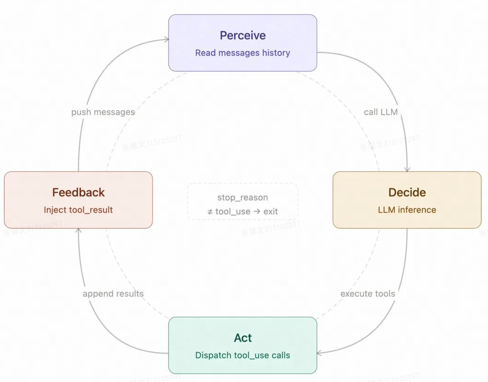

### WorkFlow 和 Agent 的区别
Workflow：执行路径由代码预先写死
agent：由 LLM 动态决定下一步
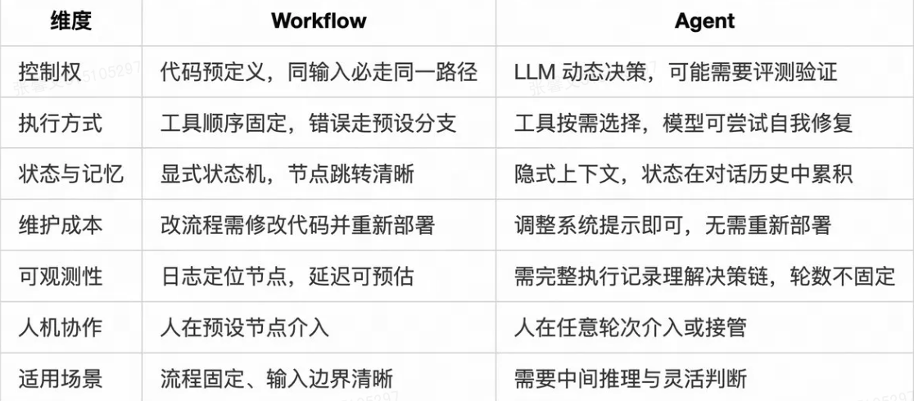
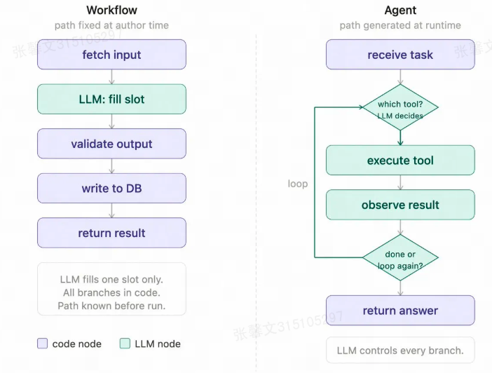

五种常见控制模式

- 大多数 AI 系统拆开看，其实都是这五种模式的组合。很多场景并不需要完整的 Agent 自主权，把其中几种模式搭起来就够了，关键还是看任务本身适合哪一种设计。
- 提示链 Prompt Chaining：任务拆成顺序步骤，每步 LLM 处理上一步的输出，中间可加代码检查点，适合生成后翻译、先写大纲再写正文这类线性流程。
- 路由 Routing：对输入分类，定向到对应的专用处理流程，简单问题走轻量模型，复杂问题走强模型，技术咨询和账单查询走不同逻辑。
- 并行 Parallelization：两种变体：分段法把任务拆成独立子任务并发跑，投票法把同一任务跑多次取共识，适合高风险决策或需要多视角的场景。
- 编排器-工作者 Orchestrator-Workers：中央 LLM 动态分解任务，委派给工作者 LLM，综合结果。nanobot 的 spawn 工具和 learn-claude-code 的子 Agent 模式都是这个原型。
- 评估器-优化器 Evaluator-Optimizer：生成器产出，评估器给反馈，循环直到达标，适合翻译、创意写作这类质量标准难以用代码精确定义的任务。

##  为什么 Harness 比模型更关键
Harness 是指围绕 Agent 构建的测试、验证与约束基础设施，这里的 Harness 至少包括四个部分：验收基线、执行边界、反馈信号和回退手段。

哪些工程约束在起作用：
- 代码库结构是 Agent 的导航信号：清晰的目录结构、命名约定和模块边界会成为 Agent 的隐式引导，如果代码库本身缺乏结构化约束，Agent 的修改行为也会随之变得混乱。
- 约束编码化而非文档化：写在文档中的规范很容易被 Agent 忽略，而被编码进 Linter、类型系统或 CI 规则中的约束，才具备可执行性。
- 基于执行日志的自验证闭环：Agent 在完成操作后，通过查询执行日志或系统状态来确认修改确实生效，避免仅凭一次生成结果就认为任务完成。
- 最小化合并阻力：在高吞吐开发环境中，等待人工审查的成本往往高于修复小错误的成本，团队需要通过完善的自动化测试体系，真正建立对自动化修改的信任。

CodeX 配套了一整套按任务临时创建、任务完成后即销毁的可观测性栈，让 Agent 可以直接利用日志、指标和追踪来理解、验证并修正系统行为，从而把代码修改、运行验证和结果反馈串成一个闭环。
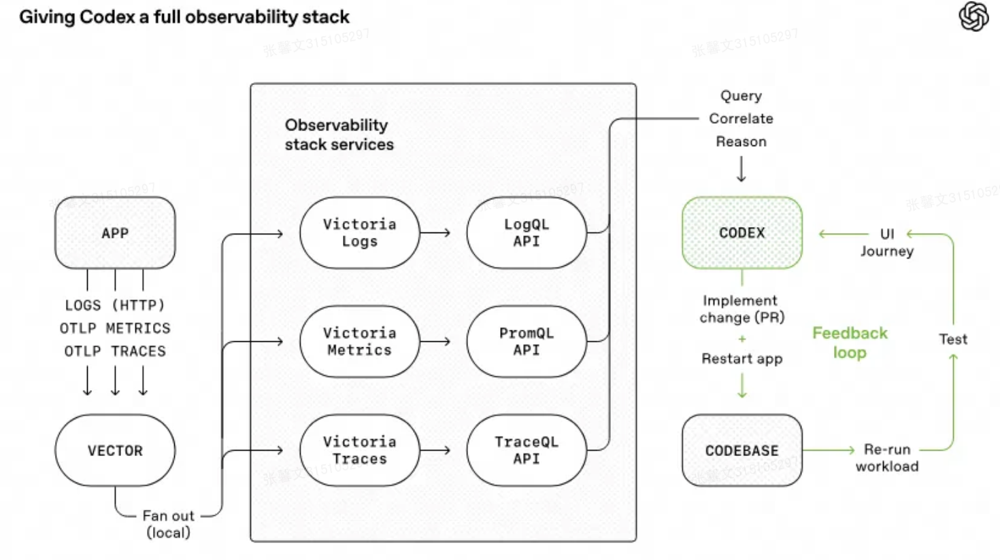
完整数据流：应用产生的日志、指标和追踪数据先汇集到可观测性栈，再通过统一查询接口暴露给 Codex。Codex 查询这些数据进行分析、关联和推理，生成代码修改，应用修改后重启服务并重新运行工作负载进行测试，测试结果再次进入可观测性栈，形成循环。这个架构的关键在于 Agent 能主动查询和理解系统状态，而不是被动等待人工告知错误。

关键工程判断：
- 高质量测试先行：Agent 只有在有清晰测试的情况下，才会朝正确方向优化，否则只会高效地写 Bug。
- 用 GCC（编译器工具链） 做对照验证：用 GCC 的编译结果作为基准，通过对比和二分定位 Bug，而不是依赖 Agent 互相 Review。
- 角色专业化分工：不同 Agent 分别负责重构、性能优化、代码质量等职责，避免所有 Agent 同时改同一类问题。

设计参考：
- 单文件搜索空间：Agent 只能修改train.py，数据处理和评估脚本保持只读，避免通过修改评估逻辑来刷分。
- 固定时间预算：每次实验只允许运行 5 分钟，这样系统优化的目标就变成在有限时间内取得更好的结果，而不是通过无限延长训练时间来提升指标。
- 失败成本低：实验结果不好就直接 Revert，不留下技术债，让 Agent 可以大胆探索不确定方向。
你的约束条件越清晰，Agent 的优化目标就越明确，加上搜索空间可控，我们就更容易在系统跑偏时把它及时拉回。

结论：Harness 设计的关键在于，只有自动化验证和清晰的目标与参照标准同时具备，Agent 才能真正高效工作，只满足其中一个条件都不够。

## 上下文工程为什么决定稳定性
### 按用途分层管理
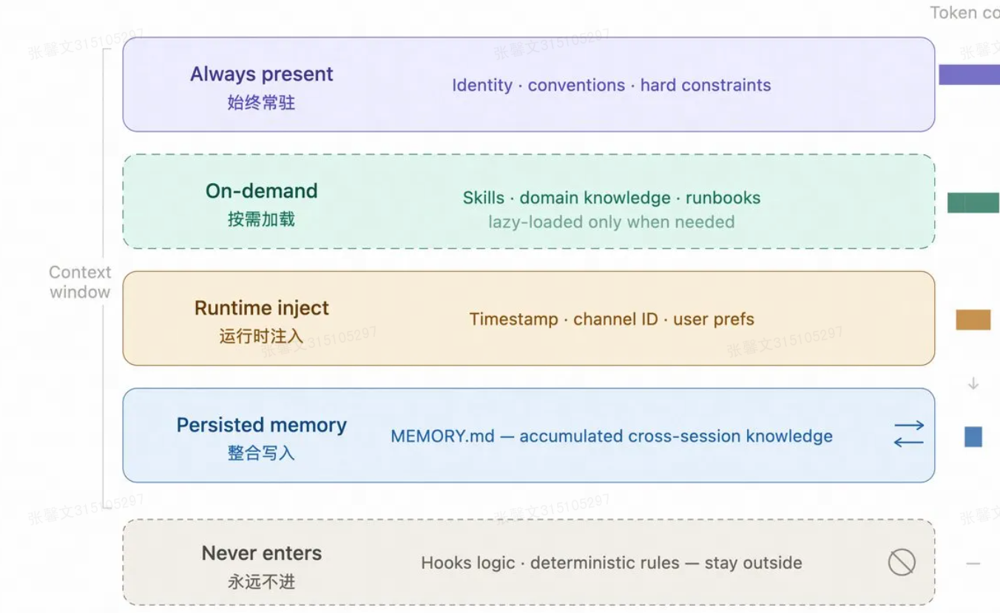
信息分发机制：
- 常驻层：身份定义、项目约定、绝对禁止项等稳定规则
- 按需加载：Skills，领域知识和操作流程
- 运行时注入：当前时间、渠道 ID、用户偏好等动态信息
- 记忆层：跨会话经验写入 MEMORY.md
- 系统层：Hooks 或代码规则处理确定性逻辑

别把确定性逻辑放进上下文，凡是可以通过 Hooks、代码规则或工具约束表达的内容，都应交给外部系统处理，而不是让模型反复读取。

### 压缩策略
压缩目的：在有限上下文预算内优先保留决策价值最高的信息，并把可重建内容（在需要时能从其他信息快速推导或恢复的内容）移出上下文。
策略：
1. 滑动窗口：丢弃旧消息，成本极低，会丢早期上下文，适合简短对话 
2. LLM 摘要：模型生成总结，成本中等，丢细节保留决策，适合长任务，进阶做法是 branch summarization，在摘要时明确保留架构决策、未完成任务和关键约束。
3. 工具结果替换：占位符替换原始输出，成本极低，适合工具调用密集型，工具输出不再保留原始内容，而是用占位符或摘要替换，例如 micro_compact（每轮替换旧工具输出）、auto_compact（上下文超阈值时自动触发归档并摘要），这种方式通常开销最低，因为它主要处理占比最大的工具输出，而不影响核心决策信息。

### Prompt Caching 如何减少重复开销
很多 Agent 的系统提示都很长，但其中大部分内容在整个会话里基本不变，每轮请求都重新编码，等于在重复支付同一段输入成本。

Anthropic API 支持对消息内容块标记 cache_control: { type: "ephemeral" }。首次请求会建立缓存，之后 5 分钟内，相同前缀的请求可以直接复用。被缓存部分的费用可下降约 90%，很适合系统提示较长、调用又频繁的 Agent。是否命中缓存，可以通过 response.usage 里的 cache_read_input_tokens 和 cache_creation_input_tokens 来判断。

### Skills 为什么按需加载
关键点：
1. Skill 描述要短，因为描述本身会常驻上下文，几十个 token 的差异在高频调用里会持续累积
2. Skill 描述要写成路由条件（模型用来决定是否调用这个 Skill 的判断标准），而不是功能介绍（ 对 Skill 做什么的描述）。
3. 至少要说明三件事：什么时候用、什么时候不要用、产出物是什么。最直接的写法是加入 Use when / Don't use when，再补几条反例。很多路由失败不是模型能力问题，是边界写得不清楚。
4. 系统提示里也要把调用规则写明确：每次回复前先扫描 available_skills，有明确匹配时再读取对应 SKILL.md，多个匹配时优先选最具体的那个，没有匹配就不读取，一次只加载一个，重点不是给模型更多自由，而是把路由过程压缩成一个低成本、可重复执行的步骤。

### 压缩问题
问题：压缩阶段最常见的问题，不是摘要不够短，而是保留顺序设错了。
解决：
1. 在 CLAUDE.md 或等价文档里明确写出压缩时的保留优先级：
``` text
### Compact Instructions 如何保留关键信息
保留优先级：
1. 架构决策，不得摘要
2. 已修改文件和关键变更
3. 验证状态，pass/fail
4. 未解决的 TODO 和回滚笔记
5. 工具输出，可删，只保留 pass/fail 结论
```
2. 压缩时不要改动各种标识符。像 UUID、hash、IP、端口、URL、文件名这类值，都必须原样保留，不能改写、简化，也不能凭感觉修正

## 工具设计
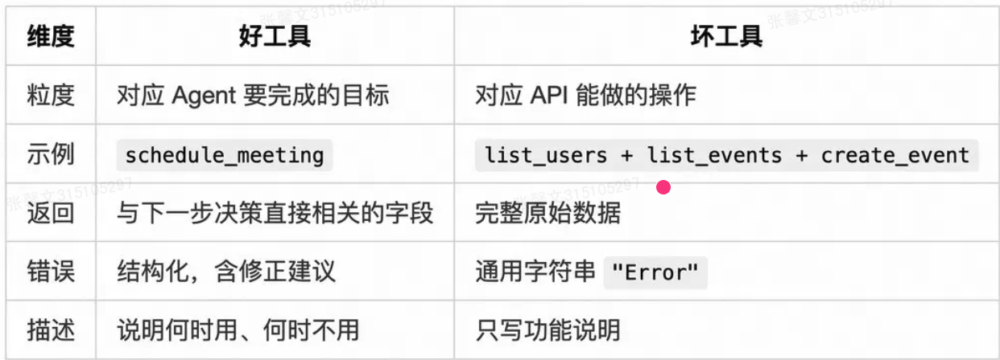
- Tool Search，动态工具发现：别把全部工具定义一次性塞给模型。Agent 通过 search_tools 按需发现工具定义，上下文保留率可达到 95%，Opus 4 的准确率也从 49% 提升到 74%。

- Programmatic Tool Calling，代码编排：别让中间数据一轮轮穿过模型，而是让模型用代码编排多个工具调用，中间结果在执行环境中流转，不进入 LLM 上下文，token 消耗可从约 150,000 降到约 2,000。

- Tool Use Examples，示例驱动：每个工具附带 1-5 个真实调用示例。JSON Schema 只能描述参数类型，但无法表达调用方式，加入示例后，工具调用准确率可从 72% 提升到 90%。

- 参数层防错：在参数定义层面尽量提前约束错误，不依赖 Agent 自行推断。
``` python
# 差：接受相对路径，Agent 容易传错
read_file(path: string)

# 好：参数名 + 描述强制绝对路径
read_file(absolute_path: "必须是绝对路径，如 /home/user/project/src/main.ts")
```

### 工具信息隔离
框架运行过程中会产生一些内部事件：压缩发生了、通知推送了、某个工具调用被跳过了。这些事件需要记在会话历史里，但不应该直接进 LLM，否则模型会看到一堆它不理解的字段，白白消耗 token。

解决方式是在框架层分两种消息类型：一种是给应用层用的 AgentMessage，可以携带 compaction_summary、notification 等任意自定义字段，另一种是真正发给 LLM 的 Message，只保留 user、assistant、tool_result 三种标准类型。调用 LLM 前先过一遍过滤，把模型无法理解的内容剥掉再发送，会话历史可以保留完整的框架状态，LLM 只接收它需要的部分。

## 记忆系统
按照实际解决的问题分为四种：
- 上下文窗口，工作记忆：当前任务所需的最小信息，token 有限，得主动管理
- Skills，程序性记忆：怎么做某件事，操作流程、领域规范，按需加载不默认常驻
- JSONL（JSON Lines = 一种文本格式，每一行都是一个独立的 JSON 对象） 会话历史，情景记忆：发生了什么，磁盘持久化，支持跨会话检索
- MEMORY.md，语义记忆：Agent 主动写入认为重要的事实，每次启动时注入系统提示
左侧：agent 运行时，只有上下文窗口存在于message[]中，随会话结束情况
右侧：磁盘上的持久层，Skills 文件按需加载，JSONL 会话历史保留完整过程并支持检索，MEMORY.md 则沉淀 Agent 主动写入的稳定事实，并在后续会话中持续注入。
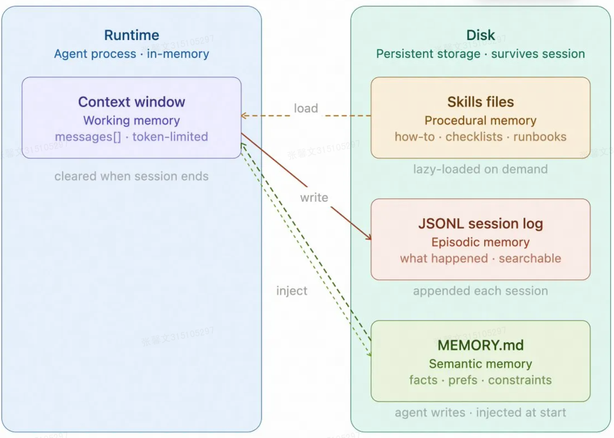

为什么 Claude Code 选择 JSONL：
  ✅ 追加新消息：O(1) 时间复杂度
  ✅ 恢复会话：逐行读取，内存高效
  ✅ 压缩历史：可选择性删除某些行
  ✅ 流式处理：不需要一次性加载整个文件
  ✅ 人类可读：直接用文本编辑器查看
  ✅ 标准格式：易于工具链集成

### 记忆整合如何触发并回退
有了记忆分层之后，下一步要处理的就不是「要不要存」，而是「什么时候整合，以及整合失败怎么办」。
左边是持续增长的对话消息流，中间用 tokenUsage / maxTokens >= 0.5 作为触发阈值。达到阈值后，成功路径会先对待整合消息做 llmSummarize LLM摘要(toConsolidate 待整合消息)，再把摘要追加到 MEMORY.md，最后只更新 lastConsolidatedIndex 上次整合索引，失败路径则把原始消息写入 archive/ 存档，保留完整历史，避免整合失败时丢失上下文。
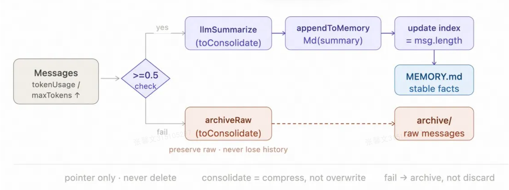
最关键的不是摘要写得多漂亮，而是流程本身必须可回退。整合本质上是压缩，不是覆盖，系统只移动指针，不删除原始消息，即使整合失败，也还能回到原始存档继续工作。

## 自主度应该如何逐步放开
自主度：让 Agent 能在更长时间跨度内稳定推进任务

### 长任务跨 session 继续（文件、git记录进度）
把长任务拆成 Initializer（初始化） Agent 和 Coding Agent 两个角色协作，这种模式最适合代码生成、应用搭建、重构迁移这类单个 session 做不完、但又能拆成一批可验证子任务的工作。

Initializer Agent 只在第一轮运行一次，负责生成 feature-list.json（功能清单）、init.sh（初始化脚本）、初始 git commit 和 claude-progress.txt（进度文件），先把任务变成可持久化的外部状态。后面的多个 session 由 Coding Agent 循环执行，每次从 claude-progress.txt 和 git log 恢复现场，定位当前任务，实现一个功能，跑测试，更新 passes 字段，提交代码后退出。这样即使中途崩溃，也能直接从文件系统里的状态继续，而不是从头再来。
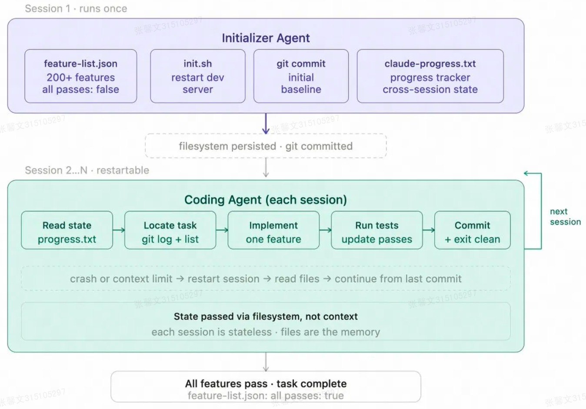
进度要放在文件里，不要放在上下文里，功能清单用 JSON，不用 Markdown，结构化格式更适合模型稳定修改。当 feature-list.json 里所有功能都变成 passes: true，任务才算完成。

### 单个 session 内的进度约束
没有外部进度锚点，Agent 很容易偏航，或者在还有任务未完成时过早结束。
任务状态要显式记录为外部控制对象，而不是留在模型的工作记忆里：
``` JSON
{
  "tasks": [
    {"id": "1", "desc": "读取现有配置", "status": "completed"},
    {"id": "2", "desc": "修改数据库 schema", "status": "in_progress"},
    {"id": "3", "desc": "更新 API 接口", "status": "pending"}
  ]
}
```
约束很简单，同一时间只能有一个 in_progress，每完成一步都先更新状态，再继续下一步，必要时再加轻量校正，例如连续多轮未更新任务状态时，自动注入 <reminder> 提示当前进度。

重点不是多记一份日志，而是把进度从对话里解耦出来，变成外部可查询、可校验、可恢复的控制对象。

### 后台I/O的接入
自主度提高以后，真正容易拖慢主循环的，通常不是模型推理，而是文件操作、网络请求和长耗时命令这类外部 I/O。这些操作一旦阻塞主循环，执行节奏就会明显变差。
务实的做法，是把慢速 subprocess 放到后台线程，通过通知队列在下一轮 LLM 调用前注入结果，主循环不需要感知太多并发细节，只要在每轮开始前检查是否有新结果，再决定继续执行、等待还是调整计划。

这通常比把整个 loop 改造成复杂的 async runtime 更稳，也更容易维护。自主度提高，不是减少控制，而是把控制从对话里的临时记忆，迁移到对话外可恢复的状态和事件流中。

## 多Agent应该如何组织
一说到多 Agent，不少同学先想到的就是并行，但工程上先要解决的其实是隔离和协作，这里对应的是两种完全不同的工作模式。

  传统模式：人 → AI → 人 → AI（频繁交互）
  - 人需要持续参与、反复确认

  统筹者模式：人 → [多个AI并行工作] → 人
  - 人只在起点（设定目标）和终点（审查产出）出现
  - 中间过程完全由Agent独立处理

  多Agent的真正价值

  ❌ 不是：简单地多开几个模型
  ✅ 是：
  - 把人的持续参与转变为最终审核
  - 产出物变成可持久化的工件（分支、PR等）
  - 人可以异步地审查和合并结果
  
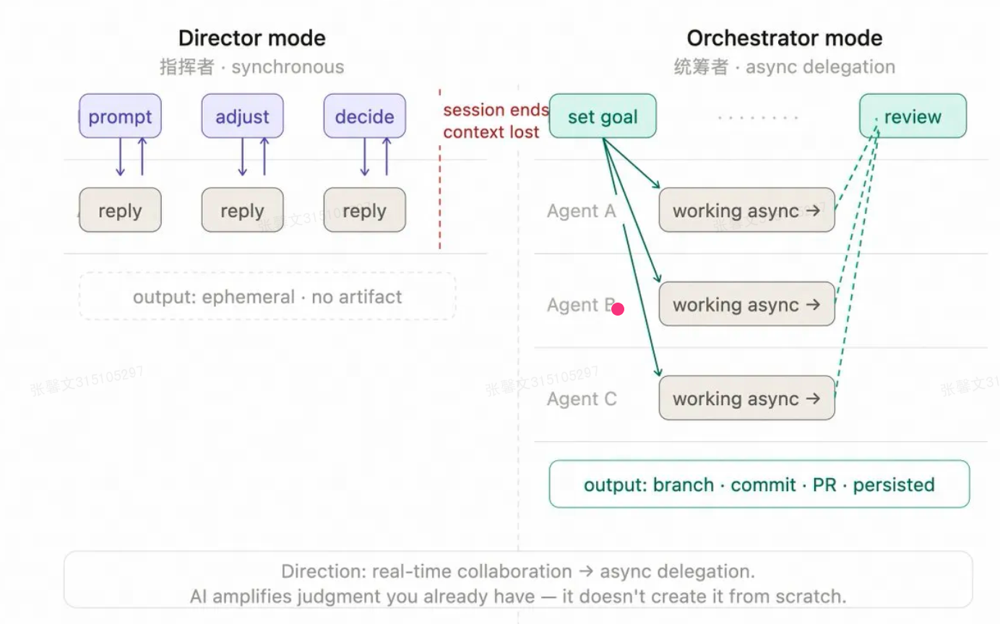
常见的组织方式是主 Agent 作为 Orchestrator(统筹者) 统筹全局，下挂多个子 Agent 独立并行工作。它们之间通过 JSONL inbox（Agent之间的通信机制（结构化消息队列）） 协议通信，用 Worktree 隔离（每个Agent在独立的工作区修改文件，避免冲突）文件修改，用任务图管理（跟踪依赖关系，确保任务按正确顺序执行）依赖关系。
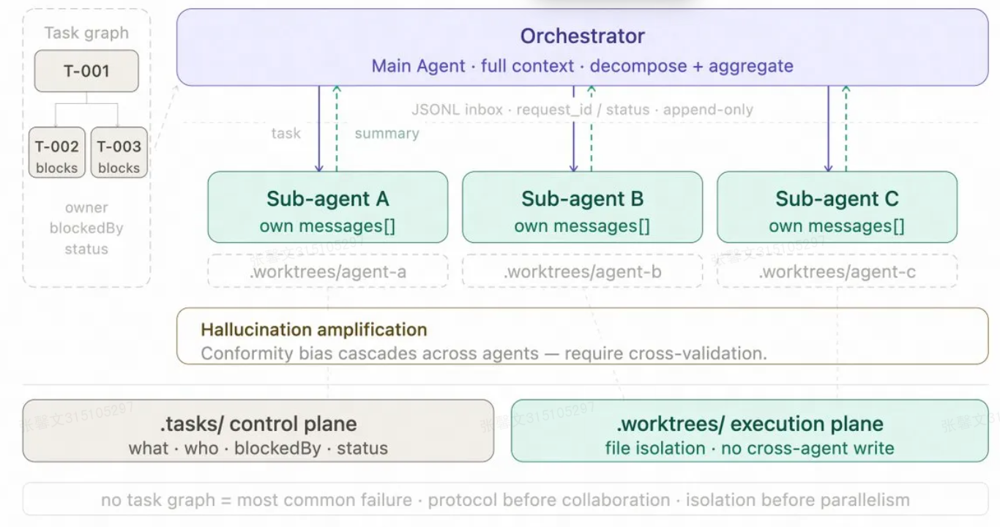

### 为什么协作方式要写成协议

多 Agent 协作一旦靠自然语言来对齐，很快就会出问题。模型记不稳谁承诺了什么，也记不稳谁在等谁的结果，任务开始互相依赖之后，就得先把协议写清楚：
``` TS
// 消息结构：结构化，有状态，append-only，崩溃可恢复
{
  request_id, from_agent, to_agent,
  content,
  status: 'pending' | 'approved' | 'rejected',
  timestamp
}
// 写入：.team/inbox/{agentId}.jsonl，append-only，崩溃可恢复
// 读取：按行解析，按 status 过滤
```
这里至少要先有三样东西，协议、任务图、隔离边界。主 Agent 通过 JSONL 消息队列分派任务给子 Agent，子 Agent 执行后只回摘要，搜索和调试细节留在自己的独立上下文里。.tasks/ 记录任务图和依赖关系，.worktrees/ 隔离每个子 Agent 的文件修改。顺序也别反过来，协议先定，隔离先做，再谈协作和并行。
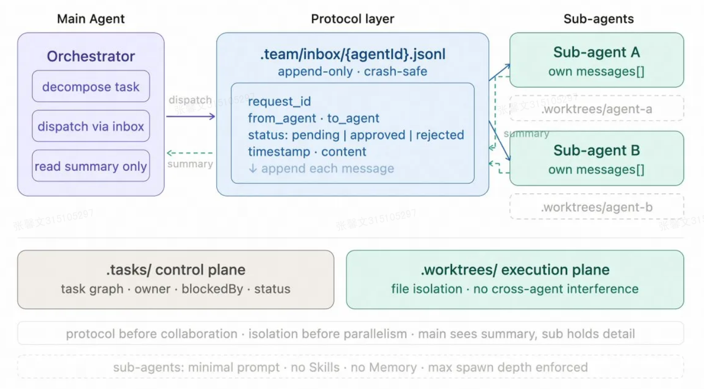
