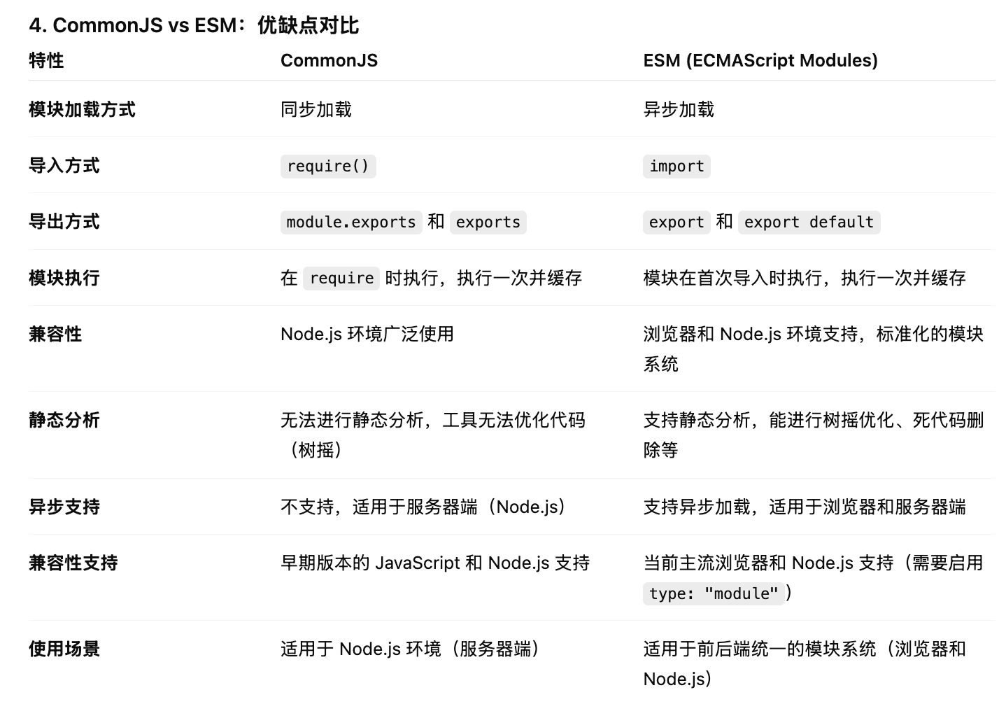

setTimeout：用于只执行一次延迟任务，适合单次延迟执行。

setInterval：用于周期性地重复执行任务，直到被清除，适合实现倒计时、定时任务等。

Proxy：创建一个对象的代理（Proxy）。代理对象能够对原始对象的基本操作（如属性访问、赋值、函数调用等）进行干预和修改。
必须修改proxy的实例才可以触发拦截
基本语法：`let proxy = new Proxy(target, handler);`
    - target：目标对象，Proxy 代理的原始对象。
    - handler：一个对象，用于定义拦截操作的行为，包含一组捕捉器方法。
handler 对象中的方法是用来拦截对象的操作的，这些方法被称为 捕捉器（trap）。常见的捕捉器有：
    - `get(target, prop, receiver)`：拦截对对象属性的读取操作。
    - `set(target, prop, value, receiver)`：拦截对对象属性的设置操作。
    - `has(target, prop)`：拦截 in 运算符。
    - `deleteProperty(target, prop)`：拦截删除属性操作。
    - `apply(target, thisArg, argumentsList)`：拦截函数调用。
    - `construct(target, argumentsList, newTarget)`：拦截 new 操作符创建对象。

Object.defineProperty 方法，该方法可以在一个对象上定义一个新属性，或者修改一个对象的现有属性，并返回这个对象。只能重定义属性的读取（get）和设置（set）行为

Reflect
reflect 不是一个函数对象，因此它是不可构造的。
从 Reflect 对象上可以拿到语言内部的方法。
不管 Proxy 怎么修改默认行为，你总可以在Reflect 上获取默认行为。

模块化的作用：
    - 解决命名冲突
    - 解决空间污染
    - 按需加载
    - 复用、模块化
CJS和ESM的区别

TS（静态类型语言）的主要功能：为JS添加类型系统
优点：
- 有利于代码的静态分析
- 有利于发现错误
- 更好的 IDE 支持，做到语法提示和自动补全
- 提供了代码文档
- 有助于代码重构

缺点：
- 引入了独立的编译步骤
- 丧失了动态类型的代码灵活性
- 增加了编程工作量
- 更高的学习成本
- 兼容性问题

TS 有哪些类型？
- boolean
- string
- number
- bigint
- symbol
- null
- undefined
- object
- array
- tuple
- enum
- any：可以进行任何操作，不会收到任何错误提示
- unknown：比any更安全，对 unknown 类型的变量进行操作时，必须进行类型检查或类型断言
- never
- void

五种原始数据类型（Boolean、String、Number、BigInt、Symbol）都有对应的包装对象
大写类型同时包含包装对象和字面量两种情况，小写类型只包含字面量，不包含包装对象。建议只使用小写类型，不使用大写类型。

