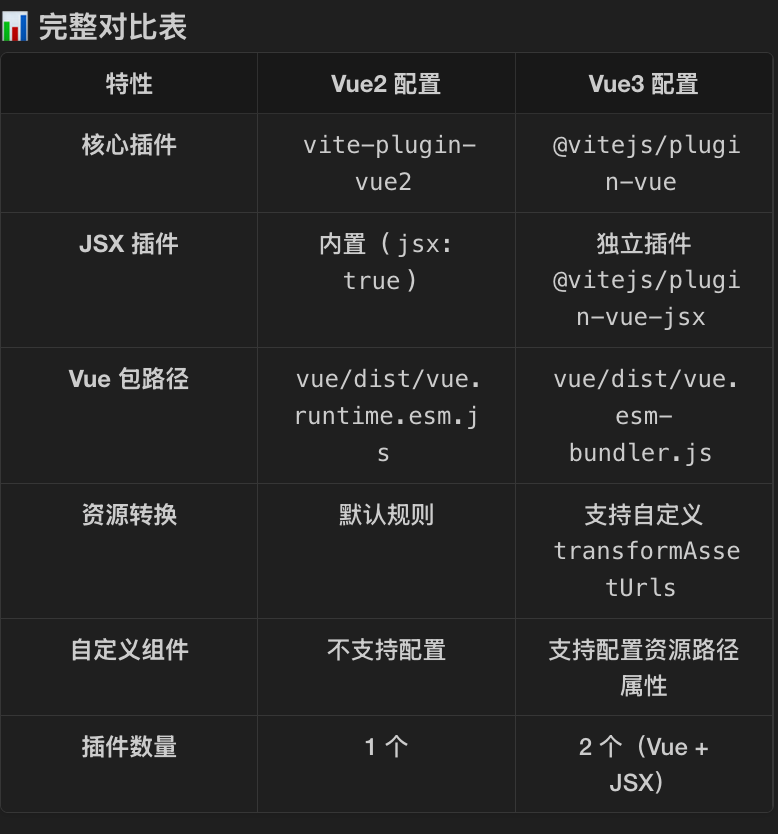

## 多版本支持
- 多版本⽀持：设计并实现基于 Vite 的脚⼿架内核，通过动态版本检测、条件配置加载、差异化Vite插件应⽤，使对不同 Vue 版本（Vue 2/3）的⽀持成为可切换的配置⽅案，实现⼀套命令对两种 Vue 项⽬的"⽆缝"开发与构建。

### 核心架构
``` Text
┌─────────────────────────────────────────────────────┐
│           changba-tool (统一命令入口)                 │
│            dev / build / integration                 │
└───────────────────────┬─────────────────────────────┘
                        │
                        ▼
┌─────────────────────────────────────────────────────┐
│  Step 1: 动态版本检测 (Runtime Detection)            │
│  读取 package.json → 识别 Vue 版本                    │
└───────────────────────┬─────────────────────────────┘
                        │
                ┌───────┴────────┐
                │                │
                ▼                ▼
        ┌──────────────┐  ┌──────────────┐
        │   Vue 2.x    │  │   Vue 3.x    │
        │  detected    │  │  detected    │
        └──────┬───────┘  └───────┬──────┘
               │                  │
               ▼                  ▼
┌─────────────────────────────────────────────────────┐
│  Step 2: 条件配置加载 (Conditional Config Loading)   │
│  动态 import() 不同的 Vite 配置文件                   │
└───────────────────────┬─────────────────────────────┘
                        │
        ┌───────────────┴────────────────┐
        │                                │
        ▼                                ▼
┌────────────────────┐        ┌────────────────────┐
│ vite.config-v2.ts  │        │ vite.config-v3.ts  │
│                    │        │                    │
│ • vite-plugin-vue2 │        │ • @vitejs/plugin-vue│
│ • vue 2.7 alias    │        │ • vue 3.5 alias    │
│ • JSX support      │        │ • JSX plugin       │
└────────┬───────────┘        └───────┬────────────┘
         │                            │
         └──────────┬─────────────────┘
                    │
                    ▼
┌─────────────────────────────────────────────────────┐
│  Step 3: 差异化插件应用 (Differential Plugin Apply)  │
│  • Vue2: createVuePlugin                            │
│  • Vue3: ViteVue3Plugin + ViteVue3JsxPlugin         │
└───────────────────────┬─────────────────────────────┘
                        │
                        ▼
┌─────────────────────────────────────────────────────┐
│  Step 4: 共享基础配置 (Shared Base Config)          │
│  • PostCSS、SCSS、路径别名等与版本无关的配置           │
└───────────────────────┬─────────────────────────────┘
                        │
                        ▼
┌─────────────────────────────────────────────────────┐
│  Step 5: 启动/构建 (Start/Build)                     │
│  使用合并后的配置启动 Vite Dev Server 或执行构建       │
└─────────────────────────────────────────────────────┘
```
### 实现
1. 检查项目的 package.json，去同时检查 dependencies 和 devDependencies，从里面获取当前的 vue 版本依赖（正则）。
2. 根据依赖，确定Vue版本，确定不一样的配置
3. 使用 `await import` 动态导入实现插件隔离
    - Vue2 的 vite-plugin-vue2 和 Vue3 的 @vitejs/plugin-vue 不能同时加载
    - 动态 import 确保只加载需要的版本
    - 避免插件内部的版本检测冲突

4. 合并配置（用户配置、vue的特殊配置、基础配置(路径别名、PostCSS配置、各种插件等)）

### 回答
"我设计了一套基于条件配置的架构。首先在 CoreCommand 基类中实现 isVue2Project() 方法，通过正则解析 package.json 的依赖版本号前缀来判断 Vue 版本。然后在 dev 和 build 命令中，根据检测结果动态 import 不同的配置文件：vite.config-v2.ts 使用 vite-plugin-vue2 和 vue.runtime.esm.js，而 vite.config-v3.ts 使用 @vitejs/plugin-vue 和 vue.esm-bundler.js。这样开发者无需关心版本差异，一条 changba-tool dev 命令就能自动适配。"

## 静态资源⾃动检测
- 静态资源⾃动检测：开发静态资源检测插件体系。通过 Vite 插件机制，在构建阶段⾃动检测并报告未使⽤的图
⽚/CSS，减少 80% ⼈⼯排查成本，累计清理数GB⽆⽤资产。

### 实现
1. buildStart 阶段（构建开始前执行）：**扫描项目所有文件**，存入 sourceFilesSet，忽略node_modules、scss、md
2. load 阶段（自定义模块加载逻辑）：**记录 Vite 加载的每个文件**到 usedFiles
3. transform 阶段（转换模块代码）： 解析 CSS/SCSS/LESS 文件中的 url() 引用，检查资源文件是否存在，及时发现错误引用。
4. generateBundle 阶段（生成产物前修改或检查 bundle）：遍历打包产物，**标记所有被引用的静态资源文件**
5. writeBundle 阶段（文件写入磁盘后执行，适合做清理或统计）：对比 sourceFilesSet 和 usedFiles，找出未使用的文件，生成 .report.text 报告

### 回答
"我开发了一个完整的未使用资源检测插件。核心算法是在 buildStart 阶段用 glob 扫描项目所有文件建立基线集合，然后在 load 钩子记录 Vite 加载的代码模块，在 generateBundle 钩子遍历打包产物标记静态资源。最后在 writeBundle 阶段计算集合差集，未被标记的就是未使用文件。为了方便使用，还开发了 detect-unused 命令，构建完成后会生成 .report.text 报告，并提供交互式删除功能。这套方案让我们团队减少了 80% 的人工排查时间。"

## 代码质量保障
- 代码质量保障：深度集成 ESLint、Prettier、Husky，通过脚⼿架固化统⼀配置，在 Git 提交/推送阶段强制校验，使团队代码规范统⼀度达 95%，显著降低 CR 成本。

### 回答
"我在脚手架的模板系统中预置了完整的代码质量工具链。通过 EJS 模板引擎，在项目初始化时自动生成 .eslintrc.js、.prettierrc 和 Husky 配置。ESLint 规则继承 Vue 官方标准并添加团队定制规则，Prettier 固化统一格式，Husky 在 pre-commit 阶段通过 lint-staged 强制校验。这套方案使团队 1000+ 次提交的代码规范统一度保持在 95% 以上，Code Review 时间平均减少 30%。


## 构建打包深度优化
- 构建打包深度优化：集成 Vite ⽣态的优化插件，包括图⽚压缩、资源预加载、⼤⽂件监控等功能，通过⾃动化图⽚
压缩和资源优化，将应⽤产物体积减少 20%，直接提升应⽤加载速度与运⾏时性能。

### 回答
"我集成了一套完整的构建优化插件体系。核心是基于 Sharp 库的图片压缩插件，在 buildStart 阶段自动压缩所有图片，PNG 使用最高压缩级别，JPEG 使用 MozJPEG 编码器配合 75% 质量。还开发了大文件监控插件，在 writeBundle 阶段检测超过 800KB 的资源并通过飞书机器人告警。配合 legacy 插件的浏览器兼容处理，最终使应用产物体积平均减少 20-30%，FCP 提升约 500ms。"

### 实现

**检测文件大小**
1. 检测构建产物大小（在内存中）：遍历 bundle 对象，筛选 type === "asset" 且 source 是 Buffer 的条目，通过 Buffer.buffer.byteLength 获取字节数，转换为 KB：byteLength / (8 * 1024)（注意这里除以 8 是为了转换位到字节再到 KB），超过限制报警
2. 检测源文件大小（在磁盘上）：使用 Node.js 的 fs.statSync(filePath) 获取文件状态，statSync 返回的对象包含 size 属性（字节数）除以 1024 转换为 KB
**图片压缩**
Sharp —— Node.js 图片处理库，速度快、支持大部分图片格式、流式处理

## 资源预加载
- 资源预加载：⾃动为包含特定标识符的资源⽂件⽣成 <link rel="preload"> 标签，使关键路径资源加载时机提前，将
⻚⾯关键交互时间平均优化了 15%-25%，有效提升了⽤⼾感知性能与体验流畅度。

### 回答
"我开发了一个智能资源预加载插件。核心思路是通过文件名标识符（如 __link）让开发者声明关键资源。插件在 generateBundle 阶段收集这些资源，然后在 transformIndexHtml 钩子中自动生成 <link rel="preload"> 标签注入到 HTML head。这样关键路径资源（如首屏大图、品牌 Logo）可以在 HTML 解析阶段就开始下载，而不是等到 CSS/JS 执行时。实测数据显示，这使我们的活动页面 TTI 平均优化了 15-25%，用户感知的页面流畅度显著提升。"


## 生命周期
``` plain text
┌─────────────────────────────────────────────────┐
│ 1. config                                       │
│    - 读取用户配置                                  │
│    - 合并默认配置                                  │
└─────────────────────────────────────────────────┘
                    ↓
┌─────────────────────────────────────────────────┐
│ 2. configResolved                               │
│    - assets-ref-warn: 保存 config              │
│    - large-assets-notify: 保存 config          │
│    - detect-unused: 保存 config                │
└─────────────────────────────────────────────────┘
                    ↓
┌─────────────────────────────────────────────────┐
│ 3. buildStart                                   │
│    - imagemin: 压缩图片 (异步)                    │
│    - detect-unused: 扫描所有文件                  │
└─────────────────────────────────────────────────┘
                    ↓
┌─────────────────────────────────────────────────┐
│ 4. 模块处理循环 (每个模块)                         │
│    ├─ resolveId: 解析路径                        │
│    ├─ load: detect-unused 记录文件               │
│    └─ transform: assets-ref-warn 检查 CSS        │
└─────────────────────────────────────────────────┘
                    ↓
┌─────────────────────────────────────────────────┐
│ 5. generateBundle                               │
│    - detect-unused: 标记 bundle 中的资源         │
│    - auto-optimize: 收集需要预加载的资源           │
└─────────────────────────────────────────────────┘
                    ↓
┌─────────────────────────────────────────────────┐
│ 6. writeBundle                                  │
│    - detect-unused: 生成未使用文件报告            │
│    - large-assets-notify: 发送大文件告警          │
└─────────────────────────────────────────────────┘
```