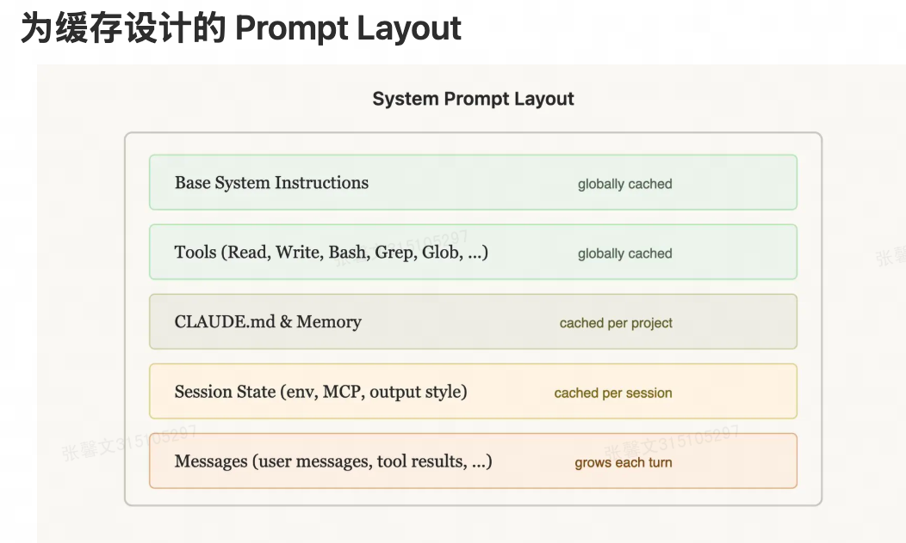
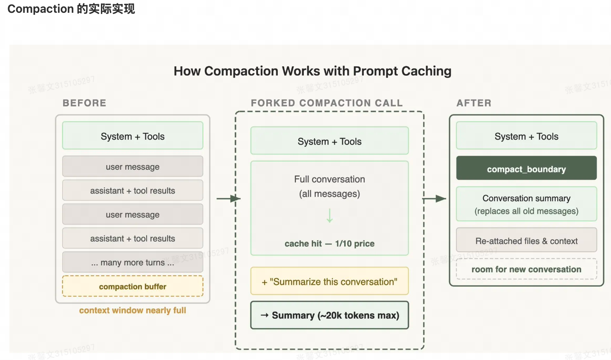
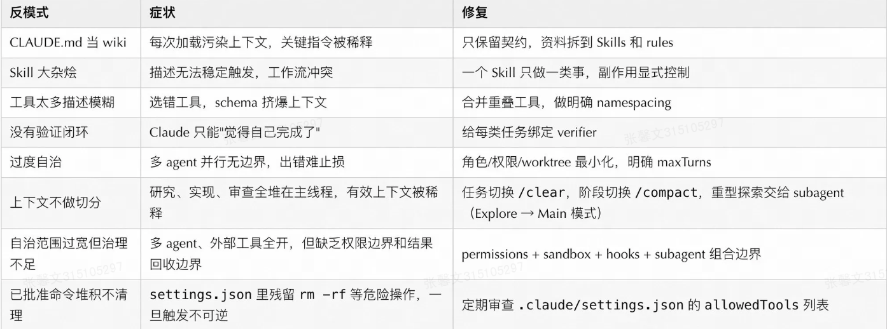

## cc的架构、治理与工程实践
可以把CC拆成6层：

底层运行逻辑

核心是一个反复循环的代理过程：
```JS
收集上下文 → 采取行动 → 验证结果 → [完成 or 回到收集]
     ↑                    ↓
  CLAUDE.md          Hooks / 权限 / 沙箱
  Skills             Tools / MCP
  Memory
```

遇到问题，找到对应的层面进行问题排查


### 上下文工程：重要的系统约束

目前上下文会包括以下内容：
```shell
200K 总上下文
├── 固定开销 (~15-20K)。 → 每个会话都要占用，无法避免
│   ├── 系统指令: ~2K    ——>Claude 的基础行为准则
│   ├── 所有启用的 Skill 描述符: ~1-5K
│   ├── MCP Server 工具定义: ~10-20K  ← 最大隐形杀手
│   └── LSP 状态: ~2-5K (LSP状态的解释：Language Server Protocol（语言服务器协议）在 Claude Code 中加载的类型定义、符号表和系统库信息。 例如加载语言的类型系统、符号定义)
│
├── 半固定 (~5-10K)   → 与项目相关，基本固定
│   ├── CLAUDE.md: ~2-5K 项目规则文档
│   └── Memory: ~1-2K 跨会话记忆
│
└── 动态可用 (~160-180K)   → 实际工作空间，随任务变化
    ├── 对话历史
    ├── 文件内容
    └── 工具调用结果
```                

推荐的上下文分层：原则就是偶尔用的东西不要每次都加载进来
```shell
加载策略 何时加载 使用场景
始终常驻，每个会话都会加载，全局规则    → CLAUDE.md：项目契约 / 构建命令 / 禁止事项
按路径加载，处理该文件/目录时，特定语言或目录的规则  → rules：语言 / 目录 / 文件类型特定规则
按需加载，任务需要时主动加载，工作流、领域知识    → Skills：工作流 / 领域知识
隔离加载，Subagent内执行，大量探索、并行研究    → Subagents：大量探索 / 并行研究
不进上下文，编译后执行，确定性检查、阻断恶意操作  → Hooks：确定性脚本 / 审计 / 阻断
```
上下文最佳实践：
- 保持 CLAUDE.md 短、硬、可执行，优先写命令、约束、架构边界。Anthropic 官方自己的 CLAUDE.md 大约只有 2.5K tokens，可以参考
- 把大型参考文档拆到 Skills 的 supporting files，不要塞进 SKILL.md 正文
- 使用 .claude/rules/ 做路径/语言规则，不让根 CLAUDE.md 承担所有差异
- 长会话主动用 /context 观察消耗，不要等系统自动压缩后再补救
- 任务切换优先 /clear，同一任务进入新阶段用 /compact
- 把 Compact Instructions 写进 CLAUDE.md，压缩后必须保留什么由你控制，不由算法猜

#### 解决压缩机制的陷阱
解决办法：
1. 在 CLAUDE.md 声明Compact Instructions
``` text
## 压缩指令

在压缩时，按优先级顺序保留以下内容：

1. 架构决策（绝不总结）
   → 为什么选择某技术栈、为什么拆分模块、关键设计权衡
   → 如果丢失，AI 会重复讨论已决策的问题，浪费 Token

2. 修改过的文件及其关键改动
   → 哪些文件被修改了、改动的核心逻辑是什么
   → 如果丢失，AI 不知道当前状态，可能重复编写或冲突

3. 当前验证状态（通过/失败）
   → 测试通过了吗？哪些测试失败了？
   → 如果丢失，AI 可能重复测试，或引入已知的 Bug

4. 未完成的待办项和回滚笔记
   → 还有哪些任务没做？如果出错应该回滚到哪里？
   → 如果丢失，任务可能被遗忘或陷入死循环

5. 工具输出（可删除，仅保留通过/失败结果）
   → 运行 npm install、curl API 返回的完整日志可以删掉
   → 但必须保留"成功"或"失败"的结论
   → 这样节省空间，又不丢失关键信息
```
2. 在开新对话之前写一份 HANDOFF.md ，把当前进度、尝试过什么、哪些走通了、哪些是死路、下一步该做什么写清楚。下一个 Claude 实例只读这个文件就能接着做，不依赖压缩算法的摘要质量。

### Skills设计
一个好Skill应该满足什么：
- 描述要让模型知道"何时该用我"，而不是"我是干什么的"，这两个差很多
- 有完整步骤、输入、输出和停止条件，别写了个开头没有结尾
- 正文只放导航和核心约束，大资料拆到 supporting files 里
- 有副作用（指的是对外部系统产生持久影响、不可逆或需要用户明确授权的操作）的 Skill 要显式设置 disable-model-invocation: true（在yaml头部）（cc不能自动调用），设置后，skill 的描述不会被加载进 Claude 的上下文，它根本不会"想起"这个 skill 的存在，只有你手动输入 /deploy 时才会执行。

### 工具设计：让CC少选错

设计原则：
- 名称前缀按系统或资源分层：github_pr_*、jira_issue_*，前缀能缩小候选范围
- 对大响应（浪费context和token；有许多无关信息，导致注意力偏移）支持 response_format: concise（返回关键字段） / detailed（返回完整信息）
- 错误响应要教模型如何修正，不要只抛 opaque error code，把错误内容内嵌到错误响应里面，让模型在运行时自我修正
- 能合并成高层任务工具时，不要暴露过多底层碎片工具，避免 list_all_* 让模型自行筛选，让工具承担数据筛选的职责，而不是把这个负担甩给模型。

什么时候不该再加 Tool：
1. 本地 shell 可以可靠完成的事情 - 如果 bash/zsh 已经能稳定地完成任务，就没必要创建新工具
2. 模型只需要静态知识 - 不需要与外部系统交互的纯知识问题，工具反而会增加复杂性
3. 需求更适合 Skill 的工作流 - 如果任务需要特定的交互流程或约束，Skill 可能比 Tool 更合适
4. 未验证工具的稳定性 - 工具描述、schema 和返回格式还不确定能被模型稳定使用时，不应该匆忙推出

### Hooks：在 Claude 执行操作前后，强制插入你自己的逻辑
作用：允许你在特定事件发生时自动执行 shell 命令。它们是事件驱动的自动化机制。
hooks 在设置文件中设置行为
本质是：                                                                                                                 
  - 事件监听器 - 监听 Claude Code 中发生的特定事件
  - 自动触发器 - 当事件发生时，自动执行预定义的 shell 命令
  - 用户可配置 - 在设置中定义哪些命令在哪些事件时执行

使用场景：
  1. 代码质量检查 - 在提交前自动运行 linter 或格式化工具
  2. 自动化测试 - 执行测试套件
  3. 预处理 - 在执行操作前进行验证或准备
  4. 日志记录 - 自动记录操作历史
  5. 集成外部工具 - 与 Git、CI/CD 或其他工具集成
适合：阻断修改受保护文件、Edit 后自动格式化/lint/轻量校验、SessionStart 后注入动态上下文（Git 分支、环境变量）、任务完成后推送通知。
不适合：需要读大量上下文的复杂语义判断、长时间运行的业务流程、需要多步推理和权衡的决策，这些该在 Skill 或 Subagent 里。

重要特性：
  - 反馈机制 - 如果 Hook 执行失败或有输出，我会看到这些反馈并相应调整我的行为
  - 用户控制 - 你完全控制哪些 Hooks 被启用，以及它们执行什么命令
  - 透明性 - Hook 的执行结果会被报告给我和用户

Hooks：越早返现错误，越省时间

注意限制输出长度（| head -30），避免 Hook 输出反而污染上下文。

Hooks + Skills + CLAUDE.md 三层叠加
- CLAUDE.md：声明"提交前必须通过测试和 lint"
- Skill：告诉 Claude 在什么顺序下运行测试、如何看失败、如何修复
- Hook：对关键路径执行硬性校验，必要时阻断

### Subagents：派一个独立的 Claude 去干一件具体的事
Subagent 就是从主对话派出去的一个独立 Claude 实例，有自己的上下文窗口、只用你指定的工具、干完汇报结果。核心价值不是"并行"，而是隔离，扫代码库、跑测试、做审查这类会产生大量输出的事，交给 Subagent 做，主线程只拿摘要，不会被中间过程污染。Claude Code 内置了 Explore（只读扫库，快速理解和搜索代码，跑 Haiku 省成本）、Plan（规划调研）、General-purpose（通用），也可以自定义。

配置时要显式约束：
- tools / disallowedTools：限定能用什么工具，别给和主线程一样宽的权限
- model：探索任务用 Haiku/Sonnet，重要审查用 Opus
- maxTurns：防止跑飞
- isolation: worktree：需要动文件时隔离文件系统

另一个实用细节：长时间运行的 bash 命令可以按 Ctrl+B 移到后台，Claude 之后会用 BashOutput 工具查看结果，不会阻塞主线程继续工作。subagent 同理，直接告诉它「在后台跑」就行。

几个常见反模式：
- 子代理权限和主线程一样宽，隔离没有意义
- 输出格式不固定，主线程拿到没法用
- 子任务之间强依赖，频繁要共享中间状态，这种情况用 Subagent 不合适

### Prompt Caching： cc内部架构的核心

Prompt 缓存是按**前缀匹配**工作的，从请求开头到每个 cache_control 断点之前的内容都会被缓存。所以这里的顺序很重要：只有前面的"稳定部分"才能被缓存，一旦某个位置变化，后续所有内容都失效。
``` text
Claude Code 的 Prompt 顺序：
1. System Prompt AI的身份、指导原则 → 静态，锁定，每次都一样
2. Tool Definitions 可用的工具说明 → 静态，锁定
3. Chat History 每轮用户和AI的信息回答 → 动态，在后面
4. 当前用户输入 → 最后
```
破坏缓存的常见陷阱:
- 在静态系统 Prompt 中放入带时间戳的内容（让它每次都变）
- 非确定性地打乱工具定义顺序
- 会话中途增删工具

那像当前时间这种动态信息怎么办？别去动系统 Prompt，放到下一条消息里传进去就行。Claude Code 自己也是这么做的，用户消息里加 <system-reminder> 标签，系统 Prompt 不动，缓存也就不会被打坏。

总结：Prompt Caching 就像一个"聪明的记忆系统"，只要你保持前面的内容稳定，后面再加新内容就能复用之前的计算。破坏它的唯一方式就是改变前面已缓存的部分。

会话中途不要切换模型：新的模型会重建整个缓存，消耗更多token，想切换，使用Subagent交接，给出交接信息给另一个模型。

上下文压缩的执行流程如下图所示：

左边：上下文快满的状态
中间：开一个fork调用，把完整对话历史+“Summarize this conversation”，命中缓存，1/10的价格完成压缩
右边：完成压缩，对话被替换为20k token的摘要，再挂上之前用到的文件引用，腾出空间继续对话

defer_loading：工具的延迟加载
Claude Code 有数十个 MCP 工具，每次请求全量包含会很贵，但中途移除会破坏缓存。解决方案是发送轻量级 stub（占位符），比完整定义节省80%，只有工具名，标记 defer_loading: true。模型通过 ToolSearch 工具"发现"它们，完整的工具 schema 只在模型选择后才加载，这样缓存前缀保持稳定，缓存命中率高。

### 验证闭环：没有Verifier就没有工程上的Agent
Verifier的层级：
- 最低层：命令退出码、lint、typecheck、unit test
- 中间层：集成测试、截图对比、contract test、smoke test
- 更高层：生产日志验证、监控指标、人工审查清单

在 Prompt、Skill 和 CLAUDE.md 中显式定义验证，吧验收标准提前说清楚
``` text
验收标准
后端改动：
运行 make test 和 make lint
API 改动：更新 tests/contracts/ 下的契约测试
UI 改动：
如果有可视化改动，提供前后截图
完成定义（Done 条件）：
所有测试通过
Lint 通过
没有遗留 TODO，除非已经明确记录在案（显式追踪）
```

### 高频命令的工程意义
主动管理上下文，别等系统自己处理
上下文管理指令：
``` shell
/context   # 查看 token 占用结构，排查 MCP 和文件读取占比
/clear     # 清空会话，同一问题被纠偏两次以上就重来
/compact   # 压缩但保留重点，配合 Compact Instructions
/memory    # 确认哪些 CLAUDE.md 真的被加载了
```
能力与治理
``` shell
/mcp       # 管理 MCP 连接，检查 token 成本，断开闲置 server
/hooks     # 管理 hooks，控制平面入口
/permissions # 查看或更新权限白名单
/sandbox   # 配置沙箱隔离，高自动化场景必备
/model     # 切换模型：Opus 用于深度推理，Sonnet 用于常规，Haiku 用于快速探索
```
会话连续性与并行
``` shell
claude --continue               # 恢复当前目录最近会话，隔天接着做
claude --resume                 # 打开选择器恢复历史会话
claude --continue --fork    # 从已有会话分叉，同一起点不同方案
claude --worktree              # 创建隔离 git worktree
claude -p "prompt"            # 非交互模式，接入 CI / pre-commit / 脚本
claude -p --output-format json  # 结构化输出，便于脚本消费
```
好用不常见指令
- /simplify：对刚改完的代码做三维检查，代码复用、质量和效率，发现问题直接修掉。特别适合改完一段逻辑后立刻跑一遍，代替手动 review。

- /rewind：不是"撤销"，而是回到某个会话 checkpoint 重新总结。适合：Claude 已沿错误路径探索太久；想保留前半段共识但丢掉后半段失败。

- /btw：在不打断主任务的前提下快速问一个侧问题，适合"两个命令有什么区别"这类单轮旁路问答，不适合需要读仓库或调用工具的问题。

- claude -p --output-format stream-json：实时 JSON 事件流，适合长任务监控、增量处理、流式集成到自己的工具。

- /insight：让 Claude 分析当前会话，提炼出哪些内容值得沉淀到 CLAUDE.md。用法是会话做了一段之后跑一次，它会指出"这个约定你们反复提到，但没有写进契约"之类的盲点，是迭代优化 CLAUDE.md 的好手段。

- 双击 ESC 回溯：按两次 ESC 可以回到上一条输入重新编辑，不用重新手打。Claude 走偏了、或者上一句话没说清楚，双击 ESC 修改后重发，比重新开会话省事得多。

- 对话历史都在本地：所有会话记录存放在 ~/.claude/projects/ 下，文件夹名按项目路径命名（斜杠变横杠），每个会话是一个 .jsonl 文件。想找某个话题的历史，直接 grep -rl "关键词" ~/.claude/projects/ 就能定位，或者直接告诉 Claude「帮我搜一下之前关于 X 的讨论」，它会自己去翻。

### 如何写一个好的 CLAUDE.md
只放那些每次会话都得成立的事。输入 # 可以把当前对话里的内容直接追加进 CLAUDE.md，或者直接告诉 Claude「把这条加到项目的 CLAUDE.md 里」，它会知道该改哪个文件。

应该放什么哪些内容：
- 怎么 build、怎么 test、怎么跑（最核心）
- 关键目录结构与模块边界
- 代码风格和命名约束
- 那些不明显的环境坑
- 绝对不能干的事（NEVER 列表）
- 压缩时必须保留的信息（Compact Instructions）
高质量模版：
``` text
# Project Contract

## Build And Test

- Install: `pnpm install`
- Dev: `pnpm dev`
- Test: `pnpm test`
- Typecheck: `pnpm typecheck`
- Lint: `pnpm lint`

## Architecture Boundaries

- HTTP handlers live in `src/http/handlers/`
- Domain logic lives in `src/domain/`
- Do not put persistence logic in handlers
- Shared types live in `src/contracts/`

## Coding Conventions

- Prefer pure functions in domain layer
- Do not introduce new global state without explicit justification
- Reuse existing error types from `src/errors/`

## Safety Rails

## NEVER

- Modify `.env`, lockfiles, or CI secrets without explicit approval
- Remove feature flags without searching all call sites
- Commit without running tests

## ALWAYS

- Show diff before committing
- Update CHANGELOG for user-facing changes

## Verification

- Backend changes: `make test` + `make lint`
- API changes: update contract tests under `tests/contracts/`
- UI changes: capture before/after screenshots

## Compact Instructions

Preserve:

1. Architecture decisions (NEVER summarize)
2. Modified files and key changes
3. Current verification status (pass/fail commands)
4. Open risks, TODOs, rollback notes
```
使用：每次都要知道的放 CLAUDE.md，只对部分文件生效的放 rules，只在某类任务中需要的放 Skills。

### 项目经验
项目：https://github.com/tw93/Kaku
经验：
1. 环境透明：新建一个doctor命令，统一收集环境状态、依赖和配置情况信息，输出结构化健康报告，每次做事前跑一次
2. hooks实践：两套语言，按照文件类型进行检查触发
```JSON
{
  "hooks": {
    "PostToolUse": [
      {
        "matcher": "Edit",
        "pattern": "*.rs",
        "hooks": [{
          "type": "command",
          "command": "cargo check 2>&1 | head -30",
          "statusMessage": "Checking Rust..."
        }]
      },
      {
        "matcher": "Edit",
        "pattern": "*.lua",
        "hooks": [{
          "type": "command",
          "command": "luajit -b $FILE /dev/null 2>&1 | head -10",
          "statusMessage": "Checking Lua syntax..."
        }]
      }
    ]
  }
}
```
3. 工程化布局参考
``` plain text
Project/
├── CLAUDE.md
├── .claude/
│   ├── rules/
│   │   ├── core.md
│   │   ├── config.md
│   │   └── release.md
│   ├── skills/
│   │   ├── runtime-diagnosis/     # 统一收集日志、状态和依赖
│   │   ├── config-migration/      # 配置迁移回滚防污
│   │   ├── release-check/         # 发布前校验、smoke test
│   │   └── incident-triage/       # 线上故障分诊
│   ├── agents/
│   │   ├── reviewer.md
│   │   └── explorer.md
│   └── settings.json
└── docs/
    └── ai/
        ├── architecture.md
        └── release-runbook.md
```
全局约束（CLAUDE.md）、路径约束（rules）、工作流（skills）和架构细节完全解耦，Claude Code 的执行稳定性会显著上升。假如你同时维护多个项目，可以把稳定的个人基线放在 ~/.claude/，各项目的差异放在项目级 .claude/，通过同步脚本分发，不同项目之间就不会互相污染了。

### 常见反模式


### 配置健康检查
一个开源 Skill 项目tw93/claude-health，可以一键检查你的 Claude Code 配置现在处于什么状态。
`npx skills add tw93/claude-health`
装好之后在任意会话里跑 /health，它会自动识别项目复杂度，对 CLAUDE.md、rules、skills、hooks、allowedTools 和实际行为模式各跑一遍检查，输出一份优先级报告：需要立刻修 / 结构性问题 / 可以慢慢做。