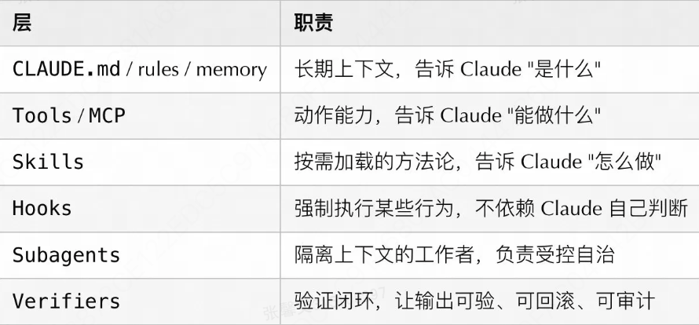
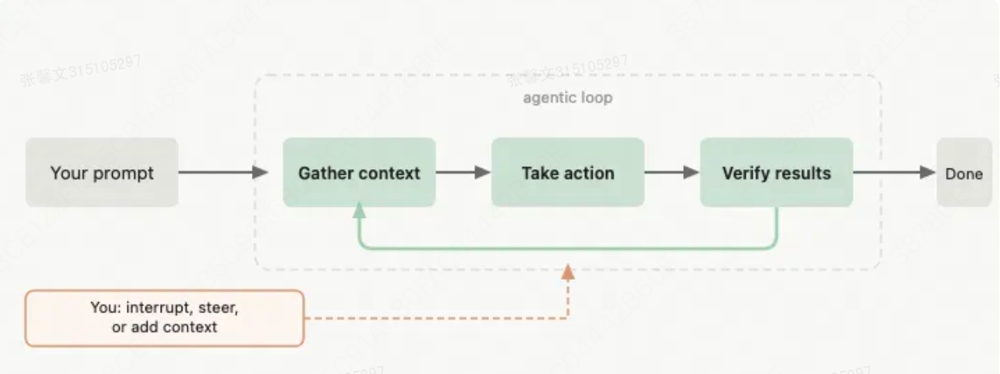
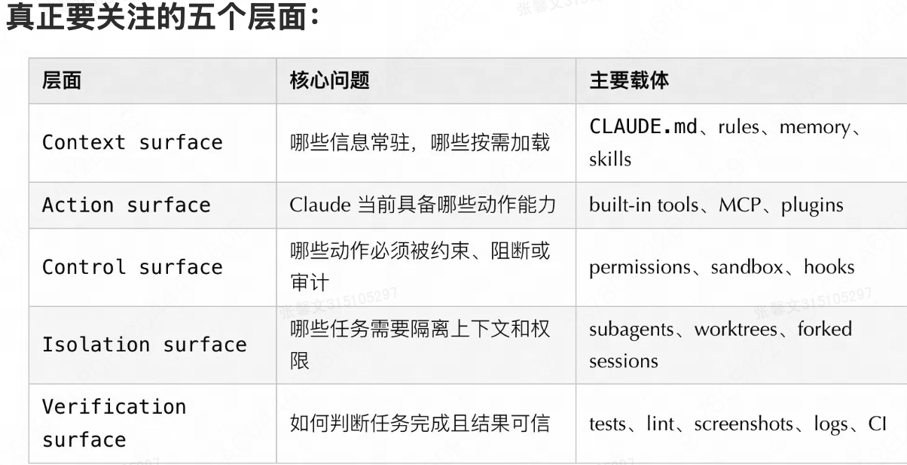
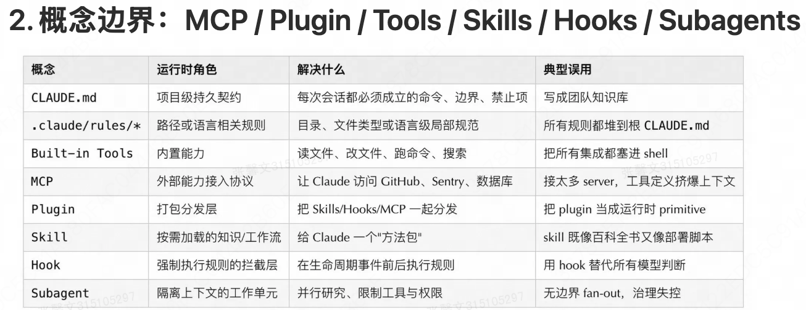
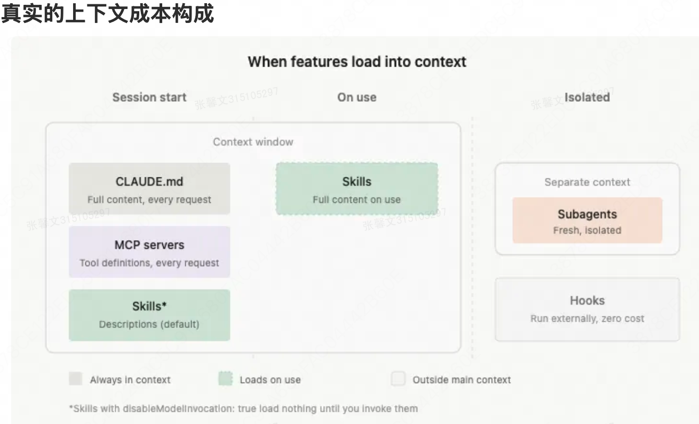
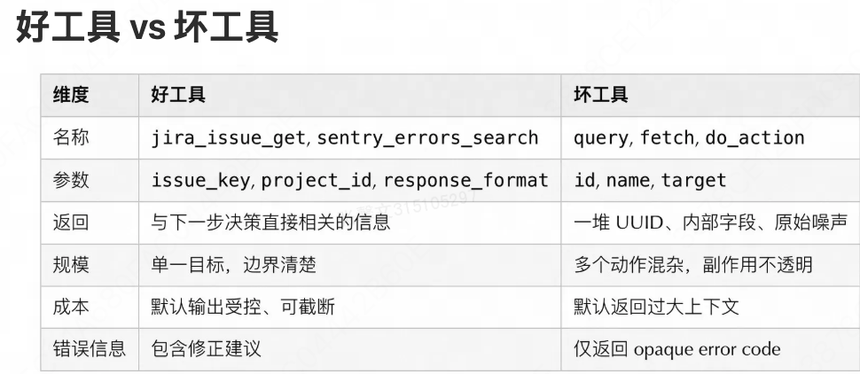
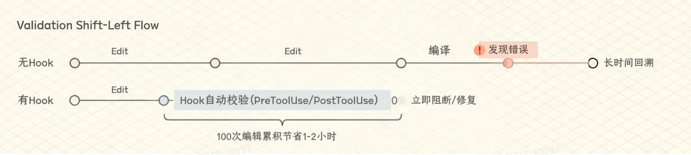

## cc的架构、治理与工程实践
可以把CC拆成6层：

底层运行逻辑

核心是一个反复循环的代理过程：
```JS
收集上下文 → 采取行动 → 验证结果 → [完成 or 回到收集]
     ↑                    ↓
  CLAUDE.md          Hooks / 权限 / 沙箱
  Skills             Tools / MCP
  Memory
```

遇到问题，找到对应的层面进行问题排查


### 上下文工程：重要的系统约束

目前上下文会包括以下内容：
```shell
200K 总上下文
├── 固定开销 (~15-20K)。 → 每个会话都要占用，无法避免
│   ├── 系统指令: ~2K    ——>Claude 的基础行为准则
│   ├── 所有启用的 Skill 描述符: ~1-5K
│   ├── MCP Server 工具定义: ~10-20K  ← 最大隐形杀手
│   └── LSP 状态: ~2-5K (LSP状态的解释：Language Server Protocol（语言服务器协议）在 Claude Code 中加载的类型定义、符号表和系统库信息。 例如加载语言的类型系统、符号定义)
│
├── 半固定 (~5-10K)   → 与项目相关，基本固定
│   ├── CLAUDE.md: ~2-5K 项目规则文档
│   └── Memory: ~1-2K 跨会话记忆
│
└── 动态可用 (~160-180K)   → 实际工作空间，随任务变化
    ├── 对话历史
    ├── 文件内容
    └── 工具调用结果
```                

推荐的上下文分层：原则就是偶尔用的东西不要每次都加载进来
```shell
加载策略 何时加载 使用场景
始终常驻，每个会话都会加载，全局规则    → CLAUDE.md：项目契约 / 构建命令 / 禁止事项
按路径加载，处理该文件/目录时，特定语言或目录的规则  → rules：语言 / 目录 / 文件类型特定规则
按需加载，任务需要时主动加载，工作流、领域知识    → Skills：工作流 / 领域知识
隔离加载，Subagent内执行，大量探索、并行研究    → Subagents：大量探索 / 并行研究
不进上下文，编译后执行，确定性检查、阻断恶意操作  → Hooks：确定性脚本 / 审计 / 阻断
```
上下文最佳实践：
- 保持 CLAUDE.md 短、硬、可执行，优先写命令、约束、架构边界。Anthropic 官方自己的 CLAUDE.md 大约只有 2.5K tokens，可以参考
- 把大型参考文档拆到 Skills 的 supporting files，不要塞进 SKILL.md 正文
- 使用 .claude/rules/ 做路径/语言规则，不让根 CLAUDE.md 承担所有差异
- 长会话主动用 /context 观察消耗，不要等系统自动压缩后再补救
- 任务切换优先 /clear，同一任务进入新阶段用 /compact
- 把 Compact Instructions 写进 CLAUDE.md，压缩后必须保留什么由你控制，不由算法猜

#### 解决压缩机制的陷阱
解决办法：
1. 在 CLAUDE.md 声明Compact Instructions
``` text
## 压缩指令

在压缩时，按优先级顺序保留以下内容：

1. 架构决策（绝不总结）
   → 为什么选择某技术栈、为什么拆分模块、关键设计权衡
   → 如果丢失，AI 会重复讨论已决策的问题，浪费 Token

2. 修改过的文件及其关键改动
   → 哪些文件被修改了、改动的核心逻辑是什么
   → 如果丢失，AI 不知道当前状态，可能重复编写或冲突

3. 当前验证状态（通过/失败）
   → 测试通过了吗？哪些测试失败了？
   → 如果丢失，AI 可能重复测试，或引入已知的 Bug

4. 未完成的待办项和回滚笔记
   → 还有哪些任务没做？如果出错应该回滚到哪里？
   → 如果丢失，任务可能被遗忘或陷入死循环

5. 工具输出（可删除，仅保留通过/失败结果）
   → 运行 npm install、curl API 返回的完整日志可以删掉
   → 但必须保留"成功"或"失败"的结论
   → 这样节省空间，又不丢失关键信息
```
2. 在开新对话之前写一份 HANDOFF.md ，把当前进度、尝试过什么、哪些走通了、哪些是死路、下一步该做什么写清楚。下一个 Claude 实例只读这个文件就能接着做，不依赖压缩算法的摘要质量。

### Skills设计
一个好Skill应该满足什么：
- 描述要让模型知道"何时该用我"，而不是"我是干什么的"，这两个差很多
- 有完整步骤、输入、输出和停止条件，别写了个开头没有结尾
- 正文只放导航和核心约束，大资料拆到 supporting files 里
- 有副作用（指的是对外部系统产生持久影响、不可逆或需要用户明确授权的操作）的 Skill 要显式设置 disable-model-invocation: true（在yaml头部）（cc不能自动调用），设置后，skill 的描述不会被加载进 Claude 的上下文，它根本不会"想起"这个 skill 的存在，只有你手动输入 /deploy 时才会执行。

### 工具设计：让CC少选错

设计原则：
- 名称前缀按系统或资源分层：github_pr_*、jira_issue_*，前缀能缩小候选范围
- 对大响应（浪费context和token；有许多无关信息，导致注意力偏移）支持 response_format: concise（返回关键字段） / detailed（返回完整信息）
- 错误响应要教模型如何修正，不要只抛 opaque error code，把错误内容内嵌到错误响应里面，让模型在运行时自我修正
- 能合并成高层任务工具时，不要暴露过多底层碎片工具，避免 list_all_* 让模型自行筛选，让工具承担数据筛选的职责，而不是把这个负担甩给模型。

什么时候不该再加 Tool：
1. 本地 shell 可以可靠完成的事情 - 如果 bash/zsh 已经能稳定地完成任务，就没必要创建新工具
2. 模型只需要静态知识 - 不需要与外部系统交互的纯知识问题，工具反而会增加复杂性
3. 需求更适合 Skill 的工作流 - 如果任务需要特定的交互流程或约束，Skill 可能比 Tool 更合适
4. 未验证工具的稳定性 - 工具描述、schema 和返回格式还不确定能被模型稳定使用时，不应该匆忙推出

### Hooks：在 Claude 执行操作前后，强制插入你自己的逻辑
作用：允许你在特定事件发生时自动执行 shell 命令。它们是事件驱动的自动化机制。
hooks 在设置文件中设置行为
本质是：                                                                                                                 
  - 事件监听器 - 监听 Claude Code 中发生的特定事件
  - 自动触发器 - 当事件发生时，自动执行预定义的 shell 命令
  - 用户可配置 - 在设置中定义哪些命令在哪些事件时执行

使用场景：
  1. 代码质量检查 - 在提交前自动运行 linter 或格式化工具
  2. 自动化测试 - 执行测试套件
  3. 预处理 - 在执行操作前进行验证或准备
  4. 日志记录 - 自动记录操作历史
  5. 集成外部工具 - 与 Git、CI/CD 或其他工具集成
适合：阻断修改受保护文件、Edit 后自动格式化/lint/轻量校验、SessionStart 后注入动态上下文（Git 分支、环境变量）、任务完成后推送通知。
不适合：需要读大量上下文的复杂语义判断、长时间运行的业务流程、需要多步推理和权衡的决策，这些该在 Skill 或 Subagent 里。

重要特性：
  - 反馈机制 - 如果 Hook 执行失败或有输出，我会看到这些反馈并相应调整我的行为
  - 用户控制 - 你完全控制哪些 Hooks 被启用，以及它们执行什么命令
  - 透明性 - Hook 的执行结果会被报告给我和用户

Hooks：越早返现错误，越省时间

注意限制输出长度（| head -30），避免 Hook 输出反而污染上下文。

Hooks + Skills + CLAUDE.md 三层叠加
- CLAUDE.md：声明"提交前必须通过测试和 lint"
- Skill：告诉 Claude 在什么顺序下运行测试、如何看失败、如何修复
- Hook：对关键路径执行硬性校验，必要时阻断

### Subagents：派一个独立的 Claude 去干一件具体的事
Subagent 就是从主对话派出去的一个独立 Claude 实例，有自己的上下文窗口、只用你指定的工具、干完汇报结果。核心价值不是"并行"，而是隔离，扫代码库、跑测试、做审查这类会产生大量输出的事，交给 Subagent 做，主线程只拿摘要，不会被中间过程污染。Claude Code 内置了 Explore（只读扫库，快速理解和搜索代码，跑 Haiku 省成本）、Plan（规划调研）、General-purpose（通用），也可以自定义。

配置时要显式约束：
- tools / disallowedTools：限定能用什么工具，别给和主线程一样宽的权限
- model：探索任务用 Haiku/Sonnet，重要审查用 Opus
- maxTurns：防止跑飞
- isolation: worktree：需要动文件时隔离文件系统

另一个实用细节：长时间运行的 bash 命令可以按 Ctrl+B 移到后台，Claude 之后会用 BashOutput 工具查看结果，不会阻塞主线程继续工作。subagent 同理，直接告诉它「在后台跑」就行。

几个常见反模式：
- 子代理权限和主线程一样宽，隔离没有意义
- 输出格式不固定，主线程拿到没法用
- 子任务之间强依赖，频繁要共享中间状态，这种情况用 Subagent 不合适

### Prompt Caching： cc内部架构的核心