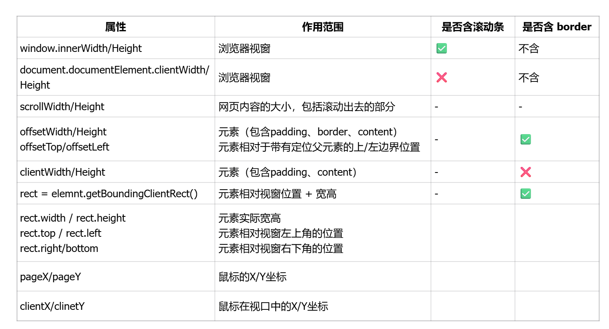

1. 有关获取视窗、页面、元素的宽高的属性

2. Margin塌陷问题如何解决？BFC是什么？如何触发BFC？
1. Margin塌陷问题：当两个垂直方向（上下方向）的块级元素相邻时，它们的 margin发生重叠（取两者中较大的值）
  1. 解决方式：触发BFC、让那个子元素脱离文档流（子元素加 display: inline-block / float）、父元素用flex
2. BFC (Block Formatting Context)，中文叫“块级格式化上下文”：一个独立的渲染区域，内部的元素布局与外部元素不会互相影响
  1. 常用于：margin 塌陷、清除浮动、两列布局等问题
3. 如何触发BFC（满足任意一个都可以）
  1. overflow 不为 visible：overflow: hidden | auto | scroll;
  2. display 为：
    1. display: flow-root;   /* 专门用于触发 BFC，推荐 */
    2. display: flex | inline-flex;
    3. display: grid | inline-grid;
    4. display: table | table-cell | table-caption;
  3. position 为：position: absolute | fixed;
  4. float 不为 none：float: left | right;
3. flex的相关属性
Flex 布局（弹性布局）
1. 容器属性
  - flex-direction：row | row-reverse | column | column-reverse; 项目的排列方向
  - flex-wrap：nowrap | wrap | wrap-reverse 如果一条轴线排不下，如何换行
  - flex-flow：<flex-direction> <flex-wrap> flex-direction属性和flex-wrap属性的简写形式，默认值为row nowrap
  - justify-content：flex-start | flex-end | center | space-between | space-around 项目在主轴上的对齐方式
  - align-items：flex-start | flex-end | center | baseline | stretch 在交叉轴上如何对齐
    - baseline: 项目的第一行文字的基线对齐。
    - stretch（默认值）：如果项目未设置高度或设为auto，将占满整个容器的高度。
  - align-content: flex-start | flex-end | center | space-between | space-around | stretch; 多跟轴线的对齐方式
2. 项目属性
  - order：定义项目的排列顺序。数值越小，排列越靠前，默认为0
  - flex-grow：项目的放大比例，默认为0，即如果存在剩余空间，也不放大
  - flex-shrink：项目的缩小比例，默认为1，即如果空间不足，该项目将缩小
    - 如果一个项目的flex-shrink属性为0，其他项目都为1，则空间不足时，前者不缩小。
  - flex-basis：在分配多余空间之前，项目占据的主轴空间
  - flex（推荐使用）：是flex-grow, flex-shrink 和 flex-basis的简写，默认值为0 1 auto。后两个属性可选
  - align-self： auto | flex-start | flex-end | center | baseline | stretch; 允许单个项目有与其他项目不一样的对齐方式，可覆盖align-items属性
4. 如何实现两栏布局，左侧固定200，右侧自适应（多个方案）
方案 1：浮动 + margin（兼容所有浏览器，需注意清除浮动避免父容器塌陷。）

  
左侧固定200px

  
右侧自适应

方案 2：定位（适合需要脱离文档流的场景）
左侧脱离文档流，不影响其他元素；父容器需固定高度或设置min-height。

  
左侧固定200px

  
右侧自适应

方案 3：Flexbox（现代推荐方案，简洁灵活）

  
左侧固定200px

  
右侧自适应

方案三：calc () 计算宽度（配合浮动或 inline-block）
特点：依赖 CSS 计算，需注意运算符前后空格（calc(100% - 200px)而非calc(100%-200px)）。

  
左侧固定200px

  
右侧自适应

5. 什么是塌陷，如何解决塌陷？
1. 定义：通常指父容器高度塌陷：当子元素设置float（浮动）后，脱离文档流，父容器若未设置固定高度，会失去子元素支撑，高度变为 0（视觉上 “塌陷”）。
2. 常见塌陷场景
  1. 子元素全部浮动：父容器无固定高度，且未清除浮动。
  2. 子元素使用绝对定位：脱离文档流，父容器无法感知高度。
  3. 空元素或字体大小为 0：父容器无内容，高度塌陷为 0。
3. 解决塌陷的 5 种方法
  1. 父容器设置overflow: hidden（触发 BFC）
    1. BFC（块级格式化上下文）会包含浮动元素，自动计算高度。
  2. 父容器添加清除浮动的伪元素
.parent::after {    
  content: ""; /* 必须有内容 */
  display: block; /* 块级元素才能清除浮动 */
  clear: both; /* 清除左右浮动 */
}
  3. 使用flex/grid布局
  
6. 实现水平垂直居中
1. Flex
.container {
  display: flex;
  justify-content: center;  /* 水平居中 */
  align-items: center;      /* 垂直居中 */
  height: 100vh;            /* 需要指定高度 */
}
2. Grid
.container {
  display: grid;
  place-items: center;      /* 同时水平垂直居中 */
  height: 100vh;
}
3. 绝对定位
.container {
  position: relative;
  height: 100vh;
}

.center-element {
  position: absolute;
  top: 50%;
  left: 50%;
  transform: translate(-50%, -50%); /* 关键：基于自身尺寸偏移 */
}

/* 或者使用 margin: auto */
.center-element-2 {
  position: absolute;
  top: 0;
  left: 0;
  right: 0;
  bottom: 0;
  margin: auto;
  width: 200px;   /* 需要指定尺寸 */
  height: 100px;
}
4. CSS 计算方案
.container {
  position: relative;
  height: 100vh;
}

.center-element {
  position: absolute;
  top: calc(50% - 50px);   /* 50% 减去元素高度一半 */
  left: calc(50% - 100px); /* 50% 减去元素宽度一半 */
  width: 200px;
  height: 100px;
}