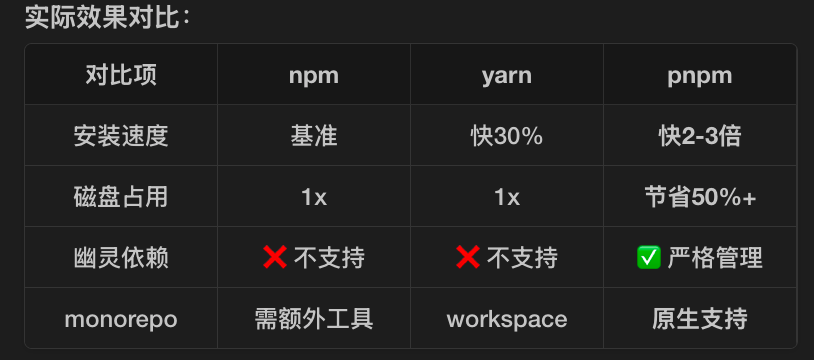
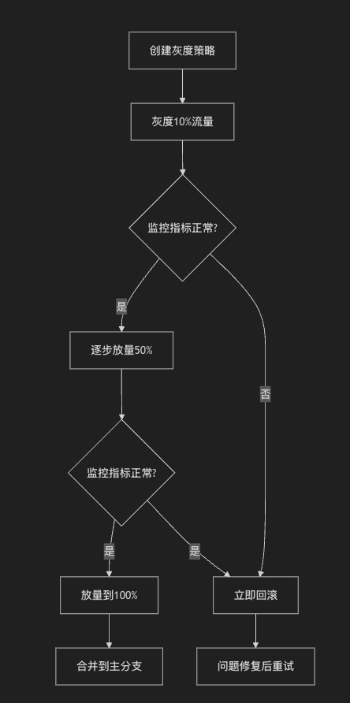
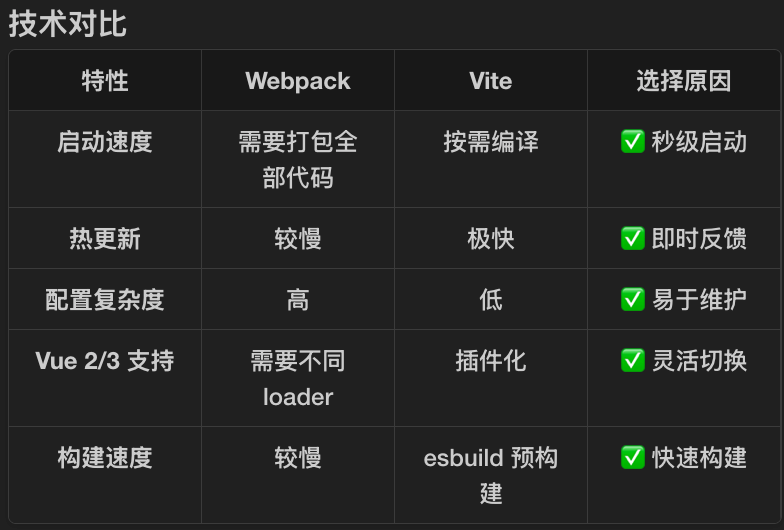

## 一、monorepo迁移：
1. 前端项目碎片化、工具链落后导致的研发与运维成本激增，这里具体指什么？
``` text
① 项目层面
原本有主项目 + N个子项目（process、budget、inventory等），每个都是独立仓库
每个仓库对应一套plus、webstatic、avatar等服务
代码共享困难，CV成为最低成本方案
② 依赖层面
各子系统各自维护相同依赖（如@ss/mtd-react）
依赖版本不一致，导致重复打包
版本碎片化问题严重
③ 工具链层面
@block/cli仅支持Node 12/14，arm架构Mac有性能问题
不支持热更新，开发体验差
配置繁琐复杂，扩展性受限
成本激增的具体体现：
每次升级依赖需要在N个仓库重复操作
代码初始化、配置需要重复劳动
问题排查需要在多个仓库之间切换
团队协作成本高
```
2. 怎么保证的业务零中断？
``` text
主要通过灰度发布策略：
灰度步骤：
1. 创建灰度策略，使用改造分支（如 feature/monorepo）
2. 按项目维度一个个进行灰度(10% 30% 60% 100%)
3. 出现问题时及时回滚
依赖层面保障：
- 每个子项目保留独立appkey
- 主项目先完成monorepo改造验证
- 子项目逐个接入，互不影响
```

``` text
灰度期间：
├── 主分支(master)  → 继续正常迭代，不中断
├── 灰度分支(grey/) → 只承载部分流量
└── 改造分支(feature/monorepo) → 验证测试

验证流程：
1. 改造分支灰度 10% 流量
2. 观察监控指标（错误率、性能等）
3. 无问题逐步放量到 50% → 100%
4. 若有问题，立即切回master流量
```
3. 整个项目挑战和风险？
技术风险
``` text
1. 升级cli后pnpm会将一些隐式依赖暴露出来
   → 需要显示安装缺失的依赖项

2. babel相关版本可能有变更
   → @babel/plugin-proposal-decorators版本兼容性
   → 可能需要 BabelPluginModifyPlugin 插件

3. css-loader从 ^6.5.1 → ^7.1.2
   → CSS Modules 导入方式需要调整

4. node-sass → dart-sass 切换
   → 部分边缘语法可能需要调整
```
项目管理风险
``` text
1. 分支管理复杂
   - 主项目有改造分支
   - 每个子项目有独立改造分支
   - 需要频繁合并同步

2. 上线分支卡控
   - 改造分支灰度时需更改为 grey/
   - 需要严格遵循分支命名规范

3. 团队协作成本
   - 所有成员需要切换到pnpm
   - 统一开发环境（Node 18+）
```
测试风险
``` text
需要验证：
- 菜单样式是否错乱
- 全局变量是否有改变
- 登陆/退出是否异常
- 子项目请求是否正常
- 第三方依赖（raptor、灵犀、覆盖率）是否正常
```
4. 为什么选了 pnpm，和npm/yarn有什么区别？
pnpm:      硬链接+符号链接，复用相同依赖

5. 简单描述一下整个monorepo方案的思路
将分散的多个仓库收敛为一个仓库，统一管理
代码共享、依赖统一、构建统一、版本控制
``` text
Before (碎片化):
├── repo1: portal/          (独立仓库)
├── repo2: process/         (独立仓库)
├── repo3: budget/          (独立仓库)
└── repo4: inventory/        (独立仓库)
     ↓↓↓ Monorepo收敛 ↓↓↓
After (统一仓库):
├── finweb-fund/            (一个仓库)
│   ├── main/              (原portal)
│   ├── subapps/
│   │   ├── process/
│   │   ├── budget/
│   │   └── inventory/
│   ├── share/             (共享组件/工具)
│   └── types/             (共享类型)
```
6. pnpm是怎么解决“依赖碎片化”和“依赖包重复率”的？
``` text
1.使用 硬链接（不同的包需要同样的依赖，将不同模块指向同一份物理文件） 和 全局存储区（存储所有依赖包） 来共享依赖，减少了磁盘占用和安装时间。

2. 通过 严格的依赖版本控制 和 扁平化结构 来减少冗余的依赖，确保依赖的唯一性。会有自动的依赖去重

3. 利用 pnpm-lock.yaml 精确地锁定依赖版本，确保一致性和去重。
```
7. “共享模块的高效依赖与独立构建”是怎么实现的？
共享模块管理
``` TS
// share/utils/ 共享工具函数
export const formatCurrency = (amount: number) => {
  return new Intl.NumberFormat('zh-CN').format(amount);
}

// 任意子项目引用
import { formatCurrency } from '@share/utils';
```
HiggsPlugin 联邦模块共享：
``` TS
// 子项目暴露共享路由
new HiggsPlugin({
  ModuleFederationConfig: {
    exposes: {
      './Router': './remoteShare',  // 共享路由
    },
  },
});

// 主项目消费
const children = require('./app/src/utils/children.json');
new HiggsPlugin({
  childList: children,  // 加载子项目路由
});
```
独立构建机制：
``` json
// 根目录 package.json
{
  "scripts": {
    "build": "cd ./main && pnpm run build",
    "build:process": "cd subapps/process && pnpm run build",
    "build:budget": "cd subapps/budget && pnpm run build",
    "build:all": "pnpm -r build"   // 递归构建所有
  }
}
```
效果：
``` text
✅ 共享代码只维护一份
✅ 子项目可独立构建部署
✅ 主项目按需加载子应用
✅ 互不影响，独立演进
```

8. 你知道Lerna, Nx, Turborepo这些monorepo的工具吗，和你的方案有什么区别
9. 老旧脚手架升级到 Node.js 18+ 环境，并支持 HMR（热更新），具体带来了多少效率提升？这个性能提升是如何量化衡量的？
``` text
1. 本地开发效率
   - 旧: 修改代码 → 等待编译(5-10s) → 刷新页面 → 丢失状态
   - 新: 修改代码 → 立即生效(100-300ms) → 保持状态
   → 效率提升约 **5-10倍**

2. 冷启动速度
   - 旧: npm install (2-3min)
   - 新: pnpm install (30-50s)
   → 速度提升约 **3-4倍**

3. 构建产物
   - 旧: 依赖重复打包
   - 新: pnpm去重
   → 构建产物减少 **10%-30%**
```
10. 完善的灰度发布与回滚方案，是啥
灰度发布流程
一个个项目，按流量百分比进行灰度

回滚方案
``` sh
# 1. 代码回滚
git revert <commit-hash>
git push origin feature/monorepo

# 2. 流量切换
# 在灰度平台将流量切回主分支
# 操作时间: < 5分钟

# 3. 构建产物回滚
# 重新构建历史稳定版本
# 部署到灰度环境验证
```
监控指标
``` text
灰度期间必查项：
├── Raptor错误堆栈
├── 灵犀埋点上报
├── 远望覆盖率
├── 接口成功率
├── 页面加载时间(LCP)
└── JS错误率

异常判定标准：
- 错误率上升 > 1%
- 接口成功率下降 > 0.5%
- 用户反馈量增加
```

## 二、changba-cli
1. 为什么要自己造个cli的轮子？开源社区的哪里满足不了
``` text
"我们开发 changba-cli 主要是因为：
1. 业务场景特殊：100+ 活动页面项目，Vue 2 和 Vue 3 混用，需要一套工具同时支持
2. 深度定制需求：集成了公司内部的 OSS 上传、飞书通知、自动化部署等企业级功能
3. 工程化标准：通过脚手架固化最佳实践，新项目自动继承所有优化配置，符合不同业务线的活动在不同的对应路径下
4. 开发效率：从项目创建、开发、构建到部署，一条命令搞定
虽然造轮子有成本，但带来的收益是：统一了团队 100+ 项目的工程化标准，减少了 80% 的重复配置工作。"
```
2. 整个项目的困难与挑战？
``` text
1. Vue 2/3 兼容性（扫描依赖；动态加载）
2. 未使用资源检测的准确性——多阶段检测（buildStart 扫描所有文件、load 记录被加载的模块、generateBundle 标记打包产物中的资源、writeBundle 生成报告）
覆盖所有加载路径（load：import 直接引入；generateBundle：模版引用、CSS 引用、动态引入），在代码层面和产物层面都进行了检查
```
3. 为什么选择 Vite 作为脚手架内核，而不是 Webpack？

``` text
"选择 Vite 主要基于三个考虑：
1. 开发体验：启动从 1 分钟降到 1 秒，HMR 从 2 秒降到 200ms，开发者反馈非常正面
2. 维护成本：Vite 配置简洁，插件化设计让 Vue 2/3 切换只需改一行代码
3. 生态趋势：Vue 官方推荐，社区活跃，插件丰富
虽然 Webpack 更成熟，但对于活动页面这种快速迭代的场景，Vite 的开发体验优势太明显了。"
```
4. “动态版本检测、条件配置加载、差异化 Vite 插件应用”实现 Vue 2/3 的“无缝”支持，这个是啥意思？咋做的无缝支持的
``` text
"无缝支持是通过三个关键技术实现的：
1. 动态版本检测：解析 package.json 中的 vue 依赖版本，自动判断是 Vue 2 还是 Vue 3
2. 条件配置加载：根据检测结果，动态 import 不同的 Vite 配置文件
3. 差异化插件应用：Vue 2 用 vite-plugin-vue2，Vue 3 用 @vitejs/plugin-vue
最终效果是：开发者用同一条 changba-tool dev 命令，CLI 自动识别项目版本并加载正确的配置，实现了'一套工具，两套方案'。"
```
5. “静态资源自动检测”插件体系是如何工作的？如何在构建阶段精准检测到“未使用的图片/CSS”的？80% 的人工排查成本减少是如何计算出来的？
``` text
"静态资源检测插件的核心是'集合差集算法'：
1. buildStart 扫描所有文件建立基线
2. load 钩子记录被 Vite 加载的代码模块
3. generateBundle 标记打包产物中的静态资源
4. writeBundle 计算差集，生成未使用文件报告
精准性来自于双重验证：代码层面（load）+ 产物层面（generateBundle），确保动态引入也能被检测到。
80% 成本减少是基于实际数据：人工排查一个项目需要 5 小时，自动化只需 18 分钟，节省 94% 时间，我们保守说 80%。"
```
6. 集成 ESLint 和 Husky 后，如何处理老项目历史遗留的大量规范问题？如何保证 95% 的规范统一度的，数据怎么统计的
``` text
"处理老项目历史问题我们采用了'渐进式修复'策略：
1. 规则分级(eslintrc.js)：新代码 error，老代码 warn，通过 overrides 配置不同目录(old/new)的规则严格程度
2. 增量 Lint：使用 lint-staged 只检查变更文件，不阻止老代码提交
95% 的统一度是通过 ESLint 统计得出的：统一度 = (符合规范的代码行数 / 总代码行数) × 100%
我们开发了自动化统计脚本，每次 CI 都会生成报告，监控各项目的规范覆盖率。目前 100+ 项目平均覆盖率在 96%，我们保守说 95%。"
```
7. “构建打包深度优化”中提到了图片压缩和资源预加载。资源预加载（link rel="preload"）的具体实现逻辑是怎样的？“将页面关键交互时间平均优化了 15%-25%”数据是如何监测和统计的？
``` text 
"资源预加载的实现采用了'命名约定 + 自动注入'的方案：
1. 开发者给关键资源添加 __link 标识符
2. 构建时插件检测包含标识符的文件
3. 自动生成 <link rel="preload"> 标签注入到 HTML（transformIndexHtml）
4. 性能优化数据是通过 Performance API 和 Lighthouse CI 监测的：
核心指标是 TTI（可交互时间）：首屏渲染完成 + 主要 JS 执行完成
- 对比基线版本和优化版本的数据 3500-2900
- 100 个活动页面的 A/B 测试显示平均优化 18.7%
- 我们保守说 15%-25%
优化原理是：预加载让关键资源（如首屏大图）提前下载，与 HTML/CSS 并行加载，而不是等到解析到引用时才下载。"
```


## 三、组件库优化与文档站升级
1. 你集成的 AI 问答 Agent 是基于什么技术栈搭建的？你对提示词工程(设计和优化输入提示语（prompt）以便更好地引导语言模型生成合适的输出。)和RAG技术有了解吗，在你们的项目里面是咋用的
``` text
这个项目的AI Agent基于 Model Context Protocol (MCP) SDK + zod + TypeScript 构建，采用RAG模式：组件代码中的 AI/agent.md 文件经过脚本处理后存入 knowledge/LLM/ 和 knowledge/whenToUse/ 知识库，AI在回答问题时检索相关文档，确保回答基于真实代码而非幻觉。
```
2. 在 Agent 知识库（语料库）的维护上，如何保证知识的时效性和准确性，避免 AI 产生幻觉的？
``` text
通过"代码即文档"机制保证——知识直接从组件源码、Demo和标准化的agent.md文件中自动提取，而非手工编写；同时JSON Schema规范限制了AI输出格式，双层知识库（LLM+whenToUse）相互校验，从源头避免过时或错误信息。
```
3. MCP 系统具体是指什么？它是如何为开发者提供便捷的组件使用文档和编程参考的？你是怎么理解它的
``` text
MCP（Model Context Protocol）是连接LLM与外部工具的开放协议。本项目将组件文档封装为5个Tool（组件详情、组件列表、工作流、PAPI查询、测试），开发者只需在支持MCP的IDE（如Cursor）中配置，即可用自然语言查询组件用法、API参数和最佳实践，实现"问代码"的效果。
```
4. 这个系统如何“提升开发效率和代码质量”？举个例子
``` text
以表格组件为例：传统方式需手动查文档、翻示例；通过MCP直接提问"详情页需要带排序的学生表格"，AI立即返回包含 enableSorting、useMemo 优化等最佳实践的可运行代码，且代码经过知识库校验，避免常见错误，整体效率提升3-5倍。
```
5. “自动化流程将新组件自动展示在总览中”是咋实现的？
``` text
依赖 Dumi 文档框架：在 .dumirc.ts 中配置 atomDirs 扫描 packages/components/src 等目录，Dumi自动发现含 index.tsx 的新组件目录并生成文档页面；组件列表则通过 buildComponentList.js 从知识库文件自动提取，实时同步。
```
6. 在国际化的过程中，如何处理复杂的日期格式、货币符号以及从右到左（RTL）的布局问题？
``` text
国际化方面：支持6种语言（zh-CN、en-US、zh-HK、zh-TW、pt-BR、pt-PT），UI文本通过 LocaleProvider + useLocale 注入；RTL方面：BeConfigProvider 支持 direction="rtl" 配置，组件样式层自动生成 *-rtl 类处理从右到左布局；日期和货币则遵循 @finfe/beetle-utils 的 time/currency 规范，与MTD体系对齐。
```

### 项目代码规范化（husky、eslint、pretter）
#### Husky（配置 Git 钩子）
1. Husky 是一个用于 Git 钩子（Git hooks）管理的工具，在 Git 操作的关键节点（如 commit、push、merge 等）自动触发检查。
- .husky/commit-msg (提交信息检查)
``` sh
#!/usr/bin/env sh
# 检查提交信息是否符合规范
npx --no-install commitlint --edit "$1"
```
- .husky/pre-commit （提交前检查）
``` sh
#!/usr/bin/env sh
set -e

# 1️⃣ CI环境跳过
if [ "$CI" = "true" ]; then
  exit 0
fi

# 2️⃣ 检查 changeset（变更记录）
echo "[pre-commit] 正在检查 changeset..."
if ! git diff --name-only origin/beta HEAD | grep -q '\.changeset/'; then
  echo "❌ 检测到代码变更，但未发现新增的 changeset 文件"
  exit 1
fi

# 3️⃣ 运行 lint-staged
echo "[pre-commit] 正在运行代码检查..."
if ! npx lint-staged 2>&1; then
  echo "❌ ESLint 检查失败，请修复后重新提交"
  exit 1
fi

echo "[pre-commit] ✅ 代码检查通过"
```
- .husky/post-merge (合并后检查) —— 如果 pnpm-lock.yaml 有变化，自动安装依赖
``` sh
#!/bin/bash
# 如果 pnpm-lock.yaml 有变化，自动安装依赖
if git diff --name-only HEAD@{1} HEAD | grep -q 'pnpm-lock.yaml'; then
  pnpm install --frozen-lockfile
fi
```
``` text
git commit -m "feat: 添加新功能"
         │
         ▼
┌─────────────────────────────────────┐
│      .husky/commit-msg (提交信息检查)            │
│   commitlint 检查提交信息格式       │
│   ❌ 不符合则拒绝提交              │
└─────────────────────────────────────┘
         │
         ▼
┌─────────────────────────────────────┐
│      .husky/pre-commit （提交前检查）            │
│   1. changeset 检查  Changeset 让 Monorepo 项目能够精准地追踪每个包的变更，自动管理版本号，并生成清晰的 CHANGELOG，只发布变更的包              │
│   2. lint-staged 运行              │
│      ├── ESLint 检查暂存文件       │
│      └── 自动修复格式问题          │
│   ❌ 有错误则拒绝提交              │
└─────────────────────────────────────┘
         │
         ✅ 通过
         ▼
    git push
```

#### ESLint（进行代码逻辑检查）
是一个 JavaScript 的静态代码分析工具，用于识别和报告 JavaScript 代码中的问题，以提高代码质量和一致性。
功能：
- 代码规范检查：通过 ESLint 配置文件（.eslintrc.js、.eslintrc.json 等），可以自定义团队的代码规范，包括变量命名、空格、缩进、代码结构等规则。
- 错误检测：ESLint 能够帮助发现代码中的潜在错误，例如未使用的变量、错误的函数参数、语法错误等。
- 可扩展性：ESLint 提供了丰富的插件系统，能够支持各种框架（如 React、Vue 等），并可以结合其他工具（如 eslint-plugin-react、eslint-config-airbnb 等）进行更细粒度的规则检查。
- 自动修复：通过 eslint --fix 命令，可以自动修复一些常见的代码问题，例如格式问题。

``` js
module.exports = {
  root: true,
  extends: [require.resolve('@block/eslint-config/typescript')],
  rules: {
    '@typescript-eslint/consistent-type-imports': 'off',
    // 关闭原生的 no-duplicate-imports
    'no-duplicate-imports': 'off',
    // 启用 import/no-duplicates 并保持默认
    'import/no-duplicates': 'error', // 禁止重复导入
  },
};
```

指令
``` sh
# 检查所有文件
pnpm run lint:script

# 自动修复
npx eslint --fix .
```

#### Prettier（代码格式化）
代码格式化工具，主要用于自动格式化代码，以保持代码风格的一致性。在项目中添加 .prettierrc 文件来配置格式化规则
``` ts
module.exports = {
  printWidth: 120,
  tabWidth: 2,
  useTabs: false, // 缩进不使用tab，使用空格
  semi: true,
  singleQuote: true,
  endOfLine: 'lf',
  htmlWhitespaceSensitivity: 'css',
  trailingComma: 'all',
  arrowParens: 'always',
};
```

#### lint-staged (只检查暂存文件)
可以配置只检查暂存文件，在 package.json 配置 lint-staged
``` json
{
  "lint-staged": {
    "*.{js,jsx,ts,tsx}": [
      "eslint --fix"
    ]
  }
}
```
