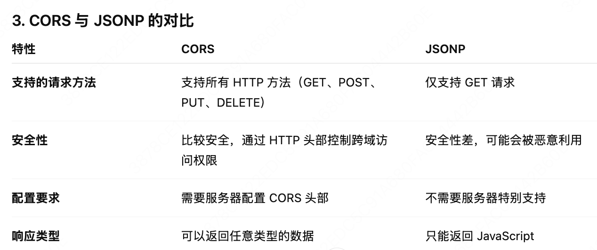

## 麦克思
1. 封装了哪些hooks
2. 浏览器输入url会发生什么
3. 如果我使用这个cli创建了一个项目，之后这个项目要做eslint升级怎么做？
4. 如果用户的node版本不对，用cli init项目出问题了，无法创建项目，怎么解决
5. 如何在这个项目的基础上增加React 18版本支持
6. 跨域，JSONP的原理，在vite.package.json上面进行跨域处理是对开发环境有用还是生成环境
7. CDN
8. 浏览器的缓存策略
9. 304 301 302 401
10. stript defer async
11. console.log(a) var a = 10
12. array.filter会改变原数组吗
13. 如何做预加载，原理是什么
14. 如何在数组最前面添加一个元素
15. vue2 和 vue3 的区别
16. vue 的响应式原理
17. vuex 和 pinia 的区别
18. react的组件通信
19. 算法：三数之和

### 1. 什么是预加载？原理是什么？实现方式？
没有预加载，解析完css 发现图片引用开始下载
有预加载，css解析和图片下载并行
**原理**：在用户请求特定内容之前，提前加载某些资源或数据到浏览器或者应用测序的缓存中，来减少等待时间
**作用**：提高页面的加载速度，优化用户体验
**应用场景**：网页加载优化（有大量图片、字体、脚本等）；单页面应用（SPA）预加载即将访问的路由或页面组件；游戏或者应用程序优化（预加载关卡资源、模型、音效等，减少用户等待的时间）
**注意**：不要过度预加载，会占用资源，影响首次加载速度；注意加载的优先级（浏览器会根据 as 的类型来决定加载顺序，一般来说，style > script > image）
**实现**：
1. `<link rel="preload">`标签，提前加载资源（JS、图片、字体、CSS等），会被加载到缓存里面，preload 优先级高，当前页面需要，会阻塞页面的渲染，直到资源加载完成
``` JS
<!-- 预加载 CSS -->
// as 属性指定了加载资源的类型，这有助于浏览器更好地优化加载顺序
<link rel="preload" href="styles.css" as="style">

<!-- 预加载 JavaScript -->
<link rel="preload" href="app.js" as="script">

<!-- 预加载图片 -->
<link rel="preload" href="logo.png" as="image">
```
2. `<link rel="prefetch">` 标签，prefetch 优先级低，未来可能用到，但不会阻塞当前页面的渲染。

`<link rel="prefetch" href="next-page.js">`
3. JS中的预加载，在运行时通过 fetch 或 XMLHttpRequest 来请求数据或资源，提前加载数据并存储在缓存中，等到需要时再使用。通常应用于 SPA（单页面应用）中，提前获取下一个页面或路由需要的数据。
``` JS
// 使用 fetch 预加载数据
fetch('/api/next-page-data')
  .then(response => response.json())
  .then(data => {
    // 缓存数据，或存储到全局变量/状态中
    window.nextPageData = data;
  });
```
4. Service Worker 和缓存，Service Worker 可以在后台运行，捕获网络请求并将其缓存，或者提前加载某些资源
基本步骤：
1. 使用 serviceWorker.register() 注册一个 Service Worker。
2. 在 Service Worker 中通过 caches API 缓存资源。
3. 利用 fetch 捕获资源请求并返回缓存中的资源，减少后续的网络请求延迟。

5. Web Components 预加载，在路由切换时预加载某些组件，避免用户在切换时产生延迟。
React：
``` TS
import React, { Suspense, lazy } from 'react';

// 使用 lazy 加载组件
const NextPageComponent = lazy(() => import('./NextPage'));

function App() {
  return (
    <div>
      <Suspense fallback={<div>Loading...</div>}>
        <NextPageComponent />
      </Suspense>
    </div>
  );
}

// 在用户准备进入下一页时，通过预加载来减少延迟
setTimeout(() => {
  NextPageComponent.preload(); // 提前加载组件
}, 2000);

```
Vue
``` TS
const NextPage = () => import(/* webpackPrefetch: true */ './NextPage.vue');

export default {
  components: {
    NextPage
  }
}

```
6. 图片和字体预加载（通过CSS、JS）
字体预加载
``` TS
<!-- 预加载字体 -->
<link rel="preload" href="font.woff2" as="font" type="font/woff2" crossorigin="anonymous">

<style>
  @font-face {
    font-family: 'MyFont';
    src: url('font.woff2') format('woff2');
    font-display: swap; /* 使用 swap 防止 FOUT */
  }
</style>
```

### 2.懒加载（延伸）
1. 在实际需要时才加载某个资源，而不是在页面加载时一次性加载所有资源。它主要目的是为了提高网页性能，减少初始加载时间，节省带宽和减少服务器负担。
2. 应用场景：图片、视频、组件的懒加载
3. 实现方式：
- 图片懒加载，使用标签：`loading="lazy"`属性 ,``
- 使用 `IntersectionObserver` 或监听滚动事件，判断图片是否出现在视口内。当图片进入视口时，设置 src 属性来加载图片。
``` TS
// 使用 IntersectionObserver 实现懒加载
document.addEventListener("DOMContentLoaded", () => {
  const images = document.querySelectorAll('img.lazyload');
  
  const options = {
    rootMargin: '0px 0px 200px 0px',  // 提前200px加载
    threshold: 0.1                   // 当图片的10%进入视口时触发
  };

  const observer = new IntersectionObserver((entries, observer) => {
    entries.forEach(entry => {
      if (entry.isIntersecting) {
        const img = entry.target;
        img.src = img.dataset.src;  // 设置 src 属性来加载图片
        img.classList.remove('lazyload');
        observer.unobserve(img);  // 停止监听该图片
      }
    });
  }, options);

  images.forEach(image => {
    observer.observe(image);  // 监听每个懒加载图片
  });
});
```

- 组件懒加载
React
``` TS
import React, { Suspense, lazy } from 'react';

// React.lazy 用于动态导入组件，当组件需要时才会加载。
const LazyComponent = lazy(() => import('./LazyComponent'));

function App() {
  return (
    <div>
    // 在懒加载组件加载时显示一个加载提示。
      <Suspense fallback={<div>Loading...</div>}>
        <LazyComponent />
      </Suspense>
    </div>
  );
}

```

Vue
通过动态 import() 来实现组件懒加载
``` TS
// 使用 Vue 路由懒加载
const LazyComponent = () => import('./LazyComponent.vue');

const routes = [
  {
    path: '/lazy',
    component: LazyComponent
  }
];
```

- 视频懒加载
``` TS
// 使用 IntersectionObserver 来懒加载视频
document.addEventListener("DOMContentLoaded", () => {
  const videos = document.querySelectorAll('video.lazyload');
  
  const options = {
    rootMargin: '0px 0px 200px 0px',
    threshold: 0.1
  };

  const observer = new IntersectionObserver((entries, observer) => {
    entries.forEach(entry => {
      if (entry.isIntersecting) {
        const video = entry.target;
        video.src = video.dataset.src;  // 设置 src 来加载视频
        video.classList.remove('lazyload');
        observer.unobserve(video);  // 停止监听该视频
      }
    });
  }, options);

  videos.forEach(video => {
    observer.observe(video);
  });
});

```
需要注意：
- SEO：懒加载的内容可能会对 SEO 产生影响，因为爬虫可能无法抓取懒加载的资源。解决办法包括服务器端渲染（SSR）或提供懒加载的替代方案。
- 用户体验：懒加载技术需要合理配置，避免因延迟加载资源而造成闪烁、卡顿等问题。需要平衡加载时间和用户体验。

### 3. 如果我使用这个cli创建了一个项目，之后这个项目要做eslint升级怎么做？
#### 手动升级（针对单个项目）
1. 进入项目目录
2. pnpm 升级 ESlint 和相关的包
3. 更新 ESlint 配置文件
4. 更新 package.json 的scripts
#### 通过脚手架升级（针对多个项目）
1. 修改 CLI 源码，创建新命令
  - 检查项目 ——》备份当前配置 ——〉升级依赖 ——》 更新配置文件
2. 注册命令到 CLI
3. 更新 CLI 包，直接使用命令

### 4. 如果用户的node版本不对，用cli init项目出问题了，无法创建项目，怎么解决
1. 在模版里面增加.nvmrc 文件，指定项目所需的 Node 版本。有了.nvmrc，打开项目，使用 nvm use 的时候会自动找到项目对应的.nvmrc，自动切换脚本
2. 在 package.json 增加 engines 字段，在安装依赖的时候会强制检查
3. 在脚手架里面增加在创建项目之前进行版本检查的代码
4. 使用 package-lock.json 固定版本

### 5. 如何在这个项目的基础上增加React 18版本支持
1. 创建 React 模版目录结构和对应的模版文件
2. 创建 React Vite 配置，有关 React 的常量
3. 修改初始化命令支持 React
4. 检查依赖 React 来使用对应的模版

### 6. 跨域问题
#### JSONP 的原理
- 原理
  1. 通过 `<script>` 标签进行跨域请求的技术，因为 `<script>` 标签不受同源策略的限制
  2. 服务器返回的是 JavaScript 代码，通常是一个调用回调函数的方式来返回数据。例如：服务器返回的数据是 callback({"name": "Alice"})，前端可以通过预定义的 callback 函数来处理返回的结果。

- 实现方式：前端通过动态创建一个 `<script>` 标签，指定跨域资源的 URL 和一个回调函数，服务器返回的数据会被传入该回调函数。
``` TS
// 前端
function fetchData(url, callback) {
  const script = document.createElement('script');
  script.src = `${url}?callback=${callback}`;
  document.body.appendChild(script);
}

function handleData(data) {
  console.log('Received data:', data);
}

fetchData('https://example.com/data', 'handleData');

//后端
// 服务器返回一个 JavaScript 代码，调用前端的回调函数
app.get('/data', (req, res) => {
  res.send(`${req.query.callback}({ "name": "Alice" })`);
});

```
- 优点：可以用于 GET 请求，且没有浏览器同源策略的限制。
- 缺点：
  1. 仅支持 GET 请求，不支持其他 HTTP 方法（如 POST、PUT、DELETE）。
  2. 安全性较差，因为恶意脚本可能通过这种方式进行攻击。

#### CORS（Cross-Origin Resource Sharing）
允许浏览器通过在 HTTP 请求中携带特殊的 HTTP 头来告诉服务器，允许特定来源的请求访问其资源。
CORS 请求的工作流程：
1. 简单请求（如 GET、POST 等）：
  - 浏览器会自动添加一个 Origin 头部，表示请求的来源。
  - 如果服务器允许该来源的请求，会在响应头中返回 Access-Control-Allow-Origin 头部，值为允许访问的源。

2. 预检请求（Preflight Request）：
  - 当请求的方法或头部复杂时，浏览器会先发送一个 OPTIONS 请求，询问服务器是否允许此类请求（即预检请求）。
  - 如果服务器响应允许该请求，会返回必要的 CORS 头部，之后浏览器才会发送真正的请求。

``` TS
// 前端请求
fetch('https://api.example.com/data', {
  method: 'GET',
  headers: {
    'Content-Type': 'application/json',
  }
})
  .then(response => response.json())
  .then(data => console.log(data))
  .catch(error => console.error('Error:', error));

// 后端响应
// Express 服务器
app.get('/data', (req, res) => {
  res.set('Access-Control-Allow-Origin', '*');  // 允许所有来源的请求
  res.json({ message: 'Hello, world!' });
});

// 服务器端响应头示例
Access-Control-Allow-Origin: *
Access-Control-Allow-Methods: GET, POST, OPTIONS
Access-Control-Allow-Headers: Content-Type

```
- 优点：支持多种 HTTP 请求方式，包括 GET、POST、PUT、DELETE 等；比 JSONP 更加安全。
- 缺点：需要服务器支持配置 CORS 头部。



#### vite 的跨域处理配置（开发环境）
``` TS
// vite.config.js
export default {
  server: {
    proxy: {
      '/api': {
        target: 'https://api.example.com',  // 目标服务器地址
        changeOrigin: true,                 // 是否修改请求头中的 Origin 字段
        rewrite: (path) => path.replace(/^\/api/, ''),  // 可选的路径重写
      }
    }
  }
}

```
#### 其他解决跨域的方法
##### WebSocket
1. WebSocket 双向通信协议，支持客户端与服务器之间的实时通信。WebSocket 连接不受同源策略限制，因此它可以用于解决跨域问题。
2. 适用场景：实时通信场景，如聊天应用、实时数据更新、在线游戏等。
  - 优点：不受同源策略限制，可以在不同域之间进行通信。
  - 缺点：需要后端支持 WebSocket 协议，且对于某些网络环境（如企业网络）可能会存在防火墙限制。

##### iframe + window.postMessage
1. 可以在不同源的窗口之间进行通信，解决跨域问题。这种方法适用于父页面与嵌套的 iframe 之间的通信。
2. 原理：父页面和 iframe 可以通过 window.postMessage 方法发送消息，即使它们是跨域的。postMessage 方法允许跨源的安全传输数据，接收端使用 message 事件监听器来接收消息。
3. 适用场景：
  - 在嵌入第三方内容（如广告、支付组件等）时，父页面和嵌入的 iframe 之间的通信。
  - 当你的页面嵌套了外部源的 iframe，需要与其进行安全通信时。
``` TS
// 父页面代码
// 获取嵌套的 iframe
const iframe = document.getElementById('myIframe');

// 向 iframe 发送消息
iframe.contentWindow.postMessage('Hello from parent', 'https://example.com');

// 接收来自 iframe 的消息
window.addEventListener('message', (event) => {
  if (event.origin !== 'https://example.com') {
    return;  // 验证消息来源
  }
  console.log('Message from iframe:', event.data);
});

// iframe 页面代码
// 向父页面发送消息
window.parent.postMessage('Hello from iframe', 'https://parent.com');

// 接收来自父页面的消息
window.addEventListener('message', (event) => {
  if (event.origin !== 'https://parent.com') {
    return;  // 验证消息来源
  }
  console.log('Message from parent:', event.data);
});

```
4. 优点：适用于不同源的页面间的安全通信，避免直接暴露敏感数据。
5. 缺点：相对复杂，且需要对 postMessage 的来源和目标进行严格验证，防止恶意消息。

##### Reverse Proxy（反向代理）
1. 反向代理是将客户端的请求转发到不同的服务器，通过代理服务器实现跨域请求。
2. 原理：
  - 客户端请求发送到同一域名下的代理服务器，代理服务器接收到请求后，将请求转发到目标服务器，再将响应返回给客户端。
  - 由于客户端与代理服务器在同一个域中，所以避免了跨域问题。
3. 适用场景：
  - 生产环境中，前后端分离的应用可以使用反向代理，避免跨域问题。
  - 部署多个服务时，通过反向代理集中管理请求。
4. 优缺点：
  - 优点：简单有效，生产环境中常用，尤其适合前后端分离部署。
  - 缺点：需要配置服务器，增加了部署复杂性。

### 7. React 组件之间的通信方式
1. props （父组件 → 子组件）
2. 回调函数 （子组件 → 父组件），子组件调用父组件传递的函数来传递事件或数据
3. context 跨层级组件通信，在多个组件之间共享全局状态
4. Redux 全局状态管理，多个组件之间共享状态的场景
5. EventEmitter 跨组件通信，通过自定义事件实现跨组件通信。ComponentA 通过 `eventEmitter.emit` 触发事件，ComponentB 通过 `eventEmitter.on` 监听事件
6. 通过 URL 参数（路由传递）,在页面之间传递参数（如 id、筛选条件等）时使用

### 8. 浏览器的缓存策略
1. 强缓存：

- 强缓存是指浏览器在缓存有效期内，完全不向服务器发送请求，而直接从本地缓存中获取资源。强缓存的控制是通过 Cache-Control 和 Expires 头来实现的。
- Cache-Control: max-age 或 Expires 指定了缓存的最大有效期。在这个有效期内，浏览器会直接使用缓存资源，不会向服务器发送任何请求。
- 如果缓存未过期，浏览器就会使用本地的缓存，而不会触发与服务器的任何交互。

2. 协商缓存：
- 当强缓存失效时，浏览器会使用协商缓存机制来判断是否可以继续使用本地缓存。协商缓存通过 Last-Modified / If-Modified-Since 或 ETag / If-None-Match 来与服务器进行验证。
- Last-Modified 和 If-Modified-Since：通过文件的最后修改时间来判断文件是否有变化。
- ETag 和 If-None-Match：通过资源的哈希值（即 ETag）来判断文件是否被修改。
- 协商缓存的目的是在强缓存过期时，避免重新下载整个资源，而是通过向服务器询问资源是否发生变化，如果没有变化，服务器会返回 304 Not Modified，这样浏览器就可以继续使用本地缓存。