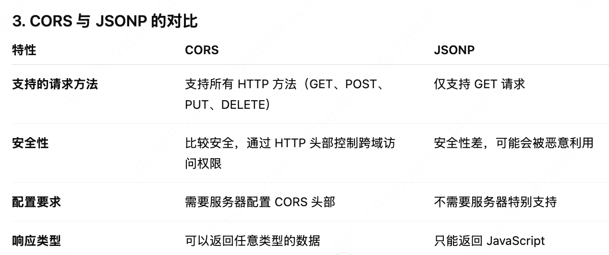

## 麦克思
1. 封装了哪些hooks
2. 浏览器输入url会发生什么
3. 如果我使用这个cli创建了一个项目，之后这个项目要做eslint升级怎么做？
4. 如果用户的node版本不对，用cli init项目出问题了，无法创建项目，怎么解决
5. 如何在这个项目的基础上增加React 18版本支持
6. 跨域，JSONP的原理，在vite.package.json上面进行跨域处理是对开发环境有用还是生成环境
7. CDN
8. 浏览器的缓存策略
9. 304 301 302 401
10. stript defer async
11. console.log(a) var a = 10
12. array.filter会改变原数组吗
13. 如何做预加载，原理是什么
14. 如何在数组最前面添加一个元素
15. vue2 和 vue3 的区别
16. vue 的响应式原理
17. vuex 和 pinia 的区别
18. react的组件通信
19. 算法：三数之和

### 1. 什么是预加载？原理是什么？实现方式？
没有预加载，解析完css 发现图片引用开始下载
有预加载，css解析和图片下载并行
**原理**：在用户请求特定内容之前，提前加载某些资源或数据到浏览器或者应用测序的缓存中，来减少等待时间
**作用**：提高页面的加载速度，优化用户体验
**应用场景**：网页加载优化（有大量图片、字体、脚本等）；单页面应用（SPA）预加载即将访问的路由或页面组件；游戏或者应用程序优化（预加载关卡资源、模型、音效等，减少用户等待的时间）
**注意**：不要过度预加载，会占用资源，影响首次加载速度；注意加载的优先级（浏览器会根据 as 的类型来决定加载顺序，一般来说，style > script > image）
**实现**：
1. `<link rel="preload">`标签，提前加载资源（JS、图片、字体、CSS等），会被加载到缓存里面，preload 优先级高，当前页面需要，会阻塞页面的渲染，直到资源加载完成
``` JS
<!-- 预加载 CSS -->
// as 属性指定了加载资源的类型，这有助于浏览器更好地优化加载顺序
<link rel="preload" href="styles.css" as="style">

<!-- 预加载 JavaScript -->
<link rel="preload" href="app.js" as="script">

<!-- 预加载图片 -->
<link rel="preload" href="logo.png" as="image">
```
2. `<link rel="prefetch">` 标签，prefetch 优先级低，未来可能用到，但不会阻塞当前页面的渲染。

`<link rel="prefetch" href="next-page.js">`
3. JS中的预加载，在运行时通过 fetch 或 XMLHttpRequest 来请求数据或资源，提前加载数据并存储在缓存中，等到需要时再使用。通常应用于 SPA（单页面应用）中，提前获取下一个页面或路由需要的数据。
``` JS
// 使用 fetch 预加载数据
fetch('/api/next-page-data')
  .then(response => response.json())
  .then(data => {
    // 缓存数据，或存储到全局变量/状态中
    window.nextPageData = data;
  });
```
4. Service Worker 和缓存，Service Worker 可以在后台运行，捕获网络请求并将其缓存，或者提前加载某些资源
基本步骤：
1. 使用 serviceWorker.register() 注册一个 Service Worker。
2. 在 Service Worker 中通过 caches API 缓存资源。
3. 利用 fetch 捕获资源请求并返回缓存中的资源，减少后续的网络请求延迟。

5. Web Components 预加载，在路由切换时预加载某些组件，避免用户在切换时产生延迟。
React：
``` TS
import React, { Suspense, lazy } from 'react';

// 使用 lazy 加载组件
const NextPageComponent = lazy(() => import('./NextPage'));

function App() {
  return (
    <div>
      <Suspense fallback={<div>Loading...</div>}>
        <NextPageComponent />
      </Suspense>
    </div>
  );
}

// 在用户准备进入下一页时，通过预加载来减少延迟
setTimeout(() => {
  NextPageComponent.preload(); // 提前加载组件
}, 2000);

```
Vue
``` TS
const NextPage = () => import(/* webpackPrefetch: true */ './NextPage.vue');

export default {
  components: {
    NextPage
  }
}

```
6. 图片和字体预加载（通过CSS、JS）
字体预加载
``` TS
<!-- 预加载字体 -->
<link rel="preload" href="font.woff2" as="font" type="font/woff2" crossorigin="anonymous">

<style>
  @font-face {
    font-family: 'MyFont';
    src: url('font.woff2') format('woff2');
    font-display: swap; /* 使用 swap 防止 FOUT */
  }
</style>
```

### 2.懒加载（延伸）
1. 在实际需要时才加载某个资源，而不是在页面加载时一次性加载所有资源。它主要目的是为了提高网页性能，减少初始加载时间，节省带宽和减少服务器负担。
2. 应用场景：图片、视频、组件的懒加载
3. 实现方式：
- 图片懒加载，使用标签：`loading="lazy"`属性 ,``
- 使用 `IntersectionObserver` 或监听滚动事件，判断图片是否出现在视口内。当图片进入视口时，设置 src 属性来加载图片。
``` TS
// 使用 IntersectionObserver 实现懒加载
document.addEventListener("DOMContentLoaded", () => {
  const images = document.querySelectorAll('img.lazyload');
  
  const options = {
    rootMargin: '0px 0px 200px 0px',  // 提前200px加载
    threshold: 0.1                   // 当图片的10%进入视口时触发
  };

  const observer = new IntersectionObserver((entries, observer) => {
    entries.forEach(entry => {
      if (entry.isIntersecting) {
        const img = entry.target;
        img.src = img.dataset.src;  // 设置 src 属性来加载图片
        img.classList.remove('lazyload');
        observer.unobserve(img);  // 停止监听该图片
      }
    });
  }, options);

  images.forEach(image => {
    observer.observe(image);  // 监听每个懒加载图片
  });
});
```

- 组件懒加载
React
``` TS
import React, { Suspense, lazy } from 'react';

// React.lazy 用于动态导入组件，当组件需要时才会加载。
const LazyComponent = lazy(() => import('./LazyComponent'));

function App() {
  return (
    <div>
    // 在懒加载组件加载时显示一个加载提示。
      <Suspense fallback={<div>Loading...</div>}>
        <LazyComponent />
      </Suspense>
    </div>
  );
}

```

Vue
通过动态 import() 来实现组件懒加载
``` TS
// 使用 Vue 路由懒加载
const LazyComponent = () => import('./LazyComponent.vue');

const routes = [
  {
    path: '/lazy',
    component: LazyComponent
  }
];
```

- 视频懒加载
``` TS
// 使用 IntersectionObserver 来懒加载视频
document.addEventListener("DOMContentLoaded", () => {
  const videos = document.querySelectorAll('video.lazyload');
  
  const options = {
    rootMargin: '0px 0px 200px 0px',
    threshold: 0.1
  };

  const observer = new IntersectionObserver((entries, observer) => {
    entries.forEach(entry => {
      if (entry.isIntersecting) {
        const video = entry.target;
        video.src = video.dataset.src;  // 设置 src 来加载视频
        video.classList.remove('lazyload');
        observer.unobserve(video);  // 停止监听该视频
      }
    });
  }, options);

  videos.forEach(video => {
    observer.observe(video);
  });
});

```
需要注意：
- SEO：懒加载的内容可能会对 SEO 产生影响，因为爬虫可能无法抓取懒加载的资源。解决办法包括服务器端渲染（SSR）或提供懒加载的替代方案。
- 用户体验：懒加载技术需要合理配置，避免因延迟加载资源而造成闪烁、卡顿等问题。需要平衡加载时间和用户体验。

### 3. 如果我使用这个cli创建了一个项目，之后这个项目要做eslint升级怎么做？
#### 手动升级（针对单个项目）
1. 进入项目目录
2. pnpm 升级 ESlint 和相关的包
3. 更新 ESlint 配置文件
4. 更新 package.json 的scripts
#### 通过脚手架升级（针对多个项目）
1. 修改 CLI 源码，创建新命令
  - 检查项目 ——》备份当前配置 ——〉升级依赖 ——》 更新配置文件
2. 注册命令到 CLI
3. 更新 CLI 包，直接使用命令

### 4. 如果用户的node版本不对，用cli init项目出问题了，无法创建项目，怎么解决
1. 在模版里面增加.nvmrc 文件，指定项目所需的 Node 版本。有了.nvmrc，打开项目，使用 nvm use 的时候会自动找到项目对应的.nvmrc，自动切换脚本
2. 在 package.json 增加 engines 字段，在安装依赖的时候会强制检查
3. 在脚手架里面增加在创建项目之前进行版本检查的代码
4. 使用 package-lock.json 固定版本

### 5. 如何在这个项目的基础上增加React 18版本支持
1. 创建 React 模版目录结构和对应的模版文件
2. 创建 React Vite 配置，有关 React 的常量
3. 修改初始化命令支持 React
4. 检查依赖 React 来使用对应的模版

### 6. 跨域问题
#### JSONP 的原理
- 原理
  1. 通过 `<script>` 标签进行跨域请求的技术，因为 `<script>` 标签不受同源策略的限制
  2. 服务器返回的是 JavaScript 代码，通常是一个调用回调函数的方式来返回数据。例如：服务器返回的数据是 callback({"name": "Alice"})，前端可以通过预定义的 callback 函数来处理返回的结果。

- 实现方式：前端通过动态创建一个 `<script>` 标签，指定跨域资源的 URL 和一个回调函数，服务器返回的数据会被传入该回调函数。
``` TS
// 前端
function fetchData(url, callback) {
  const script = document.createElement('script');
  script.src = `${url}?callback=${callback}`;
  document.body.appendChild(script);
}

function handleData(data) {
  console.log('Received data:', data);
}

fetchData('https://example.com/data', 'handleData');

//后端
// 服务器返回一个 JavaScript 代码，调用前端的回调函数
app.get('/data', (req, res) => {
  res.send(`${req.query.callback}({ "name": "Alice" })`);
});

```
- 优点：可以用于 GET 请求，且没有浏览器同源策略的限制。
- 缺点：
  1. 仅支持 GET 请求，不支持其他 HTTP 方法（如 POST、PUT、DELETE）。
  2. 安全性较差，因为恶意脚本可能通过这种方式进行攻击。

#### CORS（Cross-Origin Resource Sharing）
允许浏览器通过在 HTTP 请求中携带特殊的 HTTP 头来告诉服务器，允许特定来源的请求访问其资源。
CORS 请求的工作流程：
1. 简单请求（如 GET、POST 等）：
  - 浏览器会自动添加一个 Origin 头部，表示请求的来源。
  - 如果服务器允许该来源的请求，会在响应头中返回 Access-Control-Allow-Origin 头部，值为允许访问的源。

2. 预检请求（Preflight Request）：
  - 当请求的方法或头部复杂时，浏览器会先发送一个 OPTIONS 请求，询问服务器是否允许此类请求（即预检请求）。
  - 如果服务器响应允许该请求，会返回必要的 CORS 头部，之后浏览器才会发送真正的请求。

``` TS
// 前端请求
fetch('https://api.example.com/data', {
  method: 'GET',
  headers: {
    'Content-Type': 'application/json',
  }
})
  .then(response => response.json())
  .then(data => console.log(data))
  .catch(error => console.error('Error:', error));

// 后端响应
// Express 服务器
app.get('/data', (req, res) => {
  res.set('Access-Control-Allow-Origin', '*');  // 允许所有来源的请求
  res.json({ message: 'Hello, world!' });
});

// 服务器端响应头示例
Access-Control-Allow-Origin: *
Access-Control-Allow-Methods: GET, POST, OPTIONS
Access-Control-Allow-Headers: Content-Type

```
- 优点：支持多种 HTTP 请求方式，包括 GET、POST、PUT、DELETE 等；比 JSONP 更加安全。
- 缺点：需要服务器支持配置 CORS 头部。



#### vite 的跨域处理配置（开发环境）
``` TS
// vite.config.js
export default {
  server: {
    proxy: {
      '/api': {
        target: 'https://api.example.com',  // 目标服务器地址
        changeOrigin: true,                 // 是否修改请求头中的 Origin 字段
        rewrite: (path) => path.replace(/^\/api/, ''),  // 可选的路径重写
      }
    }
  }
}

```
#### 其他解决跨域的方法
##### WebSocket
1. WebSocket 双向通信协议，支持客户端与服务器之间的实时通信。WebSocket 连接不受同源策略限制，因此它可以用于解决跨域问题。
2. 适用场景：实时通信场景，如聊天应用、实时数据更新、在线游戏等。
  - 优点：不受同源策略限制，可以在不同域之间进行通信。
  - 缺点：需要后端支持 WebSocket 协议，且对于某些网络环境（如企业网络）可能会存在防火墙限制。

##### iframe + window.postMessage
1. 可以在不同源的窗口之间进行通信，解决跨域问题。这种方法适用于父页面与嵌套的 iframe 之间的通信。
2. 原理：父页面和 iframe 可以通过 window.postMessage 方法发送消息，即使它们是跨域的。postMessage 方法允许跨源的安全传输数据，接收端使用 message 事件监听器来接收消息。
3. 适用场景：
  - 在嵌入第三方内容（如广告、支付组件等）时，父页面和嵌入的 iframe 之间的通信。
  - 当你的页面嵌套了外部源的 iframe，需要与其进行安全通信时。
``` TS
// 父页面代码
// 获取嵌套的 iframe
const iframe = document.getElementById('myIframe');

// 向 iframe 发送消息
iframe.contentWindow.postMessage('Hello from parent', 'https://example.com');

// 接收来自 iframe 的消息
window.addEventListener('message', (event) => {
  if (event.origin !== 'https://example.com') {
    return;  // 验证消息来源
  }
  console.log('Message from iframe:', event.data);
});

// iframe 页面代码
// 向父页面发送消息
window.parent.postMessage('Hello from iframe', 'https://parent.com');

// 接收来自父页面的消息
window.addEventListener('message', (event) => {
  if (event.origin !== 'https://parent.com') {
    return;  // 验证消息来源
  }
  console.log('Message from parent:', event.data);
});

```
4. 优点：适用于不同源的页面间的安全通信，避免直接暴露敏感数据。
5. 缺点：相对复杂，且需要对 postMessage 的来源和目标进行严格验证，防止恶意消息。

##### Reverse Proxy（反向代理）
1. 反向代理是将客户端的请求转发到不同的服务器，通过代理服务器实现跨域请求。
2. 原理：
  - 客户端请求发送到同一域名下的代理服务器，代理服务器接收到请求后，将请求转发到目标服务器，再将响应返回给客户端。
  - 由于客户端与代理服务器在同一个域中，所以避免了跨域问题。
3. 适用场景：
  - 生产环境中，前后端分离的应用可以使用反向代理，避免跨域问题。
  - 部署多个服务时，通过反向代理集中管理请求。
4. 优缺点：
  - 优点：简单有效，生产环境中常用，尤其适合前后端分离部署。
  - 缺点：需要配置服务器，增加了部署复杂性。

### 7. React 组件之间的通信方式
1. props （父组件 → 子组件）
2. 回调函数 （子组件 → 父组件），子组件调用父组件传递的函数来传递事件或数据
3. context 跨层级组件通信，在多个组件之间共享全局状态
4. Redux 全局状态管理，多个组件之间共享状态的场景
5. EventEmitter 跨组件通信，通过自定义事件实现跨组件通信。ComponentA 通过 `eventEmitter.emit` 触发事件，ComponentB 通过 `eventEmitter.on` 监听事件
6. 通过 URL 参数（路由传递）,在页面之间传递参数（如 id、筛选条件等）时使用

### 8. 浏览器的缓存策略
1. 强缓存：

- 强缓存是指浏览器在缓存有效期内，完全不向服务器发送请求，而直接从本地缓存中获取资源。强缓存的控制是通过 Cache-Control 和 Expires 头来实现的。
- Cache-Control: max-age 或 Expires 指定了缓存的最大有效期。在这个有效期内，浏览器会直接使用缓存资源，不会向服务器发送任何请求。
- 如果缓存未过期，浏览器就会使用本地的缓存，而不会触发与服务器的任何交互。

2. 协商缓存：
- 当强缓存失效时，浏览器会使用协商缓存机制来判断是否可以继续使用本地缓存。协商缓存通过 Last-Modified / If-Modified-Since 或 ETag / If-None-Match 来与服务器进行验证。
- Last-Modified 和 If-Modified-Since：通过文件的最后修改时间来判断文件是否有变化。
- ETag 和 If-None-Match：通过资源的哈希值（即 ETag）来判断文件是否被修改。
- 协商缓存的目的是在强缓存过期时，避免重新下载整个资源，而是通过向服务器询问资源是否发生变化，如果没有变化，服务器会返回 304 Not Modified，这样浏览器就可以继续使用本地缓存。

### 9. script 脚本的defer属性和async属性的区别和作用
1. async 让 js 文件**异步加载**，在加载完成之后**立即执行**，会阻塞页面的其他操作，如果有多个 async **执行顺序不确定**，每个脚本在加载完成后立即执行，不管其他脚本是否加载完成
2. 适用于那些不依赖其他脚本的独立脚本文件。例如，广告脚本、统计脚本

defer
1. 让 js 文件（异步加载）**延迟加载**，知道页面的 HTML 文档完全解析完成之后再执行脚本，**保证执行顺序**，会按照脚本在 HTML 中出现的顺序依次执行
2. 适用于依赖 DOM 元素的脚本，但不依赖其他脚本。


## 准备
1. websocket和http有啥区别？
| 特性         | HTTP               | WebSocket           |
| ---------- | ------------------ | ------------------- |
| **连接模式**   | 无状态，短连接，每次请求重新建立连接 | 长连接，全双工通信，连接建立后保持持久 |
| **数据传输方式** | 请求/响应模式            | 双向全双工通信             |
| **协议类型**   | 无状态文本协议，基于请求/响应模型  | 有状态，支持文本和二进制数据传输    |
| **延迟和实时性** | 高延迟，不适合实时通信        | 低延迟，适合实时通信和频繁交互     |
| **应用场景**   | 静态页面加载，RESTful API | 即时通讯，在线游戏，实时数据推送    |
| **安全性**    | HTTPS（加密）          | WSS（加密），需要额外认证      |

2. 上下文（Context）的构成与上限处理
- 包括什么：当前文件代码、相关引用的定义、选中的代码片段、最近的聊天历史、LSP 提供的类型定义、终端报错信息。
- 达到上限怎么办：
  - 滑动窗口：丢弃最早的聊天记录。
  - 摘要压缩：将之前的讨论摘要化，减少 Token 占用。
  - 重排序（Rerank）：只保留与当前任务相关度最高的信息，剔除无关文件。

3. 面对大仓库，如何告诉 LLM 哪些有用
这是目前 AI 辅助编程最关键的技术点：
- .cursorignore：类似 .gitignore，手动排除依赖包、构建产物等。
- 显式引用（Mentions）：使用 @ 符号手动指定文件（如 @Files, @Folders, @Codebase）。
- 基于 LSP 的自动查找：通过静态分析追踪调用栈，只把函数调用链路上的相关代码塞入上下文。
- 向量检索过滤：通过语义匹配，仅加载与你问题描述最贴近的模块代码。

4. TCP 为什么是三次握手和四次挥手
三次握手：确认**双方的接收能力和发送能力正常**、指定自己的**初始化序列号**为后面的可靠性传送做准备
``` arduino
Client --> Server: SYN(同步包) (seq(序列号) = x) —— 客户端的发送能力是正常的。
Server --> Client: SYN+ACK (seq = y, ack = x + 1) —— 服务端的接收和发送能力正常
Client --> Server: ACK(确认包) (seq = x + 1, ack = y + 1) —— 客户端接收能力正常
```
四次挥手：确保双方可以独立地关闭连接，并确保双方完成所有数据传输后再断开连接。
``` arduino
Client --> Server: FINx(结束包) (seq = x) —— 客户端处于 FIN_WAIT1 状态，停止发送数据，等待服务端的确认
Server --> Client: ACK (seq = y, ack = x + 1) —— 服务端已经收到客户端的报文了，此时服务端处于 CLOSE_WAIT状态
Server --> Client: FIN (seq = y) —— 服务端也想断开连接了，服务端处于 LAST_ACK 的状态
Client --> Server: ACK (seq = x + 1, ack = y + 1) —— 此时客户端处于 TIME_WAIT状态。需要过一阵子以确保服务端收到自己的 ACK 报文之后才会进入 CLOSED 状态，服务端收到 ACK 报文之后，就处于关闭连接了，处于 CLOSED 状态
```

## 钉钉 AI财务
1. 笔试 - 用 React 写 todoList ，可以新增和边输入边搜索
``` JS
import React, { useState } from 'react';

function TodoApp() {
  // 用来存储 Todo 列表的状态
  const [todos, setTodos] = useState([]);
  
  // 用来存储当前输入的 todo 标题和描述
  const [title, setTitle] = useState('');
  const [description, setDescription] = useState('');

  // 用来存储搜索关键字
  const [searchQuery, setSearchQuery] = useState('');

  // 添加 Todo
  const addTodo = () => {
    const newTodo = {
      id: Date.now(), // 使用当前时间戳作为 id
      title: title,
      description: description,
    };
    setTodos([...todos, newTodo]); // 更新 Todo 列表
    setTitle(''); // 清空输入框
    setDescription(''); // 清空输入框
  };

  // 过滤 Todo List 根据搜索关键字
  const filteredTodos = todos.filter(todo => 
    todo.title.toLowerCase().includes(searchQuery.toLowerCase()) ||
    todo.description.toLowerCase().includes(searchQuery.toLowerCase())
  );

  return (
    <div>
      <h1>Todo List</h1>

      {/* 搜索框 */}
      <input 
        type="text" 
        placeholder="Search todos..." 
        value={searchQuery} 
        onChange={(e) => setSearchQuery(e.target.value)} 
      />

      {/* 添加 Todo 表单 */}
      <div>
        <input
          type="text"
          placeholder="Todo Title"
          value={title}
          onChange={(e) => setTitle(e.target.value)}
        />
        <input
          type="text"
          placeholder="Todo Description"
          value={description}
          onChange={(e) => setDescription(e.target.value)}
        />
        <button onClick={addTodo}>Add Todo</button>
      </div>

      {/* Todo List 展示 */}
      <ul>
        {filteredTodos.map(todo => (
          <li key={todo.id}>
            <h3>{todo.title}</h3>
            <p>{todo.description}</p>
          </li>
        ))}
      </ul>
    </div>
  );
}

export default TodoApp;

```

2. 如果把这个搜索换成传参数给接口需要注意些什么？做什么处理
- 异步操作：通过 API 请求数据是一个异步操作，需要使用 async/await 或者 .then() 来处理异步调用。
- 防止重复请求：防抖
- 显示加载状态：通过 setLoading 来表示加载状态，显示加载中的字样，提供反馈。
- 错误处理：try/catch throw
``` JS
 // 发起搜索请求
  const searchTodos = async (query) => {
    setLoading(true);  // 开始加载
    setError('');  // 清除上次错误信息

    try {
      // 假设接口 URL 是 `https://api.example.com/todos`
      const response = await fetch(`https://api.example.com/todos?search=${encodeURIComponent(query)}`);
      
      if (!response.ok) {
        throw new Error('请求失败');
      }

      const data = await response.json();
      setTodos(data);  // 设置返回的 todos 数据
    } catch (err) {
      setError('加载数据失败，请稍后再试');
    } finally {
      setLoading(false);  // 完成加载
    }
  };

  // 当 searchQuery 改变时，发起新的搜索请求
  useEffect(() => {
    if (searchQuery) {
      searchTodos(searchQuery);  // 发起 API 请求
    }
  }, [searchQuery]);  // 每次 searchQuery 改变时重新发起请求
```

3. 写一个防抖函数比较关键的点？怎么重置定时器？和节流有什么不同？防抖和节流实际的应用场景？
关键点：
- 延迟执行：setTimeout
- 上下文和剩余函数：this、args
- 重置定时器：每次事件触发时清除上一次的定时器（`clearTimeout(timer)`），然后使用 `setTimeout` 重新设置一个新的定时器
``` TS
// 设置新的定时器
    timer = setTimeout(() => {
      fn.apply(this, args);
    }, delay);
```
适用场景
  - 输入框搜索：用户输入时，只有在停止输入一段时间后才会发起请求，从而避免每输入一个字符就发起一次请求。
  - 按钮点击：限制按钮的重复点击。
  - 表单验证：用户停止输入时触发验证，而不是每次输入都验证。

节流
关键点：
- 固定间隔执行：
- 不会重置定时器：
适用场景：
  - 滚动监听：例如监听滚动事件时，避免频繁触发，优化性能。
  - 窗口大小变化：在窗口调整大小时，避免多次触发导致布局重排。
  - 动画触发：每隔一段时间触发一次动画，而不是每次事件触发时都执行。

4. vue 和 React 里面比较关键的一些核心的概念或者设计思路？
5. 了解虚拟 DOM 吗？
6. 知道 diff 比较算法吗？比较步骤有哪些
7. JSX 是如何转换成最终可以执行的代码的？
8. fiber 有一个很重要的功能就是JSX的转换，除了这个还提供了哪些功能？——————Fiber 的主要改进是使 React 的渲染过程更高效、更灵活，通过增量渲染、优先级控制和异步渲染等机制，
9. React 里面有哪些默认的 Hook ？平时使用哪些？
10. uesEffect 的依赖数组和对应的执行时机是怎么样的？（[]时，执行时机是怎么样的）
11. 调用或者封装 hooks，有什么特别需要注意的地方吗？（hooks的使用规则）
12. 能简单讲一下 JS 的事件循环吗？
13. web 开发的时候，有哪些设置本地缓存的方式？
14. 如何对 agent 进行校验和观测？
15. 什么是 mcp ？什么是 skills ？
16. mcp 和 skills 的区别是什么？
17. 写过 skills 吗？如何去写 skills？
18. 用过 AI coding 吗？在日常开发的占比是多少？1个月使用多少的 token ？
19. 常用的模型是什么？
20. 对于一个需求，进行 AI coding，开发的流程是什么样的？
21. AI rules 是自己写的吗？怎么写的？

宏任务：
1. setTimeout / setInterval
2. setImmediate（IE10+和Node.js）
3. requestAnimationFrame（特殊宏任务，在渲染前执行）
4. I/O操作
  - AJAX请求回调
  - fetch回调
  - WebSocket事件回调
5. UI渲染事件
  - 点击事件
  - 键盘事件
  - 滚动事件
6. MessageChannel

微任务
1. Promise.then/catch/finally
2. async/await
3. queueMicrotask：显式地将函数添加到微任务队列中执行。
4. MutationObserver：监听DOM变化的API，当DOM发生变化时，会在微任务队列中触发回调。
5. Vue的nextTick

### vue 和 React 里面比较关键的一些核心的概念或者设计思路？
Vue
- 响应式系统：通过数据劫持来实现对数据的自动追踪和更新（object.defineProperty、proxy）
- 模版语法：v-bind、v-if、v-for
- 组合式API：
- 计算属性（Computed Properties）和侦听器（Watchers）：Vue 通过计算属性自动缓存计算结果，提高性能，同时通过侦听器来处理异步任务或复杂的业务逻辑。

React
虚拟DOM与Diff算法
单向数据流
JSX
Hooks

### JSX 是如何转换成最终可以执行的代码的？
1. JSX 语法会被 Babel 转换为 React.createElement 方法调用
2. React.createElement 的作用：创建一个虚拟 DOM 元素，该元素包含：元素类型（'div'）、元素的属性（null 或 props）、子节点（'Hello, world!'）
3. React 渲染虚拟 DOM：React.createElement 返回的虚拟 DOM 元素会被传递给 React 渲染引擎进行更新、比较和渲染。

### Map 和 Set 的区别
- Map：一个键值对集合，每个元素都是一个键值对，其中键（key）和值（value）可以是任何数据类型，包括对象、数组等。
  - 删除键值对：`map.delete('a');`
  - 遍历
  ``` ts
  map.forEach((value, key) => {
    console.log(key, value);
  });

  for (let [key, value] of map) {
    console.log(key, value);
  }

  // 只遍历key
  for (const key of myMap.keys()) {
    console.log(key);
  }

  // 只遍历value
  for (const value of myMap.values()) {
    console.log(value);
  }
  ```
- Set：一个值的集合，Set 中的元素是唯一的，不允许重复。
  - 添加元素：`set.add(1);`
  - 删除元素：`set.delete(1);`
  - 是否存在：`set.has(1)`
  - 大小：`set.size`
  - 遍历
  ``` ts
  set.forEach((value) => {
    console.log(value);
  });

  for (let value of set) {
    console.log(value);
  }
  ```

## 飞书 暑期
1. 为什么需要 TCP 三次握手，没有会怎么样
2. 为什么结束阶段需要 四次 挥手。
3. 浏览器同源策略，谁制定的，怎么样会触发，怎么解决
4. React 并发渲染 ？
React 能够同时准备多个版本的 UI，并且可以中断、暂停、恢复或放弃正在进行的渲染工作。本质是让 React 能够**根据任务的紧急程度灵活调度渲染工作**，保证用户交互始终流畅
核心特点：
  1. 可中断的渲染：传统的渲染一旦开始就必须执行完，会阻塞主线程。并发渲染可以在渲染过程中被打断，优先处理更紧急的任务。
  2. 时间切片：把长任务分割成小任务（5ms），每个时间切片执行完成之后把控制权给浏览器处理用户输入、动画等，避免卡顿
  3. 优先级调度：不同的更新有不同的优先级
    - 用户输入（打字、点击）：最高优先级
    - 动画、滚动：高优先级
    - 数据加载、Transition：低优先级
  
5. React 渲染调度 （用什么调度，内部是怎么样的）
要依赖三个核心机制：Lane 优先级模型、Scheduler 调度器、Fiber 架构
  1. Lane 优先级模型：使用 31 位二进制的 Lane 来表示优先级，每一位代表一个优先级通道。按照位运算判断优先级
    ``` TS
      const SyncLane = 0b0000000000000000000000000000001;  // 同步，最高优先级
      const InputContinuousLane = 0b0000000000000000000000000000100; // 用户输入
      const DefaultLane = 0b0000000000000000000000000010000; // 默认更新
      const TransitionLane = 0b0000000000000000000001000000000; // Transition
      const IdleLane = 0b0100000000000000000000000000000; // 空闲时执行
    ```
  2. Scheduler 调度器：使用独立的 Scheduler 包进行任务调度，核心是基于 MessageChannel（在不同线程之间传递消息的 Web API） 的时间切片
    - Scheduler 维护一个小顶堆任务队列，按照过期时间进行排序
    - 为什么用 MessageChannel 而不是 setTimeout 来模拟时间切片
      1. 精确性：
        setTimeout(fn, 0) 有 4ms 的最小延迟，且在浏览器高负载时可能被进一步延迟。
        MessageChannel 没有这个最小延迟限制，消息的处理通常更精确。
      2. 避免浏览器节流：
        浏览器会对 setTimeout 进行节流，尤其是在高负载情况下，可能会导致回调函数的延迟执行。
        MessageChannel 不会受到这种节流影响，它能更可靠地立即执行消息队列中的任务。
      3. 更高效的时间切片：
        setTimeout(fn, 0) 是通过将回调添加到任务队列中来执行时间切片，但它仍然受到事件循环的排队限制，且可能被其他任务（如渲染、用户输入）打断。
        MessageChannel 可以保证任务被更精确地调度到下一轮事件循环中的空闲时间段执行，从而更好地支持高效的时间切片。
  3. Fiber 架构 支持中断和恢复的链表结构
  4. 工作循环：取出最紧急的任务 --> 检查是否需要让出控制权 --> 时间片用完，暂停 --> 任务未完成，保留回调 --> 任务完成，移除

6. React  为什么需要自己做一套事件合成机制
  1. 跨浏览器兼容性：不同浏览器的事件系统存在差异，React 合成事件抹平了这些差异。
  2. 事件委托（性能优化）：React 将所有事件委托到根节点，而不是每个元素都绑定事件。
    流程：在 root 上监听所有事件 ——> 找到触发事件的 Fiber 节点 --> 收集事件路径上的所有监听器（模拟捕获和冒泡） --> 按顺序执行监听器
    优势：
    - 减少内存占用（只有一个监听器）
    - 动态添加/删除元素不需要重新绑定事件
    - 更快的挂载/卸载速度
  3. 统一的事件优先级：根据事件类型分配不同的优先级，配合并发渲染。
  4. 自定义事件行为：React 可以修正或增强某些事件的行为。例如： 原生 onChange 只在失焦时触发，React 的 onChange 在每次输入时触发
  5. 批量更新：合成事件天然支持批量更新（Batching），自动合并多次 setState。
7. 手撕：JS 限流器（最大并发数量）
8. 在 JS 中有时会出现精度浮点运算问题，为什么，怎么解决
9. CSRF

## 非凸科技
1. 主要做的业务模块是什么呀的？具体的流程是什么
2. 在项目里面比较难的点是什么，怎么解决的？
3. 线上问题如何解决，如何排查问题？
4. 在实际开发中怎么去定位问题？
5. 怎么去做灰度和线上的分流，从而不影响线上的环境？
6. 灰度是如何配置的？
7. 如何去提升和把控代码质量的？
8. 移动端0.5px边框如何实现的？
9. 如何使用flex布局实现左边固定宽度，右边铺满？
10. flex 1 代表什么？
11. 数组平常使用哪些方法？forEach遍历的时候可以中断吗？
12. 市面上有这样的脚手架，为什么还需要自己去开发
13. 编程
``` text
题目描述：
给定一个数组，数组内存在每一个行列的信息
如： [{ row: 1, col: 2, sizeX: 3, sizeY: 4 }]
第一条数据的信息为该模块位于第一行，第二列，水平宽度为3份额，垂直高度为4份额，1份额大小为20px

每一行每一列的宽高，根据当前行列的最大值来定

测试数据：
[
{row: 13, col: 12, sizeX: 12, sizeY: 8},
{row: 1, col: 6, sizeX: 3, sizeY: 2},
{row: 1, col: 3, sizeX: 3, sizeY: 2},
{row: 3, col: 15, sizeX: 3, sizeY: 2},
{row: 3, col: 6, sizeX: 3, sizeY: 2},
{row: 5, col: 0, sizeX: 12, sizeY: 8},
{row: 13, col: 0, sizeX: 12, sizeY: 8},
{row: 1, col: 21, sizeX: 3, sizeY: 2},
{row: 3, col: 21, sizeX: 3, sizeY: 2},
{row: 1, col: 0, sizeX: 3, sizeY: 2},
{row: 1, col: 18, sizeX: 3, sizeY: 2},
{row: 3, col: 18, sizeX: 3, sizeY: 2},
{row: 5, col: 12, sizeX: 12, sizeY: 8},
{row: 0, col: 0, sizeX: 24, sizeY: 1},
{row: 3, col: 3, sizeX: 3, sizeY: 2},
{row: 3, col: 9, sizeX: 3, sizeY: 2},
{row: 1, col: 9, sizeX: 3, sizeY: 2},
{row: 1, col: 15, sizeX: 3, sizeY: 2},
{row: 3, col: 12, sizeX: 3, sizeY: 2},
{row: 1, col: 12, sizeX: 3, sizeY: 2},
{row: 3, col: 0, sizeX: 3, sizeY: 2},
]

实现一个通用的渲染逻辑，将一个数组内的模块信息都按行列及大小渲染出来
```
``` text
要求：
1. 将入参data转化为Node类型，并且携带父节点key(没有父节点，父节点key为空字符)，最终输出treeData
2. 实现工具函数getNode，传入key获取到treeData对应node信息;
3. 实现工具函数getAllChildKeys，根据传入node key获取该node下所有层级children的key

type Node {
    /** 节点唯一键 对应key */
    key: string;
    /** 节点名称 对应title */
    label: string;
    /** 父节点key */
    parentKey: string;
    /** 子节点 */
    children: Node[];
};

type treeData = Node[];

const data = [
  {
    title: '绩效分析',
    key: '/performanceAnalysis',
    children: [
      {
        title: '拆单绩效分析',
        key: '/performanceAnalysis/splitOrder',
        children: [
          {
            title: '绩效总览',
            key: '/performanceAnalysis/splitOrder/overview',
            children: [],
          },
          {
            title: '算法分析',
            key: '/performanceAnalysis/splitOrder/algoAnalysis',
            children: [],
          },
          {
            title: '客户分析',
            key: '/performanceAnalysis/splitOrder/custom',
            children: [],
          },
        ],
      },
    ],
  },
  {
    title: '系统监控',
    key: '/monitor',
    children: [
      {
        title: '任务调度',
        key: '/monitor/spike',
        children: [],
      },
      {
        title: '服务监控',
        key: '/monitor/serviceMonitor',
        children: [],
      },
      {
        title: '流量监控',
        key: '/monitor/flowControl',
        children: [],
      },
    ],
  },
  {
    title: '系统管理',
    key: '/management',
    children: [
      {
        title: '用户管理',
        key: '/management/user',
        children: [],
      },
      {
        title: '角色管理',
        key: '/management/role',
        children: [],
      },
      {
        title: '南方数据权限管理',
        key: '/management/userAuthority',
        children: [],
      },
      {
        title: '金桥数据权限管理',
        key: '/management/jqUserAuthority',
        children: [],
      },
    ],
  },
];

```

## 安恒
1、花完 100 元钱，刚好买 100 只鸡，公鸡 5 元一只，母鸡3元一只，小鸡1元3只，问有几种买法，输出每种买法；
2、输入纯数字字符串，如 “123123125”，判断其是否可以组成合法的 IPV4 地址，并输出所有可能的 IPV4 地址组合，如：['12.31.231.25'];
3、七层协议，http在哪一层
4、https的请求方式有哪些
5、agent是什么
6、mcp是什么，mcp全称是什么